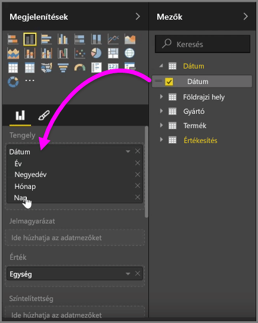
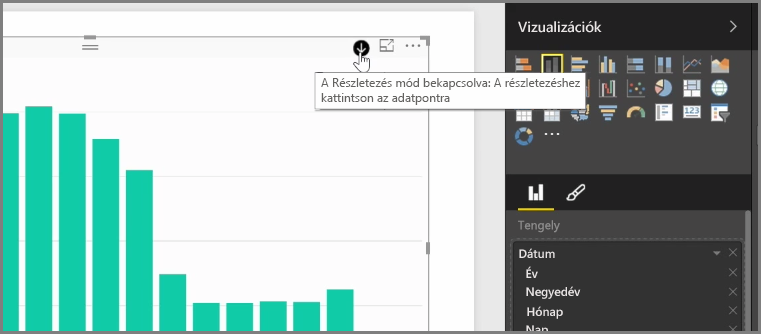
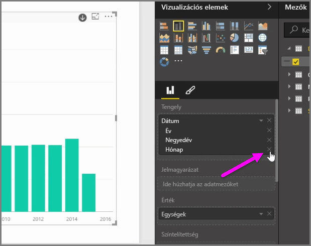
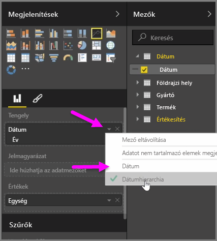
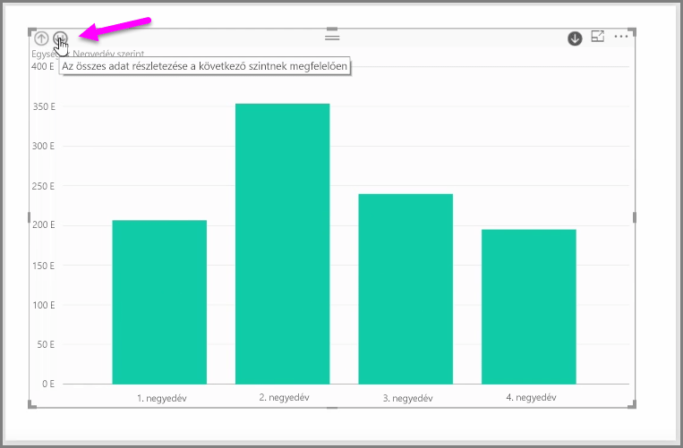

Amikor egy *dátum* mezőt ad hozzá a *Tengely* mezőgyűjtőhöz, a Power BI automatikusan felvesz egy időhierarchiát *Év*, *Negyedév*, *Hónap* és *Nap* bontással. Ezáltal a Power BI lehetővé teszi a vizualizációk időalapú kezelését a jelentést olvasók számára azáltal, hogy a felhasználók kibonthatják a különböző időszinteket.

Ha a hierarchia létrejött, elkezdheti kibontani a szinteket az időhierarchiában. Ha például rákattint az egyik évre, azzal kibontja a hierarchia következő szintjét, amely jelen esetben a *Negyedév*, innentől ez fog megjelenni a vizualizációban.

Az automatikusan létrehozott hierarchiában azt is megadhatja, hogy a felhasználok melyik szintig hatolhassanak le a megosztott jelentésben. Ehhez a Vizualizációk panelen egyszerűen kattintson az X-re amellett a hierarchia mellett, amelyet el szeretne távolítani. A törölt szint eltűnik a jelentésből, és kibontáskor sem jelenik többé meg.

Ha mégis visszaállítaná a törölt hierarchiát, csak távolítsa el a *dátum* mezőt, és vegye fel ismét a **Mezők** panelről, így a hierarchia ismét automatikusan létrejön.

Előfordulhat, hogy időnként nem kívánja használni az adott hierarchiát a vizualizációban. Ennek vezérléséhez válassza ki a lefelé mutató nyilat a *Dátum* mező mellett (miután azt hozzáadta a vizualizációhoz), majd válassza a **Dátum** lehetőséget a **Dátumhierarchia** lehetőség helyett. Ezzel beállíthatja, hogy a Power BI a nyers dátumértékeket jelenítse meg a vizualizációban.

Egyetlen negyedév vagy év kiválasztása helyett kibonthatja egyszerre az összes látható adatelemet is. Ehhez a vizuális elem bal felső sarkában válassza az *Összes kibontása* ikont, amely egy lefelé mutató kettős nyilat formáz.

