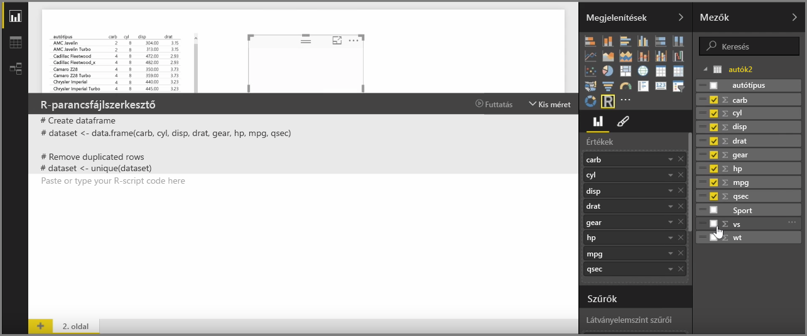
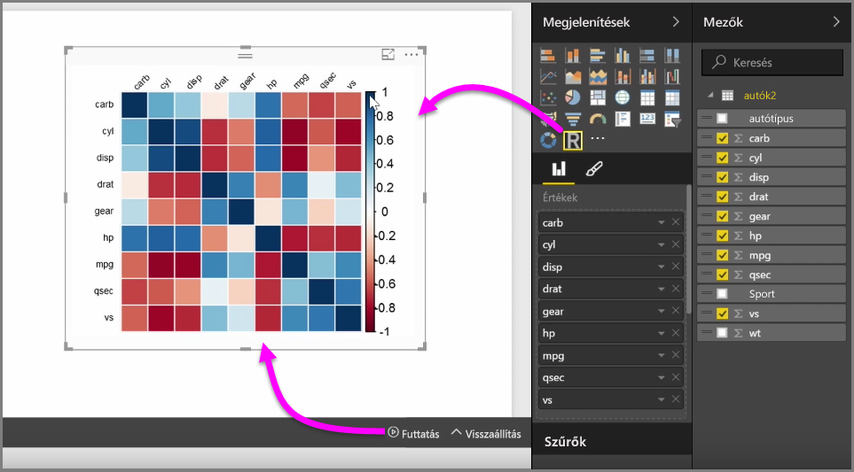
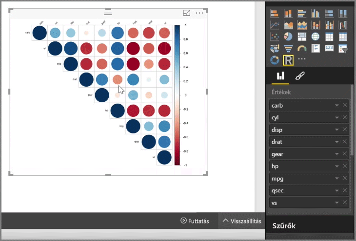

A Power BI Desktop segítségével analitikus és statisztikai elemzést hajthat végre, R-rel integrálva pedig lenyűgöző vizualizációs elemeket hozhat létre, amelyeket elhelyezhet a Power BI Desktop-jelentésekben.

Amikor a **Vizualizációk** ablaktábláról kiválasztja az **R-vizualizáció** ikont, a Power BI létrehoz egy helyőrzőt a vásznon, amelyben elhelyezhető az R-vizualizáció, majd megjelenít egy R- szkript-szerkesztőt, amelyet közvetlenül ott a vásznon használhat. Miközben mezőket vesz fel az R-vizualizációba, a Power BI Desktop hozzáadja azokat az R-szkript-szerkesztő paneljére.

Az R-szkript-szerkesztőben a Power BI által generált szkript alatt Ön elkezdheti létrehozni saját R-parancsfájlját a vizualizációs elem létrehozásához. Amikor elkészült a szkripttel, kattintson a **Futtatás** lehetőségre. A következők fognak történni:

1. A **Mezők** ablaktábláról a vizualizációs elemhez adott adatokat a rendszer a Power BI Desktopból a helyileg telepített R-hez küldi
2. A Power BI Desktop R szkript-szerkesztőjében létrehozott parancsfájlt a helyileg telepített R futtatja
3. A Power BI Desktop visszakap egy vizualizációs elemet az R-től, és megjeleníti azt a vásznon

Mindez meglehetősen gyorsan lezajlik, az eredmény pedig megjelenik a vásznon az **R-vizualizációban**.

Az R-vizualizáció az R-szkript szerkesztésével és a **Futtatás** lehetőségre kattintással módosítható. Az alábbi képen megváltoztattuk a vizualizációs elemet, hogy négyzetek helyett körök jelenjenek meg.

Mivel az R-vizualizáció éppen úgy működik, mint a Power BI Desktop bármely másik vizualizációs eleme, a felhasználó alakíthat rajta, és összekapcsolhatja a vászon más vizualizációs elemeivel. Amikor szűrés vagy kiemelés kapcsán a felhasználó elkezd dolgozni a vászon többi vizualizációs elemével, erre az R-vizualizáció éppúgy reagálni fog, mint az összes többi Power BI-vizualizációs elem, anélkül hogy ehhez változtatni kellene az R-szkripten.

Így könnyedén kihasználhatja az R-ben rejlő lehetőségeket közvetlenül a Power BI Desktop alkalmazásból.

## Következő lépések
**Gratulálunk!** Ön teljesítette a Power BI **Interaktív tanulás** oktatóanyagának **Vizualizációk** című fejezetét. Sok mindent megtanult a Power BI által kínált számtalan vizualizációs elemről, és tapasztalatokat szerzett használatukkal, módosításukkal és testreszabásukkal kapcsolatban. További jó hír, hogy a vizualizációs elemek lényegében ugyanúgy működnek a Power BI Desktopban, mint a Power BI szolgáltatásban, így a most tanultakat mindkét felületen hasznosíthatja.

Most már a felhő felé veheti az irányt, és elmélyülhet a Power BI szolgáltatásban, ahol **Feltárhatja az adatokat**. Mint már tudja, a munkafolyamat így néz ki:

* Adatok beolvasása a **Power BI Desktop**ba, jelentéskészítés.
* Közzététel a Power BI szolgáltatásba, ahol új **vizualizációk** vagy irányítópultok hozhatók létre
* Az irányítópultok **megosztása** másokkal, különösen azokkal, akik mozgásban vannak
* A megosztott irányítópultok és jelentések megtekintése és kezelése **Power BI Mobile** alkalmazásokkal

Függetlenül attól, hogy jelentéseket hoz létre, vagy egyszerűen csak megtekinti azokat és interakcióba lép velük, már tudja, hogy lettek létrehozva, és hogyan kapcsolódnak az adatokhoz a jobbnál jobb vizualizációs elemek. A következő lépésben ezeket a vizualizációs elemeket és jelentéseket működés közben vesszük szemügyre.

Találkozunk a következő szakaszban!

