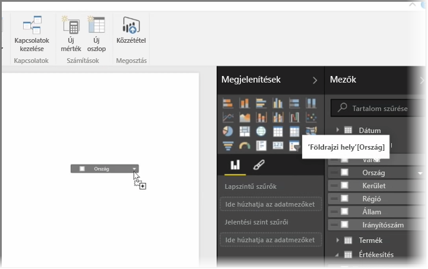
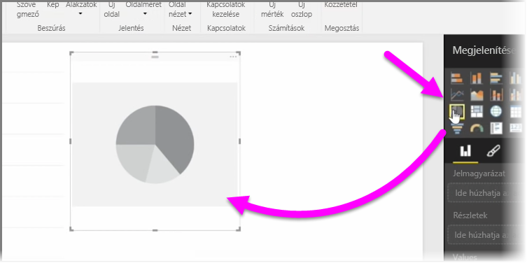
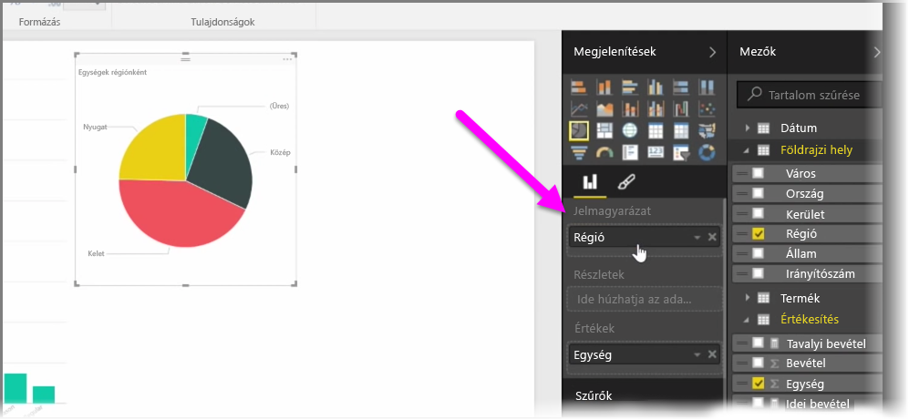
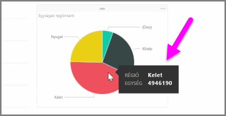

Ebben a cikkben megtudhatja, hogyan hozhat létre új sávdiagramot, tortadiagramot és fatérkép diagramot, továbbá, hogy miként szabhatja őket jelentéseire.

A Power BI Desktopban kétféleképpen lehet új vizualizációt létrehozni:

* A **Mezők** panelről áthúzhatja a mezők nevét a jelentésvászonra. Az adatok alapértelmezés szerint táblázatban jelennek meg.
  
  
* A **Vizualizációk** panelen kiválaszthatja a létrehozni kívánt vizualizáció típusát. Ennél a módszernél az alapértelmezett vizualizáció egy, a kiválasztott típusnak megfelelő üres helyőrző lesz.
  
  

Miután létrehozta a kívánt grafikont, térképet vagy diagramot, hozzákezdhet annak összeállításához és rendszerezéséhez úgy, hogy a kívánt adatmezőket a **Vizualizációk** panel alsó részére húzza. A kiválasztott vizualizáció típusától függően eltérő mezők állhatnak rendelkezésére. A vizualizáció a behúzott adatmezőknek megfelelően automatikusan frissül, és megjeleníti a módosításokat.

A kiválasztott vizualizáció átméretezhető a méretezőpontok kifelé vagy befelé történő húzásával. A vizualizációt máshova is helyezheti a vásznon, ha rákattint, és odébb húzza. Válthat is a különböző vizualizációs típusok között, ha kiválasztja a módosítani kívánt vizualizációt, majd egyszerűen egy másik típusra kattint a **Vizualizációk** panel ikonjai közül. Ilyenkor a Power BI megpróbálja a lehető legjobban átalakítani a kiválasztott mezőket az új vizualizációs típusra.

Ha a vizualizáció különböző részei fölé helyezi az egérmutatót, egy elemleírás jelenik meg, amely tartalmazza az adott szegmens részleteit, például a címkéket és a teljes értéket.

A **Vizualizációk** panel **ecset** ikonjának kiválasztásával formai módosításokat hajthat végre vizualizáción, például igazíthatja a háttérképet, vagy megváltoztathatja a cím szövegét és az adatok színét.

Az elérhető formai módosítások a kijelölt vizualizáció típusától függően eltérőek lehetnek.

