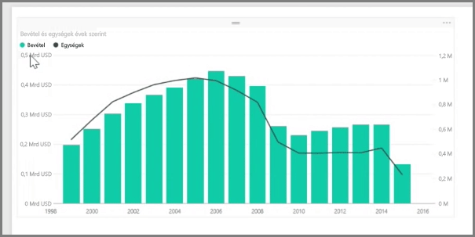
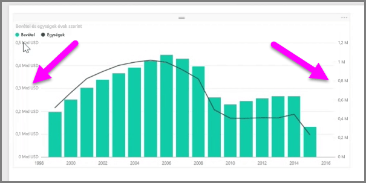
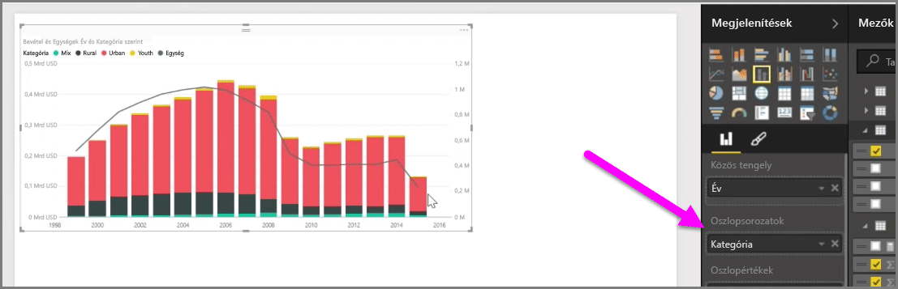

Ha különböző skálákkal rendelkező két mértéket akar megjeleníteni (például bevétel és egységek), rendkívül hasznosnak bizonyulhat a vonalat és sávot eltérő tengelyskálákkal ábrázoló **kombinált diagram**. A Power BI számos különböző típusú kombinált diagramot támogat alapértelmezés szerint, beleértve a népszerű **Vonal** és a **Halmozott oszlopok** típusú diagramokat.

Kombinált diagramok létrehozásakor megjelenik a **közös tengelyhez** (az X tengelyhez) tartozó mező, majd a két mezőhöz tartozó értékek, ebben az esetben egy oszlop és egy vonal. A két Y tengely jelmagyarázatai a vizualizáció mindkét oldalán láthatók.

Az egyes oszlopokat kategória szerint is fel lehet osztani, ha az adott kategóriát a Vizualizációk ablaktábla Oszlopsorozat mezőjébe húzza. Ilyenkor az egyes sávok színezése arányosan történik az egyes kategóriák értékei alapján.

A kombinált diagramokkal egyetlen vizualizáción lehet hatékonyan megjeleníteni a különböző méretezéssel rendelkező mértékeket.

