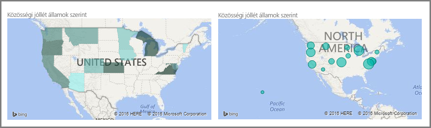
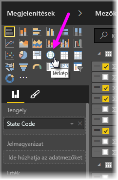
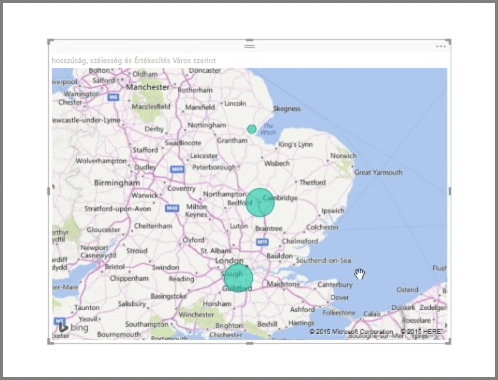
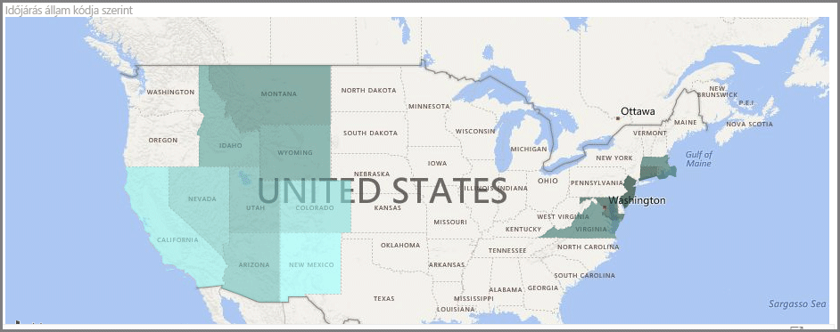
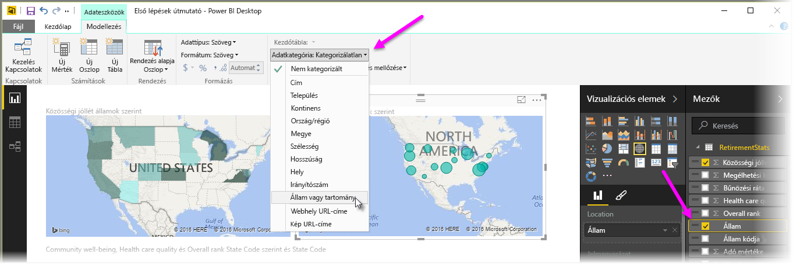

A Power BI két típusú térképi vizualizációval rendelkezik: egy buboréktérkép, amely egy földrajzi pont felé helyez egy buborékot, és egy alakzattérkép, amely a megjeleníteni kívánt terület körvonalát rajzolja meg.

> [!NOTE]
> Amikor országokkal vagy régiókkal dolgozik, használja a három betűből álló rövidítéseket, így meggyőződhet róla, hogy a térképes vizualizációk geokódolása megfelelően működik. *Ne* használjon két betűből álló rövidítéseket, mivel így előfordulhat, hogy a program nem ismer fel egyes országokat vagy régiókat.
> Ha csak a kétbetűs rövidítéseket ismeri, tekintse meg ezt a [külső blogbejegyzést](https://blog.ailon.org/how-to-display-2-letter-country-data-on-a-power-bi-map-85fc738497d6#.yudauacxp), amely az országok és régiók kétbetűs rövidítéseinek a hárombetűs rövidítéseknek való megfeleltetését ismerteti.
> 
> 

## Buboréktérképek létrehozása
Buboréktérkép létrehozásához válassza a **Vizualizációk** ablaktábla **Térkép** elemét. A térképi vizualizációk használatához a **Vizualizációk** beállításai között hozzá kell adnia egy értéket a *Hely* gyűjtőhöz.

A Power BI rugalmas a helyszínértékek elfogadását illetően, így az általánosabb részletektől kezdve (például egy városnév vagy egy repülőtér kódja) a legpontosabb szélességi és hosszúsági adatokig mindent elfogad. Ha a buborék méretét a térkép helyszíneinek méreteihez szeretné igazítani, adjon hozzá egy mezőt a **Méret** gyűjtőhöz.

## Alakzatleképezések létrehozása
Alakzatleképezés létrehozásához válassza a Vizualizációk ablaktábla **Kartogram** elemét. A buboréktérképekhez hasonlóan a vizualizáció használatához hozzá kell adnia egy értéket a Hely gyűjtőhöz. A kitöltés színerősségének megfelelő módosításához adjon hozzá egy mezőt a Méret gyűjtőhöz.

A vizualizációs elem bal felső sarkában megjelenő figyelmeztető ikon azt jelzi, hogy a térképnek további helyszínadatokra van szüksége az értékek pontos ábrázolásához. Ez leggyakrabban akkor fordul elő, ha a Hely mező adatai nem egyértelműek, például olyan nevet adott meg, mint a *Washington*, amely egy állam és egy kerület is lehet. A problémát megoldhatja, ha az oszlopnak egy pontosabb nevet ad meg, például *Állam*. Másik lehetőségként kézzel visszaállíthatja az adatkategóriát a Modellezés lap **Adatkategória** elemének kiválasztásával. Ezen a területen hozzárendelhet egy kategóriát az adatokhoz, például az „Állam” vagy a „Város” értéket.

