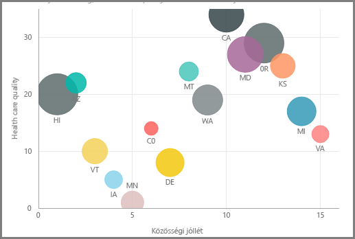
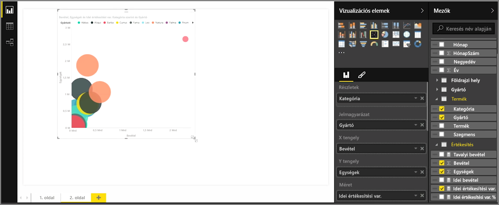
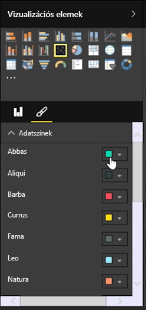
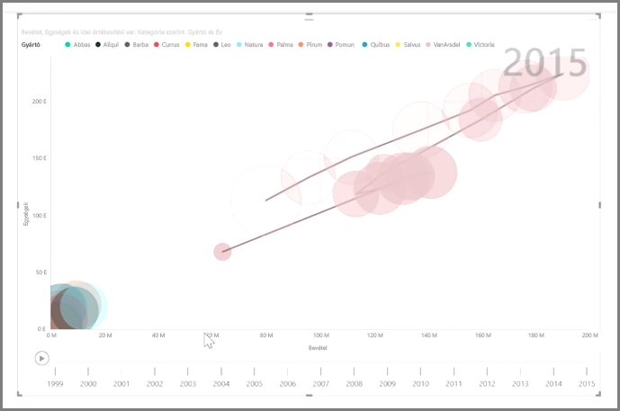

A pontdiagram vizualizációval két különböző érték, például az egységeladások és a bevétel összehasonlítását lehet elvégezni.

Üres diagram létrehozásához válassza a **Vizualizációk** ablaktáblán a **Pontdiagram** lehetőséget. Az **Mezők** ablaktáblából húzza át a két összehasonlítani kívánt mezőt az *X tengely* és az *Y tengely* alá a lehetőségek gyűjtőjében. Ekkor a pontdiagram még valószínűleg csak egy kis buborékot mutat a vizualizáció közepén, ezért meg kell adnia egy mértéket a *Részletek* gyűjtőben, amellyel azt jelöli, hogyan kívánja szegmentálni az adatokat. Ha például eladásokat és bevételt hasonlít össze, akkor érdemes lehet az adatokat kategóriák, gyártók vagy az eladás hónapja alapján felosztani.

Ha további mezőket ad a *Jelmagyarázat* gyűjtőhöz, akkor ezzel különböző színeket rendelhet az buborékokhoz a mező értéke alapján. Hozzáadhat egy mezőt a *Méret* gyűjtőhöz is, hogy megváltoztassa a buborék méretét az adott érték alapján.

A pontdiagramok megjelenítésének formázására sokféle lehetőség van, ilyenek például a színes buborékok körvonalának bekapcsolása vagy az egyéni feliratok választása. Az adatok színét más típusú diagramok esetén is módosíthatja.

A buborékdiagram változásaiból egy animációt is létrehozhat, ha hozzáad egy időalapú mezőt a *Lejátszási tengely* gyűjtőhöz. Ha animáció közben egy buborékra kattint, megjelenítheti a megtett útját.

>[!NOTE]
>Ne feledje, ha csak egyetlen buborékot lát a pontdiagramban, az azért van, mert alapértelmezés szerint a Power BI összesíti az adatokat. Hogy több buborékja legyen, adjon hozzá egy kategóriát a **Vizualizációk** ablaktáblán a *Részletek* gyűjtőhöz.
> 
> 

