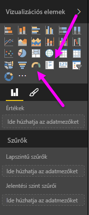
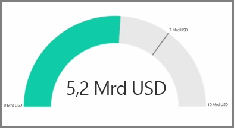
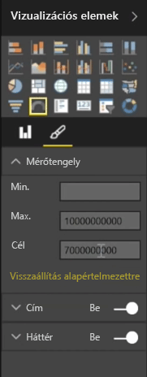
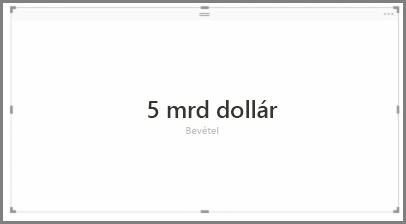
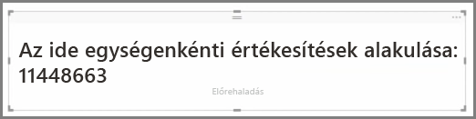

A vizualizációs elemek általában két vagy több különböző érték összehasonlítására szolgálnak. Néha azonban a jelentések készítése során érdemes egyszerűen csak egy fő teljesítménymutató (KPI) vagy metrika alakulását követnie az idő múlásával. Ennek módja a Power BI Desktopban egy **mérőműszer** vagy **egyetlen szám** kártyavizualizáció. Bármelyik típusú üres diagram létrehozásához válassza annak ikonját a **Vizualizációk** ablaktáblán.

A mérőműszerek különösen hasznosak, ha irányítópultokat készít, és egy adott célhoz viszonyított előrehaladást szeretne megjeleníteni. A mérőműszer létrehozásához kattintson az ikonjára a **Vizualizációk** ablaktáblán, és húzza a követni kívánt mezőt az *Érték* gyűjtőre.

A mérőműszerek alapértelmezés szerint 50%-on vagy az *Érték* duplázásával jelennek meg, és ez a beállítás kétféleképpen módosítható. Az értékek dinamikus beállításához az egérrel húzzon át mezőket a *Minimum*, a *Maximum*, és a *Cél* gyűjtőre. Azt is megteheti, hogy a vizualizáció formázási beállításai segítségével manuálisan testre szabja a mérőműszer tartományát.

A kártyavizualizációk egyszerűen megjelenítik a mező numerikus ábrázolását. A kártyavizualizációk alapértelmezés szerint olyan kijelzőegységeket használnak, amelyek rövid számot jelenítenek meg, például „5 000 000 000 USD” helyett „5 mrd USD”-t. A vizualizáció formázási beállításai segítségével módosíthatja a használt egységet, vagy teljesen letilthatja azt.

Egy érdekes alkalmazása a kártyáknak a szöveggel összefűzött egyéni mértékek megjelenítése. A korábbi példát használva egy egyéni mértékkel kártyája tartalmazhat speciális DAX-függvényeket, és alábbihoz hasonlót jeleníthet meg: „Összes bevétel ebben az évben: 5 mrd USD” vagy „Az egység értékesítésének növekedése ebben az évben:”, majd adja hozzá a növekedést jelző számot.

