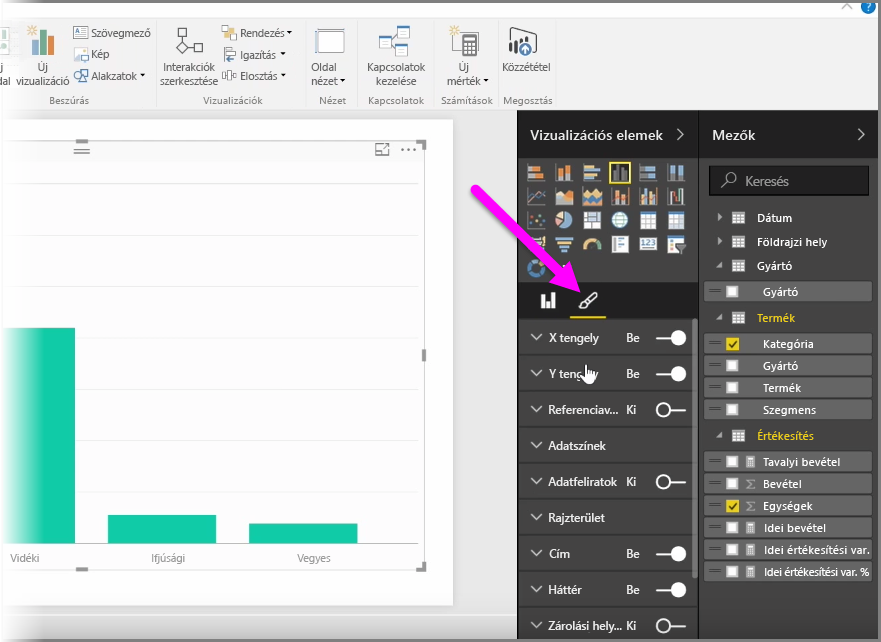
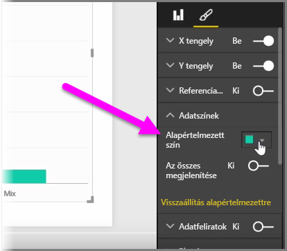
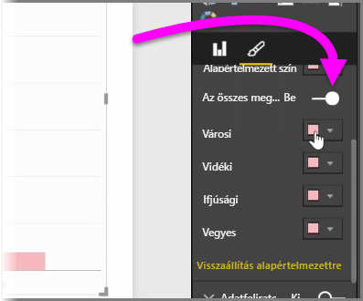
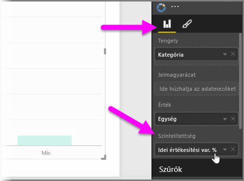
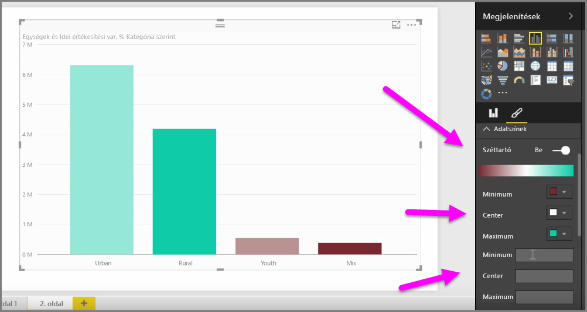
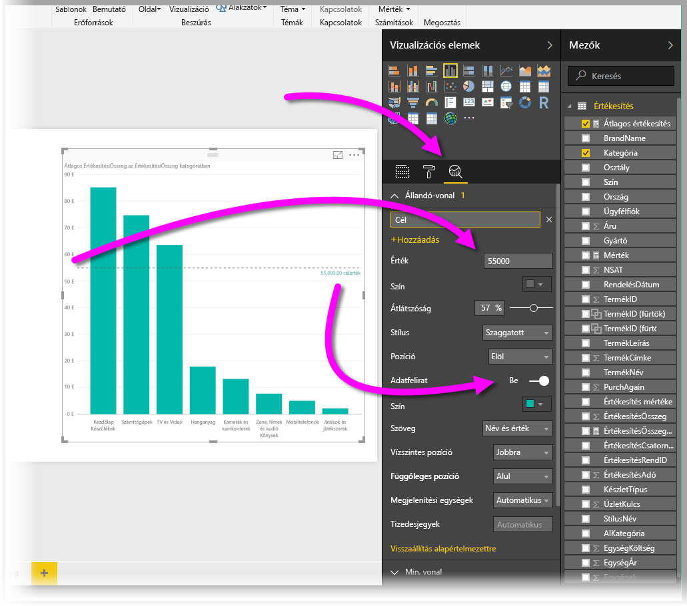
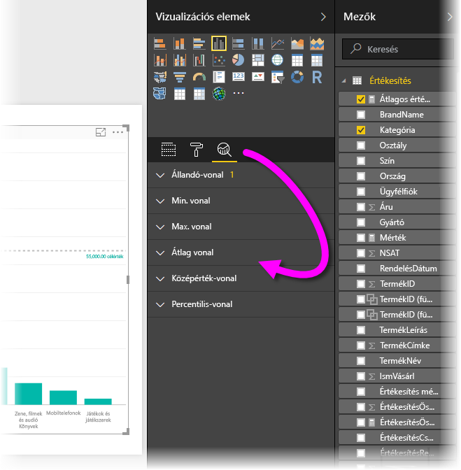

Sokszor előfordulhat, hogy módosítani szeretné a táblázatokban vagy a vizualizációkban használt színeket. A Power BI számos lehetőséget nyújt a színmegjelenítés szabályozására. Először is válasszon egy vizualizációt, majd kattintson az **ecset** ikonra a **Visualizations** (Vizualizációk) ablaktáblán.

A vizualizációk színeinek és formázásának megváltoztatására több lehetőség kínálkozik. Egy vizualizáción belül minden sáv színét megváltoztathatja, ha a **Default color** (Alapértelmezett szín) melletti színválasztóra kattint, majd kiválasztja a kívánt színt.

A sávok (vagy a választott vizualizációtól függően más elemek) színét úgy is megváltoztathatja, hogy bekapcsolja a **Show all** (Összes megjelenítése) csúszkát. Ekkor minden elemhez megjelenik egy színválasztó.

A színt egy érték vagy mérték alapján is módosíthatja. Ehhez a Vizualizációk ablaktáblán húzzon egy mezőt a **Color saturation** (Színtelítettség) gyűjtőbe (figyelem: ez a lehetőség nem az **ecset**, hanem a **mezőgyűjtő** szakaszban található).

Módosíthatja az adatelemek kitöltéséhez használt színeket és a méretezést is. Választhat széttartó skálát a Diverging (Széttartó) csúszka bekapcsolásával, ami három szín között teszi lehetővé a választást. Beállíthat *Minimum*, *Közép*, és *Maximum* értékeket a táblázaton történő megjelenítéshez.

Ezeket az értékeket többek között szabályok létrehozásához is használhatja, például különböző színekkel jelenítheti meg a pozitív és a negatív értékeket.

A színek felhasználásának további praktikus eszköze a *konstansvonal* vagy *referenciavonal* beállítása. Beállíthatja a konstansvonal értékét vagy színét, sőt feliratot is helyezhet a referenciavonalra. Konstansvonal (vagy egyéb érdekes vonalak) létrehozásához a nagyítóüveghez hasonló ikonnal válassza az **Elemzés ablaktáblát**, majd bontsa ki a **Referenciavonal** szakaszt.

Az **Elemzés ablaktábla** segítségével számos egyéb vonalat is létrehozhat vizualizációként, mint például a Min, Max, Átlag, Medián vagy Percentilis vonalak.

Végezetül pedig szegélyt hozhat létre az egyéni vizualizáció körül, és a többi elemhez hasonlóan ennek a szegélynek a színét is megadhatja.

