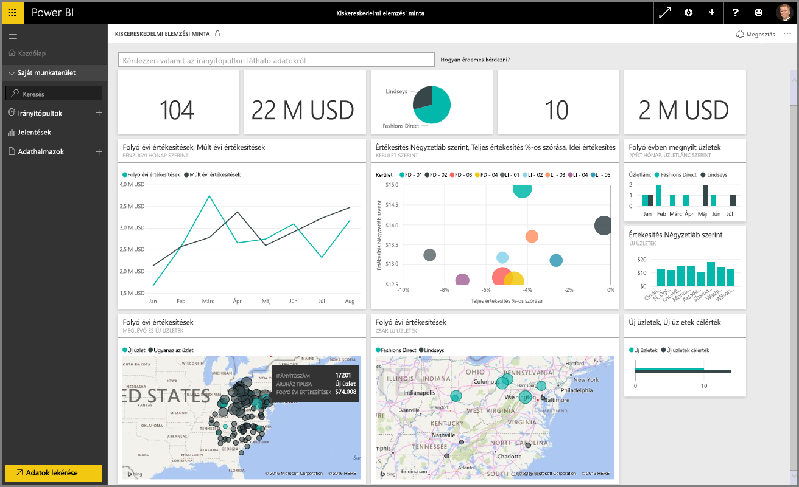
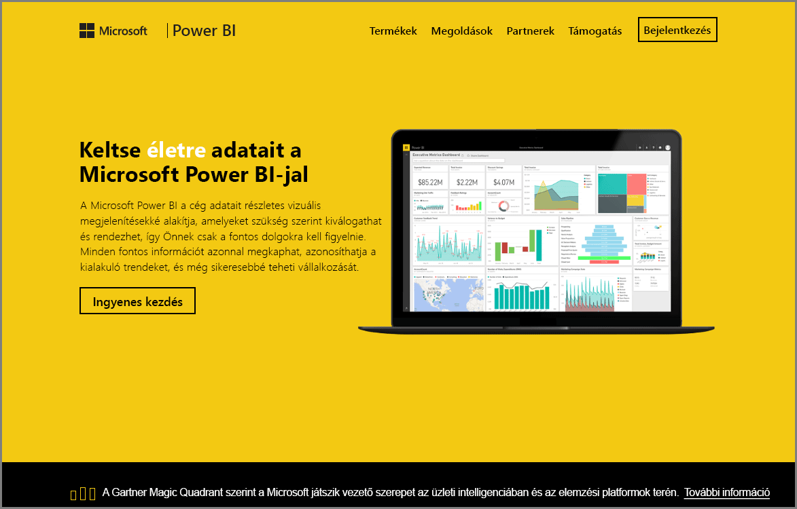

Üdvözöljük a Power BI **Interaktív tanulás** oktatóanyagának **Adatok feltárása** szakaszában. Miután megismerkedett a Power BI Desktop alkalmazással, valamint az adatok beolvasásának és megjelenítésének módjával, készen áll az adatok feltárására a Power BI szolgáltatásban.

Sokféle trükköt sajátíthat el ebben a szakaszban, és a Power BI lenyűgöző interaktivitása és adatmegosztási képessége itt válik igazán egyértelművé. Egy izgalmas és érdekes szakasz következik.

## A Power BI szolgáltatás bemutatása
*Ismerje meg, miben segíthet a Power BI szolgáltatás a munkahelyen*

A Power BI szolgáltatás a **Power BI Desktop** természetes kiterjesztése, és annak funkciói közé tartozik a jelentések feltöltése, az irányítópultok létrehozása, valamint az adatlekérdezések természetes nyelvvel való használata. Használhatja a szolgáltatást az adatok frissítési idejének beállítására, az adatok munkahellyel való megosztására, valamint testre szabott szolgáltatáscsomagok létrehozására is.

A következő témakörökben felfedezheti a Power BI szolgáltatást, és megismerheti, hogy az hogyan képes átalakítani az üzletiintelligencia-adatokat adatelemzésekké, valamint egy együttműködésen alapuló, döntéstámogató környezetté.

