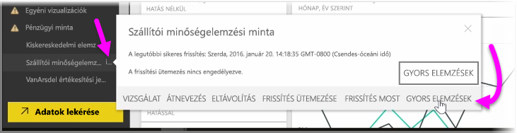
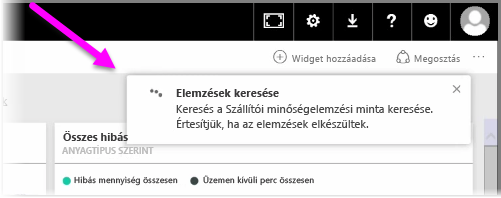
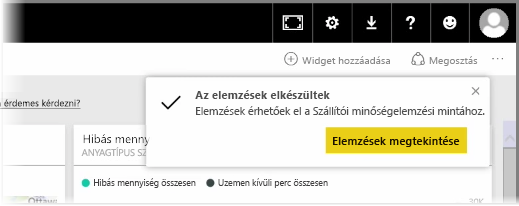
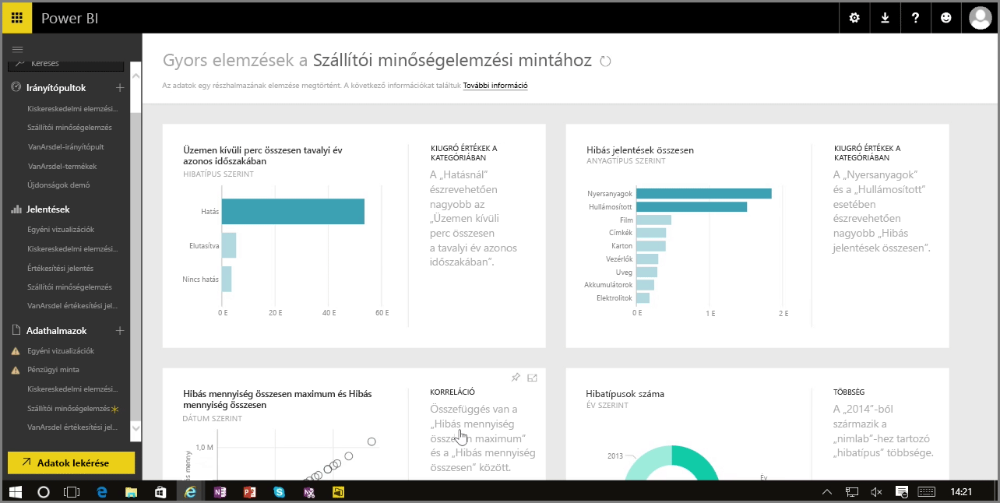

Ha a Power BI szolgáltatásban egy irányítópulttal, jelentéssel vagy adatkészlettel dolgozik, akkor lekérheti a Power BI-tól az adatok gyors elemzéseit. A Power BI szolgáltatásban bal oldalon az **Adatkészletek** részen válassza a *...* (három pont) lehetőséget az elemezni kívánt adatkészlet mellett. Ekkor megjelenik egy menü, amelynek a jobb szélén lesz egy **Gyors elemzések lekérése** nevű lehetőség.

A Gyors elemzések lekérése lehetőség kiválasztásakor a Power BI a gépi tanulás módszerével megkeresi az adatokat, megvizsgálja azokat, és gyors elemzéseket készít. A szolgáltatás jobb felső részén látni fog egy értesítést, hogy a Power BI éppen keresi az elemzéseket.

Körülbelül 15 másodperc elteltével az értesítés megváltozik, és arról tájékoztat, hogy a Power BI elkészítette az elemzéseket.

Ha rákattint az **Elemzések megtekintése** gombra az értesítésen, akkor megjelenik a vizualizációk oldala, ahol azok az elemzések láthatók, amelyeket a Power BI talált, az alábbi képen láthatóhoz hasonlóan. A lapon több elemzés is található, amelyeket lefelé görgetve átnézhet és fontolóra vehet.

A Gyors elemzések – csakúgy mint bármilyen vizualizáció – interaktívan használhatók, és ha van irányítópultja, akár rögzítheti is rá valamelyik elemzést, vagy tovább szűrheti valamelyiket (vagy akár többet is), hogy kíváncsiságának köszönhetően további elemzésekhez juthasson.

A **Gyors elemzések keresése** funkcióval rábízhatja a Power BI-ra a kiugró adatok és a trendek azonosítását, majd ezeket az eredményeket az irányítópultján tovább finomíthatja és szűrheti, hogy megkaphassa az Ön számára legfontosabb elemzéseket.

