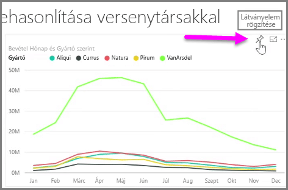
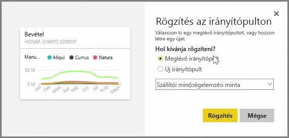
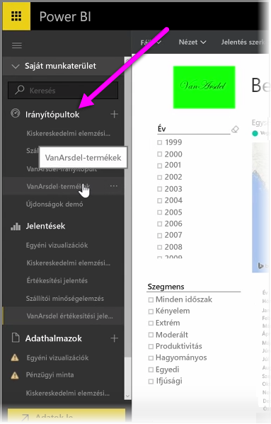
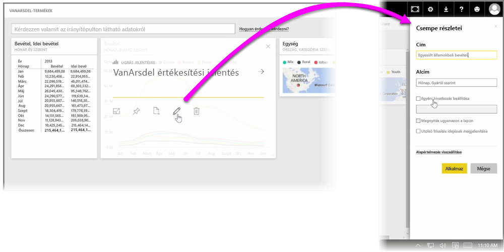

A Power BI **irányítópultjai** olyan, vizualizációkat tartalmazó egyoldalas gyűjtemények, amelyeket a Power BI szolgáltatásban hoztak létre. Irányítópultokat az Ön által a Power BI Desktopban létrehozott és közzétett jelentések vizualizációinak **rögzítésével**, vagy magán a Power BI szolgáltatáson belül létrehozott vizualizációkkal hozhat létre. A vizualizációk **rögzítése** olyan, mint egy kép kitűzése egy táblára: a kép mások számára is megtekinthetővé válik egy adott helyen, rögzített formában. Vizualizációk rögzítéséhez nyissa meg a hozzájuk tartozó jelentést a Power BI szolgáltatásban. Helyezze a kurzort a rögzíteni kívánt vizualizáció felé, és kattintson a **rajzszög** ikonra.

Ekkor megjelenik egy párbeszédpanel, ahol kiválaszthatja a vizualizáció célirányítópultját egy legördülő menüből, vagy új irányítópultot hozhat létre. Itt megtekintheti az irányítópulton rögzített vizualizáció előnézeti képét is. Vizualizációkat több jelentésből és oldalról is rögzíthet egy irányítópulton, így különböző adatkészleteket és -forrásokat egyesíthet egyetlen információs oldalon.

Az **Irányítópultok** területen bármilyen vizualizációt rögzíthet, így grafikonokat, térképeket, képeket és alakzatokat is. A vizualizációkat rögzítés után **csempének** nevezzük.

Az irányítópultok (beleértve az újakat is) a Power BI szolgáltatás bal oldalán, az Irányítópultok területen jelennek meg. Ha meg szeretne tekinteni egy irányítópultot, válassza ki a listából.

Az irányítópult vizualizációinak elrendezését igény szerint módosíthatja. Egy csempe átméretezéséhez húzza a fogópontjait befelé vagy kifelé. Egy csempe áthelyezéséhez kattintson rá és húzza át az irányítópult egy másik pontjára. Helyezze a kurzort egy csempe felé, és kattintson a **ceruza** ikonra a **Csempe részletei** szakasz megnyitásához, ahol módosíthatja a **címet** vagy az **alcímet**.

Ha meg szeretné tekinteni annak eredeti jelentését, kattintson az irányítópult csempéjére. Ezzel gyorsan megtekintheti a vizualizáció alapjául szolgáló adatokat. A hivatkozást módosíthatja a **Csempe részletei** szakasz **Egyéni hivatkozás beállítása** mezőjével.

Egy irányítópult csempéit rögzítheti egy másik irányítópulton, ha például egy összegző irányítópultot szeretne létrehozni. A folyamat ugyanaz: helyezze a kurzort a csempe felé, és kattintson a **rajzszög ikonra**. Az irányítópultok könnyen létrehozhatók és módosíthatók. Emellett testre is szabhatja őket, így az egyoldalas irányítópultokon azt jeleníthet meg, amit szeretne.

