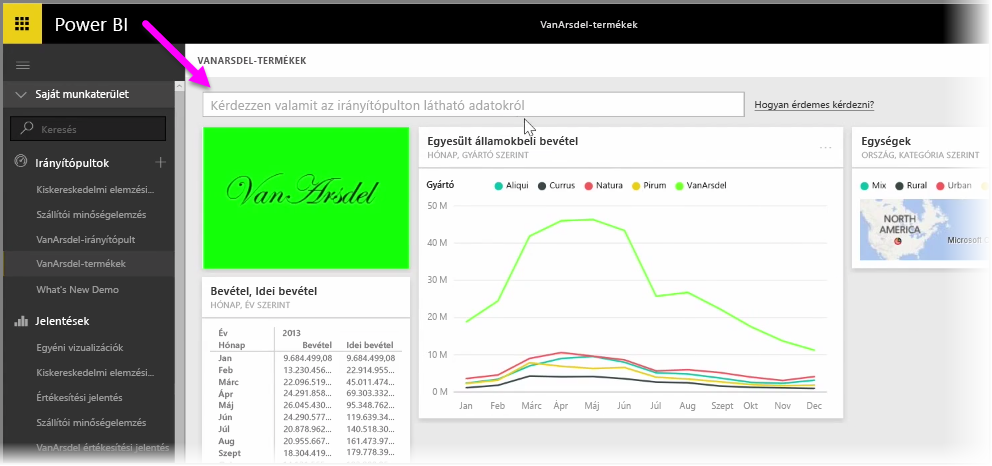
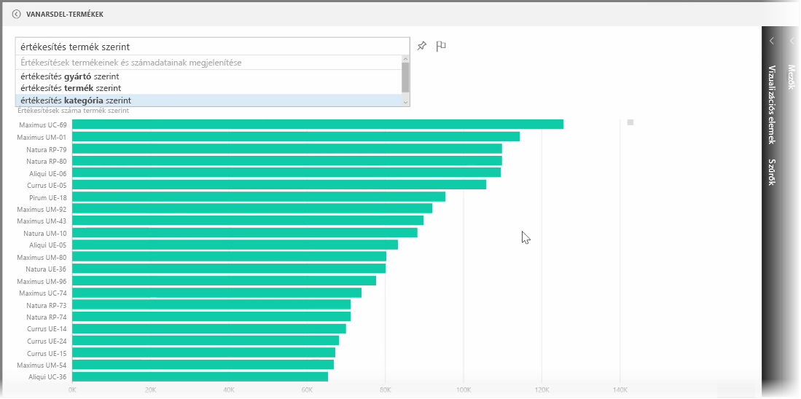
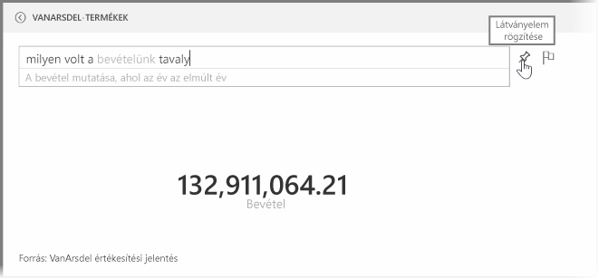
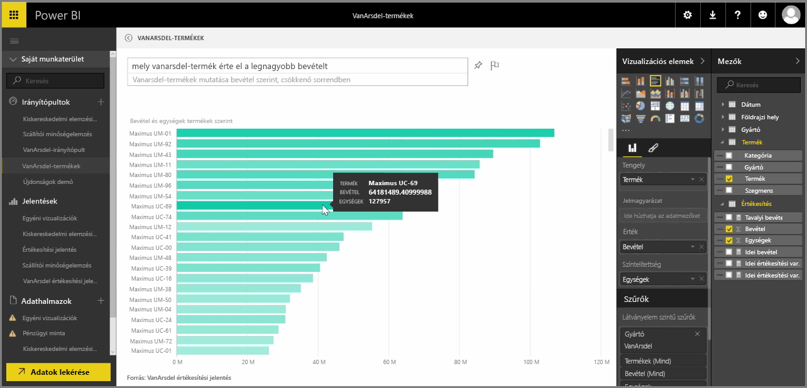

A Power BI hatékony nyelvfelismerő motorja lehetővé teszi kérdések feltételét az adatokról társalgási kifejezéseket és kérdések használatával. Ezért a Power BI-ban a jelentések és a vizualizációs elemek készítése mellett létrehozhat diagramokat vagy grafikonokat egyszerű kérdések feltételével is.

Ha kérdést szeretne feltenni az adatokról, nyisson meg egy irányítópultot a Power BI-ban, és a képernyő felső részén található beviteli mezőben felteheti a megjelenített adatokra vonatkozó kérdéseit. Ez a funkció más néven a *Kérdések és válaszok*, vagy gyakrabban csak **Q&A**-nek nevezzük.

Amikor a mezőre kattint, a Power BI néhány javasolt kérdést jelenít meg az adatok alapján, például „Idei bevétel”. A javasolt kifejezésekre kattintva megjelenik az eredmény, gyakran egy egyszerű táblázat vagy kártya formájában. A javasolt kifejezések valamelyikének kiválasztásakor a Power BI automatikusan, valós időben létrehozza annak vizualizációját.

Természetes nyelvű kérdések feltevésére is lehetősége van, mint például „Mennyi volt a tavalyi bevételünk?” vagy „Milyen termékből volt a legnagyobb értékesítés 2014 márciusában?”. A Power BI megjeleníti, hogy hogyan értelmezte a kérdést, és a legmegfelelőbb vizualizációt választja a válasz ábrázolásához. Csakúgy, mint bármely más vizualizációt a Power BI-ban, **rögzítheti** azt az Ön által választott irányítópulthoz a **rögzítés** ikonra kattintva.

Menet közben bármikor módosíthatja a természetes nyelvű kérdés vagy kifejezés által létrehozott vizualizációt. Használja a **Vizualizációk** és a **Mezők** ablaktáblát a képernyő jobb oldalán. Ahogy bármely más vizualizációnál a Power BI-ban, itt is megváltoztathatja az elrendezést, módosíthatja a szűrőket és a mezők bemeneteit.

A tökéletes vizualizáció létrehozását követően annak mentéséhez egy irányítópulton egyszerűen válassza a **rögzítés** ikont a kérdésbeviteli mező mellett.

