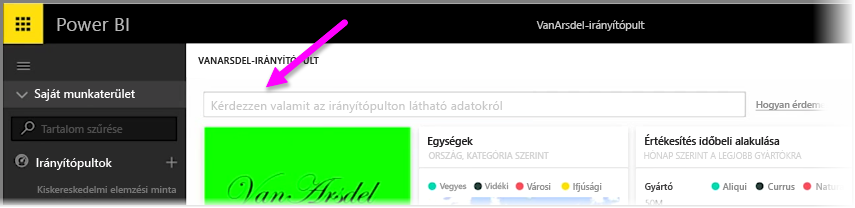
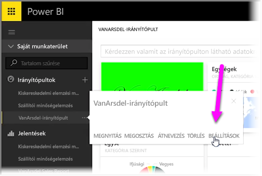

A Power BI szolgáltatással saját javasolt kérdéseket adhat hozzá más felhasználók számára, akik a természetes nyelvet használják az irányítópult lekérdezésmezőjében (más néven a **Q&A** mezőben). Amikor a felhasználók egy irányítópult tetején található beviteli mezőre kattintanak, ezek a javasolt kérdések jelennek meg.

Saját kérdések hozzáadásához kattintson a használni kívánt irányítópult neve melletti három pontra (...), majd válassza a menü **Beállítások** lehetőségét.

 Ekkor megnyílik az irányítópult **Beállítások** lapja a mögöttes adatkészletekkel és munkafüzetekkel. A Q&A beviteli mezőt letilthatja a **Beállítások** lap **Irányítópultok** területén, mi azonban kérdéseket szeretnénk hozzáadni, így az **Adatkészletek** szakaszt választjuk.

Az **Adatkészletek** szakaszban megjelenik minden olyan adatkészlet, amely az irányítópulthoz van rendelve. Válassza ki a listából az Ön irányítópultjához rendelt adatkészletet, majd válassza a **Kiemelt Q&A-kérdések**, végül a **Kérdés hozzáadása** hivatkozást. Írja be a kérdést a beviteli mezőbe, majd válassza az **Alkalmazás** lehetőséget.

Mostantól ha egy felhasználó a kijelölt irányítópult tetején található beviteli keresőmezőre kattint, a kérdéslista tetején megjelennek az Ön javasolt kérdései, amelyekre kattintva a felhasználó közvetlenül a Q&A szakasz válaszaihoz kerülhet. Az irányítópultok felhasználóit így elgondolkodtathatja az elérhető adattípusokról, illetve azok leghatékonyabb használati módjairól.

