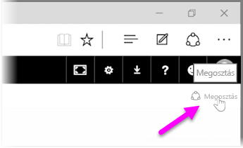
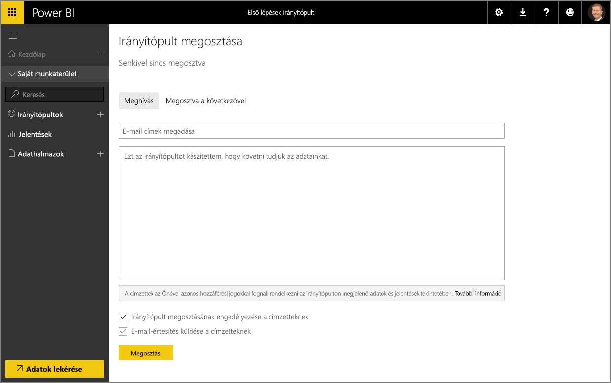

Bemutattuk hogyan segít a Power BI az adatok keresésében, azok adatmodellbe való gyűjtésében, és abban, hogy az adatokból jelentéseket és vizualizációkat készíthessen. Azt is bemutattuk, hogyan tudja ezeket a jelentéseket a Power BI szolgáltatásban közzétenni, és irányítópultokat létrehozni, amelyekkel nyomon követheti az információk változását. Mindezek a funkciók még hatékonyabbak lehetnek, ha a cégen belül másokkal is megoszthatja következtetéseit. Szerencsére az irányítópultokat könnyedén megoszthatja.

Ahhoz, hogy megosszon egy irányítópultot, nyissa meg a Power BI szolgáltatásban és válassza a **Megosztás** hivatkozást a jobb felső sarokban.

Megjelenik az **Irányítópult megosztása** oldal, ahol a **Meghívás** szakaszt választva beírhatja az **E-mail-cím** mezőbe azoknak a személyeknek az e-mail-címét, akiknek hozzáférést kíván adni az irányítópulthoz. A címek gépelése közben a Power BI összeveti az e-mail-címet a tartomány és az Office 365-tartomány fiókjaival, és automatikus kiegészítést ajánl fel, amikor csak lehet. Az e-mail-címeket nyugodtan másolhatja és beillesztheti a mezőbe, de használhat terjesztési listát, biztonsági csoportot, vagy Office 365-csoportot, hogy egyszerre több személyt is elérjen.

Ha bejelölte az *E-mail-értesítés küldése a címzetteknek* jelölőnégyzetet (alul található), akkor a címzettek egy e-mailt fognak kapni, amely tájékoztatja őket, hogy megosztott velük egy irányítópultot, és tartalmaz egy hivatkozást is az irányítópulthoz. Az e-mailhez üzenetet is fűzhet, de elküldheti a Power BI által létrehozott üzenetet is (ezt közvetlenül az e-mail-címeket tartalmazó mező alatt találja).

>[!NOTE]
>Azokat a címzetteket, akik nem rendelkeznek Power BI-fiókkal, a rendszer végigvezeti a regisztrációs folyamaton, mielőtt az irányítópultot megtekinthetnék.
> 
> 

Bárki, akivel megosztja az irányítópultot, ugyanúgy megtekintheti és kezelheti azt, mint Ön. Azonban az alapul szolgáló jelentésekhez *csak olvasható* formában férhetnek hozzá, az alapul szolgáló adatkészletekhez pedig *nem lesz hozzáférésük*.

Ha az Irányítópult megosztása oldalon a **Megosztva a következővel** lapra lép, megtekintheti, hogy korábban kikkel osztotta meg az irányítópultot.

