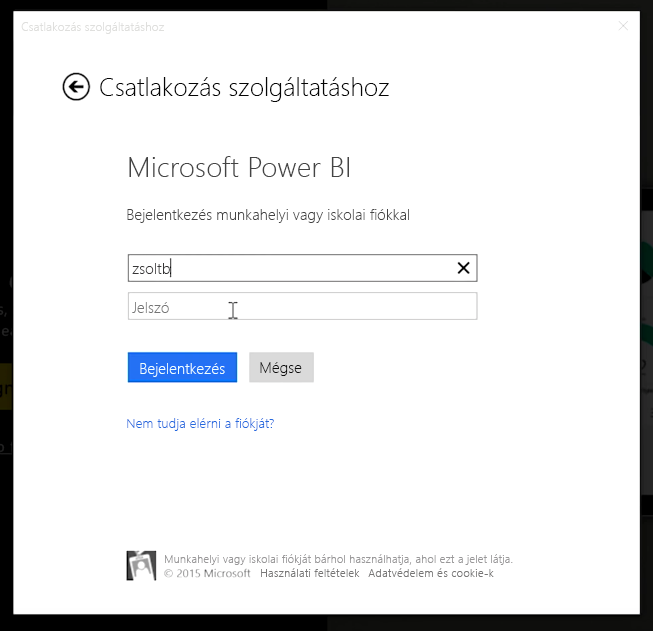
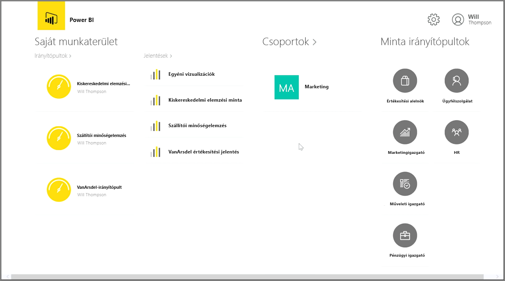
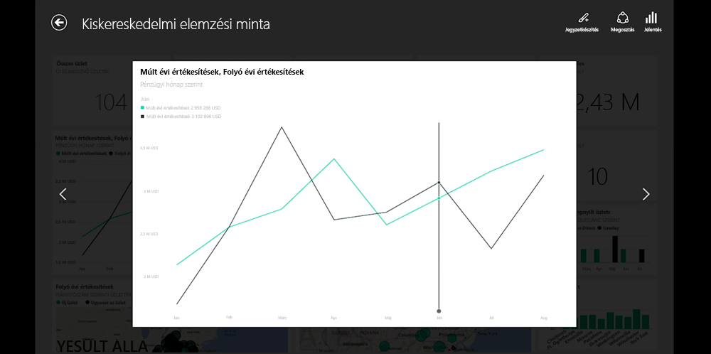
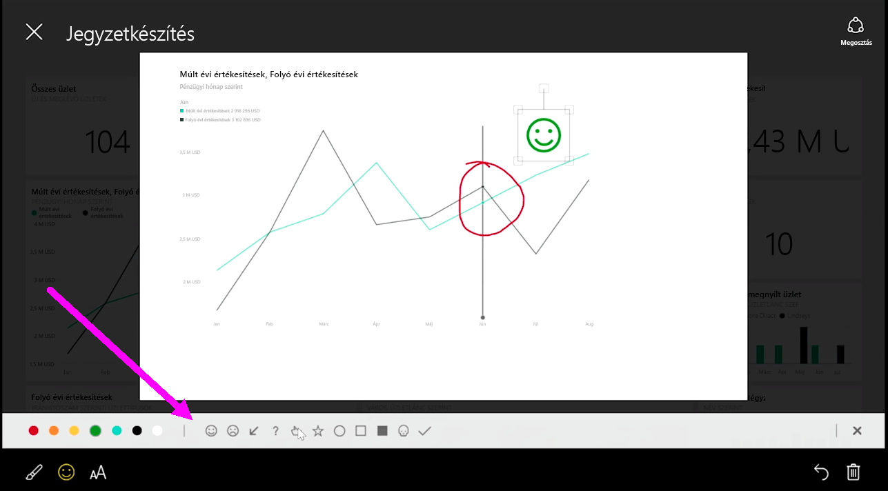

Ha útközben is szeretné figyelemmel kísérni az adatait, használhatja a Power BI mobilalkalmazást iOS, Android és Windows rendszerű eszközökön.

A Power BI alkalmazás első használatakor jelentkezzen be a fiókjába a Power BI szolgáltatás fiókadataival. Windows rendszerű mobileszközön (esetünkben egy táblagépen) a bejelentkezés az alábbihoz hasonlóan néz ki.

Az első képernyőn az összes olyan tartalom megjelenik, amelyhez hozzáféréssel rendelkezik, például a jelentések, az irányítópultok és a csoportok. Emellett irányítópultminták is találhatók itt, hogy ötletekkel szolgáljanak, vagy hogy megmutassák a Power BI-ban rejlő lehetőségeket. Az alkalmazás a kialakításának köszönhetően könnyen használható érintéssel: koppintson egy irányítópultra vagy egy jelentésre a teljes képernyős megtekintéshez, és nézze át az ujjaival görgetve.

Bármelyik irányítópultot megnyithatja, ha rákoppint. Az irányítópulton belül egy koppintással fókuszba helyezheti a csempéket, és megjelenítheti őket egy nagyobb nézetben.

Emellett bármilyen elemzéshez készíthet jegyzeteket a jobb felső sarokban található **Jegyzetkészítés** gombra koppintva. Ezzel rajzolni is tud a fókuszban lévő csempére, hogy kiemelje a fontos területeket. A jegyzetkészítési eszközök a képernyő alján találhatók.

Koppintson a **Megosztás** hivatkozásra a jobb felső sarokban a jegyzettel ellátott csempe megosztásához.

Egy csempe jobb sarkában koppintson a **Jelentés** hivatkozásra a csempéhez kapcsolódó jelentés megtekintéséhez. Ez ugyanazokat a vizualizációkat jeleníti meg, amelyeket a böngészőben vagy a Power BI Desktopban is látna, és ezek szintén interaktívan használhatók: rákoppinthat egy oszlopra, megtekinti a részletezéseket, és használhat szeletelőket is.

