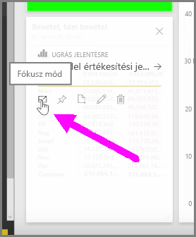
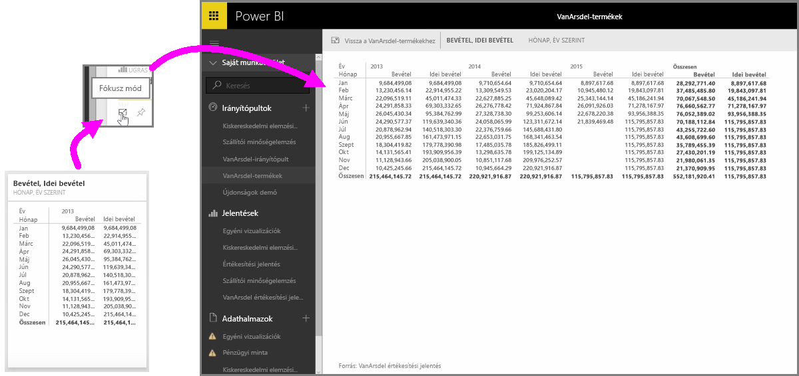

Amikor irányítópultokat vagy jelentéseket tekint meg a Power BI szolgáltatásban, időnként hasznos lehet, hogy egyetlen diagramra vagy vizuális elemre tudjon fókuszálni. Ezt két különböző módon is megteheti.

Ha irányítópultot tekint meg, mutasson az egérrel az egyik csempére, hogy a kezelési lehetőségek ikonjai megjelenjenek a jobb felső sarokban. Ha kiválasztja a három ponttal jelölt ikont, megjelennek az adott csempe beállítási lehetőségeit reprezentáló további ikonok.

A bal szélső ikon a **Fókusz mód**. Az ikon kiválasztásával a csempe kiterül, és kitölti a teljes irányítópultot.

A **Fókusz mód** lehetővé teszi, hogy az adott vizuális elem adatait és jelmagyarázatait sokkal részletesebben láthassa. Ha például átméretez egy csempét a Power BI-ban, annak néhány oszlopa lehet, hogy nem fog látszani a csempében rendelkezésre álló hely miatt.

Ilyenkor a **Fókusz mód** segítségével minden adatot megjeleníthet. Az adott vizuális elemet a **Rögzítés** ikonra kattintva közvetlenül a Fókusz módban is kitűzheti egy másik irányítópultban. A **Fókusz módból** való kilépéshez válassza a **Vissza...** ikont a **Fókusz mód** bal felső sarkában.

A folyamat hasonlóan működik jelentések megtekintésekor is. Mutasson az egérrel az egyik vizuális elemre, hogy megjelenjen a három ikon a jobb felső sarokban, majd válassza a **Fókusz mód** ikont. Amikor az ikonra kattint, a vizualizáció kiterül és kitölti a teljes jelentésvásznat. A vizualizáció ebben a módban is interaktív marad, azonban a vizualizációk közötti keresztszűrés hatásait ilyenkor ideiglenesen elveszti.

Ha vissza szeretne térni az előző nézethez, mutasson az egérrel a kiterített csempére vagy jelentésre, és válassza a balra mutató nyilat formázó **Vissza** ikont a bal felső sarokban.

