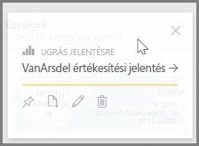
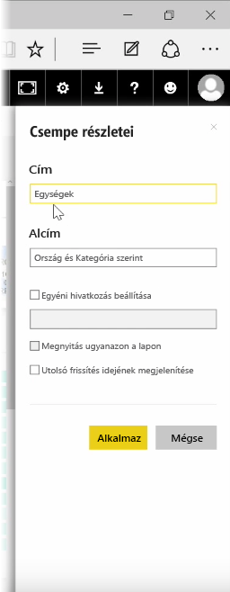
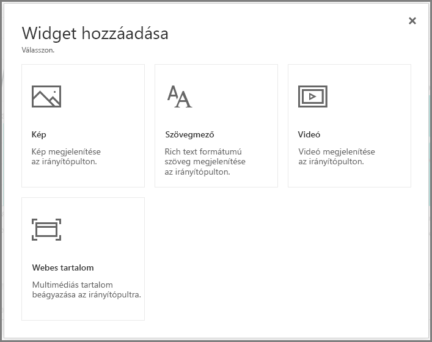
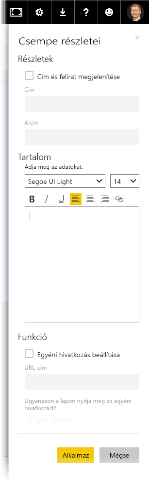

A Power BI szolgáltatásban az irányítópult **csempéi* létrehozás után szerkeszthetők is, ha formázási változtatásokat szeretne elvégezni rajtuk.

Ha módosítani szeretné, mutasson a csempére, és válassza a három pont jelet. Ekkor megjelennek azok az ikonok, amelyekkel módosíthatja a csempét.

A **toll** ikon kiválasztására a **Csempe részletei** panel jelenik meg. Itt módosíthatja a csempe **Címét**, **Alcímét**, meghatározhatja, hogy megjelenjen-e a legutóbbi frissítés dátuma és ideje, egyéni hivatkozást adhat meg, és más beállítást is elvégezhet.

Amikor egy irányítópult csempéjére kattint, alapértelmezés szerint a forrásként használt jelentéshez jut. Ez a viselkedés úgy változtatható meg, ha a **Csempe részletei** panelen található **Egyéni hivatkozás beállítása** területen megadja a kívánt hivatkozást. Ez a funkció egyebek mellett akkor lehet hasznos, ha a felhasználókat a cég weblapjára szeretné irányítani, amikor a logóra kattintanak.

## Widget felvétele az irányítópultra
Az irányítópulthoz widgetet is hozzá lehet adni. A **widget** az irányítópult speciális csempéje, amely nem vizualizációt, hanem más elemeket tartalmaz (például képet, online videót, szövegmezőt vagy formázott webes tartalmat).

Az irányítópult bal felső részén látható Widget hozzáadása hivatkozásra kattintva megjeleníthető az **Egy widget hozzáadása** párbeszédpanel.

Ha például szövegmezőt vesz fel, a jobb oldalon megjelenik a **Csempe részletei** panel, ahol olyan adatokat szerkeszthet, amelyeket más csempék esetében is. A widgetek esetében azonban elérhető egy olyan szakasz is, ahol a widget tartalmát szerkesztheti (például formázott szöveges szerkesztő a szövegmezőhöz).

A widgeteknek és a csempék szerkesztési lehetőségének köszönhetően az irányítópult saját igények szerint is testre szabható.

