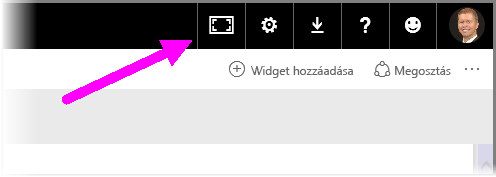
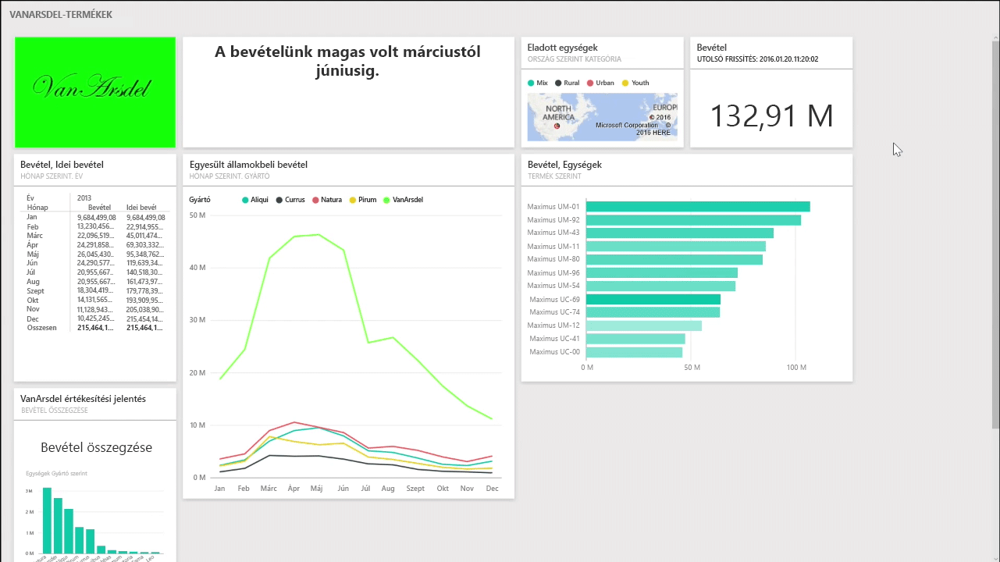
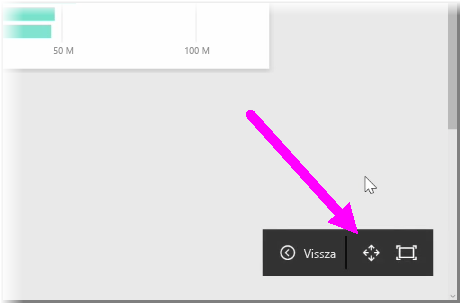
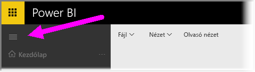

Előfordulhat, hogy időnként saját irányítópultok létrehozásakor több tartalommal rendelkezik mint ami a vászonra kifér. Néhány megoldás segíthet kezelni az irányítópult területének megjelenését, hogy az irányítópult teljes tartalmát áttekinthessem.

A legegyszerűbb módszer a teljes irányítópult egy képernyőn való megjelenítéséhez a **Teljes képernyős mód** gombra kattintás az irányítópult jobb felső sarkában.

A **Teljes képernyős mód** gomb teljes képernyős módba helyezi a böngészőt, eltávolítva az összes Chrome-elemet az irányítópult körül, és növelve a megtekinthető terület mennyiségét.

A **Teljes képernyős módon** belül kiválaszthatja a **Képernyőhöz igazítás** lehetőséget az összes csempe zsugorításához, hogy azok elférjenek egyetlen képernyőn, görgetősáv nélkül. Ezt gyakran *tv-módnak* nevezik, és akkor hasznos, ha az irányítópultok bemutató tartására vagy előcsarnokbeli monitorokon való megjelenítésre szolgálnak.

Másik lehetőség az irányítópult-terület kezelésére a lap bal oldalán látható navigációs ablaktábla összecsukása a hamburger ikonra kattintva. A navigációs ablaktábla kibontásához kattintson ismét az ikonra.

A következőnek az URL-cím végéhez fűzésével biztosíthatja, hogy egy irányítópulton mindig legyen összecsukott navigációs sáv:

> ?collapseNavigation=true
> 
> 

A hivatkozásra kattintva a felhasználók az összecsukott navigációs sávval nyithatják meg az irányítópultot.

