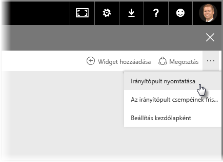
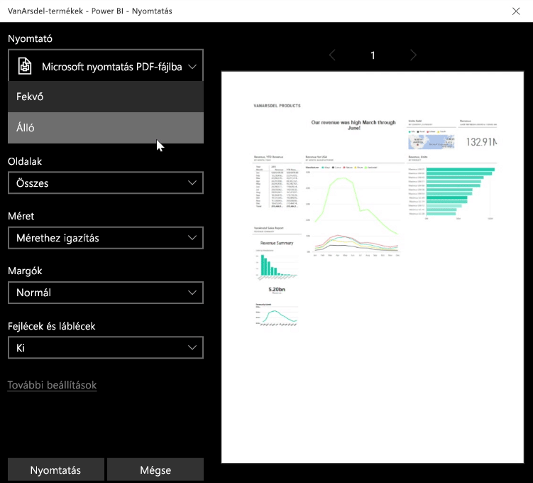
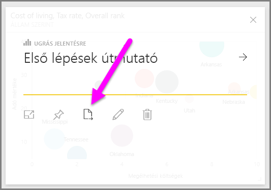
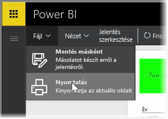

Előfordulhat, hogy szeretne magával vinni egy kinyomtatott jelentést vagy irányítópultot az értekezletre, vagy szeretné azt megosztani másokkal. A Power BI szolgáltatásban többféle lehetőség van a vizualizációk kinyomtatására.

A Power BI szolgáltatásban válassza a szolgáltatás jobb felső részén található három pontot, majd válassza az **Irányítópult nyomtatása** elemet.

A megjelenő **Nyomtatás** párbeszédpanelen választhatja ki azt a nyomtatót, amelyre el szeretné küldeni az irányítópultot, valamint itt adhatja meg a normál nyomtatási beállításokat is (például *álló* vagy *fekvő* elrendezés).

## Adatok exportálása vizualizációból
Adatokat is exportálhat a Power BI szolgáltatás bármely vizualizációjából. Csak válassza az adott vizualizáción látható három pontot, majd Válassza az **Adatok exportálása** gombot (a középső gomb). Ha így tesz, létrejön egy .CSV-fájl, amely letölthető a helyi számítógépre, majd egy értesítés jelenik meg a böngészőben arról, hogy a letöltés befejeződött (a böngésző által kezdeményezett bármely letöltéshez hasonlóan).

Közvetlenül is nyomtathat vagy exportálhat egy jelentésből. A Power BI szolgáltatás bármely jelentésének megtekintésekor a **Fájl > Nyomtatás** elem kiválasztásával nyithatja meg a nyomtatási párbeszédpanelt.

Az irányítópulthoz hasonlóan adatokat exportálhat egy jelentés vizualizációjából is az adott vizualizáció exportálási gombjának kiválasztásával.

