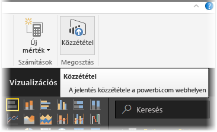
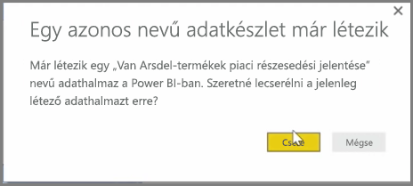
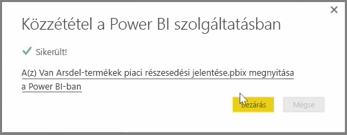

A Power BI Desktopban létrehozott és a Power BI szolgáltatásba korábban közzétett jelentéseket és adatkészleteket frissíteni is tudja. Ehhez válassza a szalagon **Kezdőlap** > **Közzététel** lehetőséget.

Amikor meglévő jelentést tesz közzé a Power BI szolgáltatásban, meg kell erősítenie, hogy a korábbi adatkészletet és jelentéseket cserélni kívánja a módosított verzióra.

Ha a **Csere** lehetőséget választja, a Power BI szolgáltatásban található adatkészleteket és jelentéseket a rendszer felülírja a Power BI Desktop-fájl legfrissebb verziójának adatkészleteivel és jelentéseivel.

Mint minden más **Közzététel** esetén, ilyenkor is egy párbeszédpanel tájékoztatja, hogy a közzététel sikeres volt, és megkapja a hivatkozást is, amely a jelentés Power BI szolgáltatásban levő példányára mutat.

Ezzel a módszerrel manuálisan frissítheti adatait. Emellett lehetőség van az adatkészletek és jelentések automatikus frissítésére is – ezt egy másik témakörben mutatjuk majd be.

