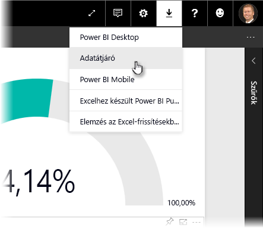
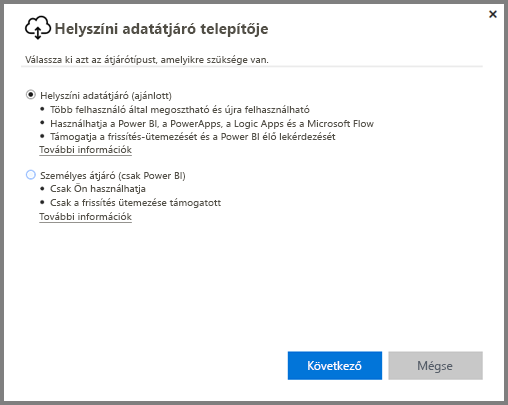
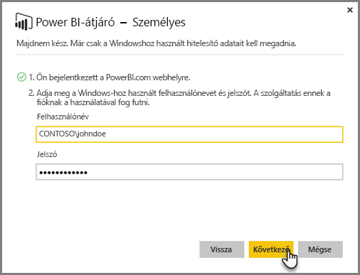
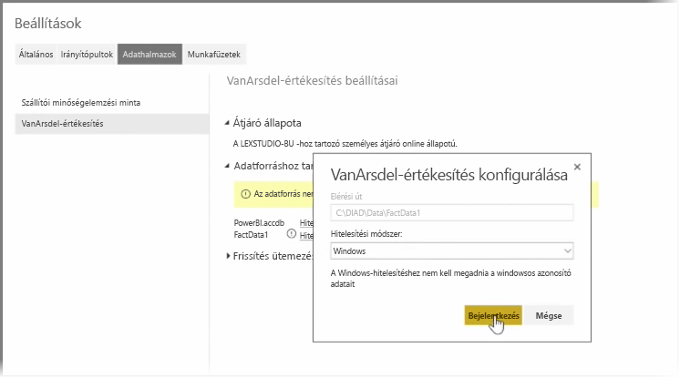

Az előző témakörökben áttekintettük, hogyan használható a Power BI adatforrásokhoz történő csatlakozásra, és hogyan frissíthetők a Power BI szolgáltatásba feltöltött adatkészletek manuálisan. Ugyanakkor, ha nem szeretne minden adatváltozás alkalmával mindent frissíteni, a Power BI segítségével beállíthat ütemezett frissítést is, amely kapcsolódik az adatforrásokhoz, és automatikusan közzéteszi a változásokat a Power BI szolgáltatásban. Bármilyen helyi adatforrást, többek között Excel-fájlokat, Access-adatbázisokat, SQL-adatbázisokat és sok minden mást is csatlakoztathat így a szolgáltatáshoz.

A helyszíni adatforrások Power BI szolgáltatáshoz történő csatlakoztatását lehetővé tevő rendszer neve **adatátjáró**. Az adatátjáró egy, a felhasználó számítógépén futó kis alkalmazás. Előre összeállított ütemezés alapján kapcsolódik az adatokhoz, összegyűjti a frissítéseket, és elküldi azokat a Power BI szolgáltatásba. A **személyes átjáró** az **adatátjáró** olyan verziója, amelyet nem szükséges a rendszergazdának konfigurálnia.

>[!NOTE]
>A **személyes átjáró** megfelelő működéséhez *arra van szükség*, hogy a Power BI személyes átjárót futtató számítógép be legyen kapcsolva, és csatlakozzon az internethez.
> 

A **személyes átjáró** beállításához először jelentkezzen be a Power BI szolgáltatásba. Válassza ki a **Letöltés** ikont a képernyő jobb felső sarkából, majd válassza az **Data Gateway** menüelemet.

Ekkor a rendszer egy olyan weboldalra lépteti, ahonnan kiválaszthatja a **Power BI Gateway – Personal** lehetőséget, ahogy az alább látható.

A letöltés befejeződésekor indítsa el az alkalmazást, és hajtsa végre a telepítő varázslóban megjelenő lépéseket.

Ezután a rendszer kérni fogja, hogy az átjáró beállításához indítsa el a beállítás varázslót.

Először be kell majd jelentkeznie saját Power BI-fiókjába, majd számítógépe Windows-fiókjába, mivel az átjáró szolgáltatás az Ön fiókja alatt fog futni.

Térjen vissza a Power BI szolgáltatásba. Kattintson a három pont menüelemre a frissíteni kívánt adatkészlet mellett, majd kattintson a **Frissítés ütemezése** lehetőségre. Ekkor megnyílik a **Beállítások frissítése** lap. A Power BI észleli, hogy telepített egy **személyes átjárót**, és jelzi annak állapotát.

Válassza ki a **Hitelesítő adatok szerkesztése** lehetőséget a megfelelő adatforrások mellett, és állítsa be a hitelesítést.

Végül az automatikus frissítések aktiválásához adja meg a beállításokat a **Frissítés ütemezése** alatt, és állítsa be, hogy azokra mikor és milyen gyakorisággal kerüljön sor.

Ezzel készen is van. Az ütemezett időpontokban a Power BI a megadott hitelesítési adatokat használva kapcsolódik a **személyes átjárót** futtató számítógéphez, és az ütemezésnek megfelelően frissíti a jelentéseket és az adatkészleteket. Amikor legközelebb a Power BI felületére lép, az iránytópultok, jelentések és adatkészletek a legutóbbi ütemezett frissítésnek megfelelő adatokat fogják tükrözni.

## Következő lépések
**Gratulálunk!** Ön teljesítette a Power BI **Interaktív tanulás** oktatóanyagának **Adatok feltárása** című fejezetét. A Power BI szolgáltatás számtalan izgalmas módszert kínál az adatok feltárására, az összefüggések megosztására és a vizualizációs elemek alakítására. A módszerek mindegyike elérhető böngészőből, egy olyan szolgáltatásból amely bárhonnan elérhető.

A Power BI egyik hatékony és jól ismert partnere az **Excel**. A Power BI-t és az Excel-t úgy tervezték, hogy jól működjenek együtt. A munkafüzetek egyszerűen beemelhetők és gond nélkül használhatók a Power BI-ban.

Mennyire egyszerűen? **A Power BI és az Excel** című következő szakasz pontosan erről szól.

Találkozunk a következő szakaszban!

