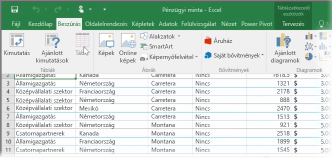
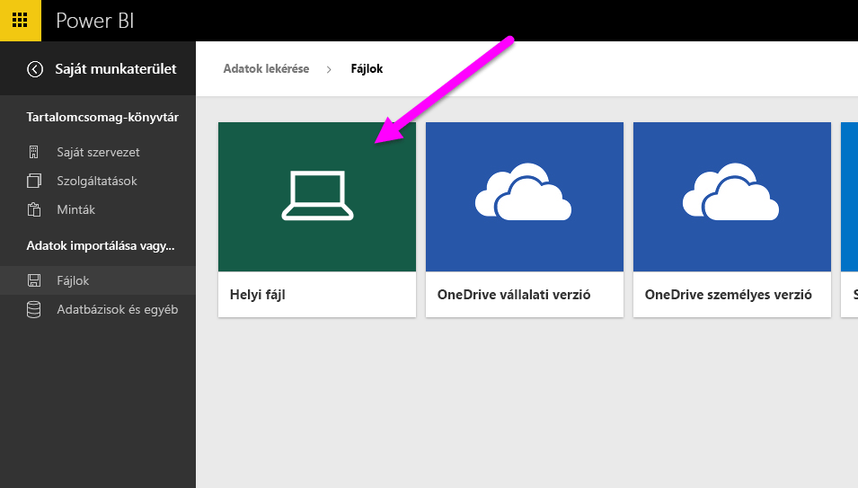

Ez a témakör elsőként azt tárgyalja, hogyan tölthető fel egy egyetlen **táblázatot** tartalmazó Excel-munkafüzetfájl a helyi meghajtóról a Power BI-ba. Ez után megtudhatja, hogyan fedezheti fel a táblázat adatait a Power BI-ban egy jelentést létrehozva.

## Az adatok táblázatként legyenek formázva
Ahhoz, hogy a Power BI importálni tudja a munkafüzetben lévő adatokat, azokat **táblázatként kell formázni**. Nem nehéz. Az Excelben jelöljön ki egy cellatartományt, majd az Excel **Beszúrás** lapján kattintson a **Táblázat** ikonra.

Ajánlott minden oszlopnak használható nevet adni. Így könnyebb megtalálni a kívánt adatokat a Power BI-beli jelentések létrehozásakor.

## Importálás helyi meghajtóról
Bárhol tárolja a fájljait, a Power BI megkönnyíti az importálásukat. A Power BI-ban az **Adatok lekérése** > **Fájlok** > **Helyi fájl** lehetőséggel megkereshető és kijelölhető a kívánt Excel-fájl.

A Power BI-ba történő importálás után megkezdheti a jelentések készítését.

A fájloknak természetesen nem kell helyi meghajtón lenniük. Még jobb, ha a fájljait a OneDrive-ra vagy SharePoint-csoportwebhelyre menti. Erről egy későbbi témakör szól részletesebben.

## A jelentéskészítés megkezdése
A munkafüzet adatainak importálása után egy adatkészlet jön létre a Power BI-ban. Az **Adatkészletek** alatt fog megjelenni. Most már megkezdheti az adatok felfedezését szolgáló jelentések és irányítópultok létrehozását. Csak kattintson az adatkészlet melletti **Menü megnyitása** ikonra, majd a **Vizsgálat** elemre. Megjelenik egy új, üres jelentésvászon. A jobb oldalon, a **Mezők** alatt a táblázatok és oszlopok nevei láthatók. Egyszerűen jelölje ki a mezőket, amelyekhez új képi megjelenítést kíván létrehozni a vásznon.

A **Vizualizációk** alatt módosíthatja a megjelenítés típusát, **szűrőket** alkalmazhat, és más tulajdonságokat is beállíthat.

