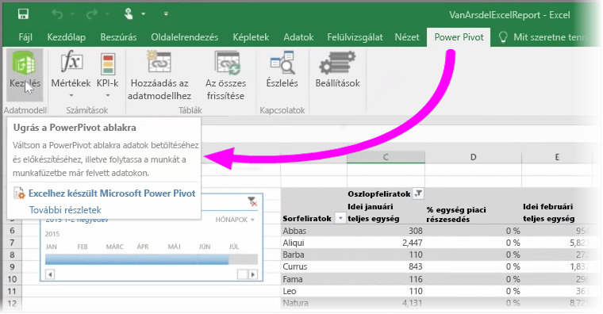

Ha az Excel speciális BI-funkcióit használja, mint a **Power Query** (az Excel 2016-ban **Beolvasás és átalakítás**) az adatok lekérdezéséhez és betöltéséhez, a **Power Pivot** a hatékony adatmodellek létrehozásához, vagy a **Power View** a dinamikus jelentésekhez, akkor ezeket is importálhatja a Power BI-ba.

Ha a **Power Pivotot** használja a több kapcsolódó táblát, mértékeket, számított oszlopokat és hierarchiákat használó fejlett adatmodellekhez, a Power BI ezeket is importálni fogja.

Az sem jelent problémát, ha munkafüzete **Power View-lapokat** tartalmaz. A Power BI új **Jelentésként** hozza létre őket ismét a Power BI-ban. És máris elkezdheti a vizualizációk rögzítését az irányítópultokon.

Íme a Power BI egyik nagyszerű funkciója: ha a Power Query vagy a Power Pivot segítségével csatlakozik a külső adatforrásokhoz, kérdezi és tölti le azokat, a munkafüzet Power BI-ba történő importálása után máris beállíthatja az **ütemezett frissítést**. Az ütemezett frissítés révén a Power BI a munkafüzetben található csatlakozási információt fogja felhasználni ahhoz, hogy közvetlenül csatlakozzon a módosított adatokhoz, lekérdezze és letöltse őket. A jelentések vizualizációi szintén automatikusan frissülnek.

