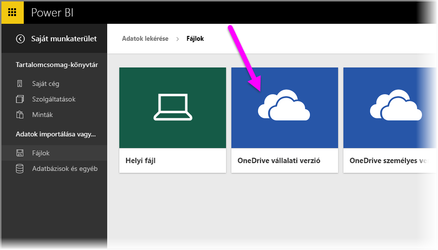
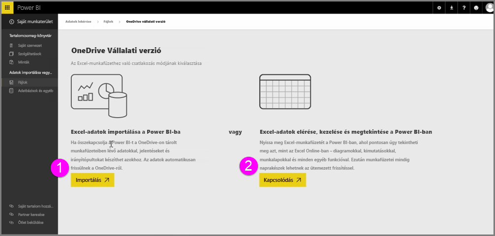
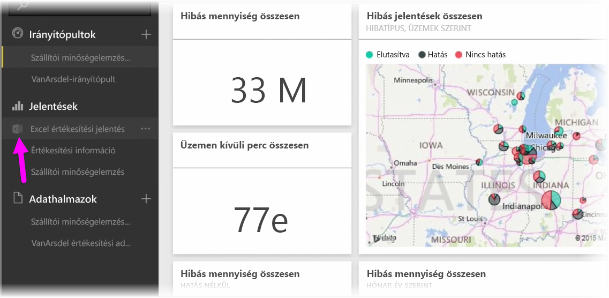
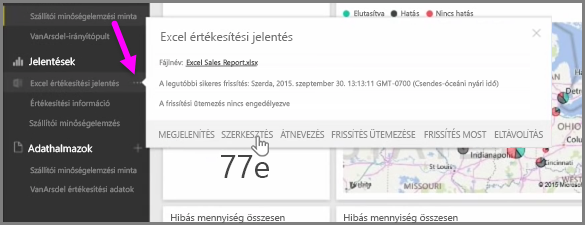

Zökkenőmentes integráció a Power BI és az Excel között az Excel-munkafüzetek a OneDrive-ba való mentésekor.

Mivel a OneDrive egy felhőszolgáltatás – csakúgy, mint a Power BI –, közte és a Power BI között élő kapcsolat van. Ha módosít egy munkafüzetet a OneDrive-ban, a módosításokat *automatikusan szinkronizálja* a Power BI. A jelentések és az irányítópultok vizualizációi így mindig naprakészek. Ha a munkafüzet külső adatforrásokhoz kapcsolódik, például egy adatbázishoz vagy egy OData-adatcsatornához, a Power BI **Frissítés ütemezése** funkciójával frissítéseket kereshet. Kérdéseket szeretne feltenni a munkafüzete adataival kapcsolatban? Ezt is megteheti. A Power BI **Q&A** funkciója éppen ezt a célt szolgálja.

Az Excel-fájlokat kétféleképpen csatlakoztathatja a OneDrive Vállalati verzióhoz:

1. Excel-adatok importálása a Power BI szolgáltatásba
2. Excel-adatok elérése, kezelése és megtekintése a Power BI-ban

### Excel-adatok importálása a Power BI szolgáltatásba
Amikor Excel-adatokat importál a Power BI szolgáltatásba, a munkafüzet táblázatadatai a Power BI egy új adatkészletében jelennek meg. Ha a munkafüzet rendelkezik egy **Power View** nézetet tartalmazó lappal, a Power BI azokat is importálja, és automatikusan létrehozza az új jelentéseket.

A Power BI megőrzi a kapcsolatot a OneDrive Vállalati verzión tárolt munkafüzettel. Ha módosítja a munkafüzetet, a mentés után a Power BI egy órán belül *automatikusan szinkronizálja** az adatokat. Ha a munkafüzet külső adatforrásokhoz kapcsolódik, ütemezett frissítést állíthat be, a Power BI-adatkészlet így mindig naprakész marad. Mivel a Power BI jelentéseinek és irányítópultjainak vizualizációi az adatkészlet adatait használják, a lekérdezéseket villámgyorsan elvégezheti.

### Excel-adatok elérése, kezelése és megtekintése a Power BI-ban
Ha az Excel-munkafüzethez csatlakozik, zökkenőmentesen dolgozhat vele mind az Excelben, mind a Power BI-ban. A csatlakozás után a munkafüzet jelentése mellett egy apró Excel-ikon jelenik meg.

A jelentésben megjelenik az Excel-munkafüzet a Power BI felületén, ugyanúgy, ahogyan az **Excel Online-ban** is megjelenne. A munkalapok az Excel Online-ban való megtekintéséhez és szerkesztéséhez válassza a Szerkesztés elemet a három pontra kattintva. A módosítások elvégzése után az irányítópulton rögzített vizualizációk automatikusan frissülnek.

A Power BI-ban nem jön létre adatkészlet. Minden adat a OneDrive-ban található munkafüzetben marad. Ennek a megoldásnak számos előnye van, többek között az, hogy **ütemezett frissítést** állíthat be, ha a munkafüzet külső adatforrásokhoz kapcsolódik. Különböző elemeket választhat ki, például kimutatásokat és diagramokat, amelyeket **rögzíthet** a Power BI irányítópultjain. A módosítások automatikusan érvénybe lépnek a Power BI-ban is. A Power BI nagyszerű **Q&A** funkciójával pedig a munkafüzet adataival kapcsolatos kérdéseket tehet fel.  

