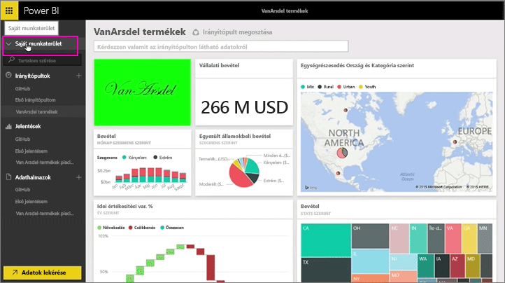
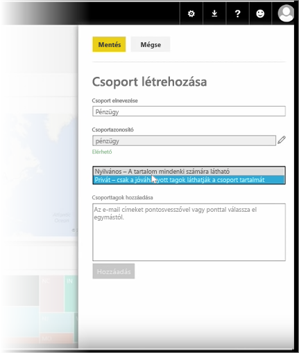
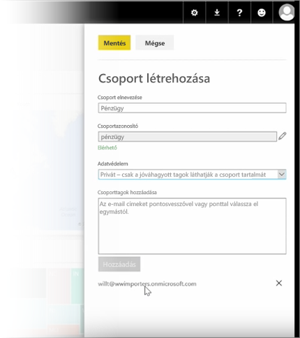

Ebben a leckében először létrehozunk egy *csoportot*. A **csoport** határozza meg azon felhasználókat, akik hozzáférhetnek a megadott irányítópultokhoz, jelentésekhez és adatokhoz.

A csoportok a Power BI-ban az Office 365 csoportjain alapulnak, így ha Office 365-csoportokat használt a csoport e-mailjeinek, naptárának és dokumentumainak kezeléséhez, látni fogja, hogy a Power BI ugyanazon szolgáltatásokon felül többet nyújt. Amikor a Power BI-ban létrehoz egy csoportot, valójában Office 365-csoportot hoz létre.

A modulban egy pénzügyi csoport létrehozásának forgatókönyvét fogjuk használni. Bemutatjuk a csoport beállításának, az irányítópultok, jelentések és adatkészletek a csoportban való megosztásának, és a csoport elemeihez hozzáféréssel rendelkező tagok hozzáadásának módját.

A kiindulópont a Saját munkaterület. Ezek azok az irányítópultok, jelentések és adatkészletek, amelyeket létrehoztam, vagy amelyeket valaki velem megosztott.

Ha kiterjesztem a Saját munkaterületet, kiválaszthatom a **Csoport létrehozása** lehetőséget.

Itt adhatok neki egy nevet. A forgatókönyvet vagy egy pénzügyi csoportot használunk, így nevezzük el Pénzügynek. A Power BI ellenőrzi, hogy a név nem létezik a tartományban.

Beállíthatom az adatvédelmi szintet eldöntve, hogy a cégnél bárki láthatja-e a csoport tartalmát, vagy csak a tagjait.

Itt beírom az e-mail-címeket, a biztonsági csoportokat és a terjesztési listákat. Kiválasztom a **Hozzáadás** lehetőséget, hogy a csoport tagjaivá tegyem őket, és mentem a csoportot.

Most pedig lássuk a következő leckét!

