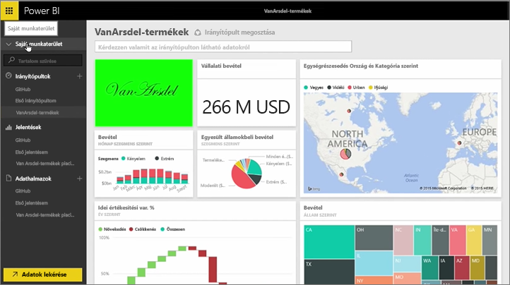
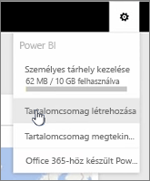
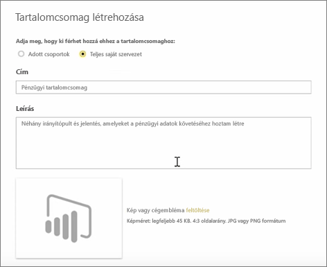
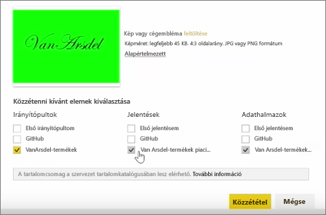

Ebben e leckében egy *tartalomcsomagot* fogunk létrehozni a Power BI-ban már meglévő összetevőkkel, majd pedig megosztjuk a munkatársakkal.

A **Saját munkaterület** részen található egy irányítópult, az alatta lévő jelentés, és az adatkészlet. Ezeket szeretném a munkatársaimmal egy csomagként megosztani, hogy újra felhasználhassák.

Ha kiválasztom a **Beállítások** ikont (a szolgáltatás jobb felső sarkában található fogaskerék), akkor láthatom, hogy mennyi tárhelyet használtam fel, és létrehozhatok egy tartalomcsomagot is.

A megjelenő párbeszédpanelen kiválaszthatom, hogy az adott személyek vagy adott csoportok között szeretném-e elosztani, és címet is adhatok a csomagnak. Érdemes egy részletes leírást is megadni a **Leírás** mezőben, hogy a tartalomcsomagokat tallózó személyek tudják, hogy mit tartalmaz, vagy hogy mire használható.

A párbeszédpanel alján feltölthetek egy képet a tartalomcsomaghoz, majd ezután következik a legfontosabb lépés: kiválasztom az irányítópultot, amelyet szeretnék elhelyezni a tartalomcsomagban, amelynek hatására a Power BI automatikusan kiválasztja az irányítópultban használt jelentést és adatkészletet. Nem távolíthatom el a pipát a jelentés vagy az adatkészlet mellől, mert ezekre szükség van a csomagban elhelyezett irányítópulthoz.

Kiválaszthatnék más irányítópultokat, jelentéseket és adatkészleteket is, de most nem teszem.

Amikor közzéteszem a tartalomcsomagot, akkor az elérhetővé válik a cég tartalomkatalógusában.

Most pedig lássuk a következő leckét!

