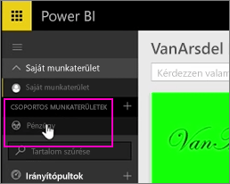
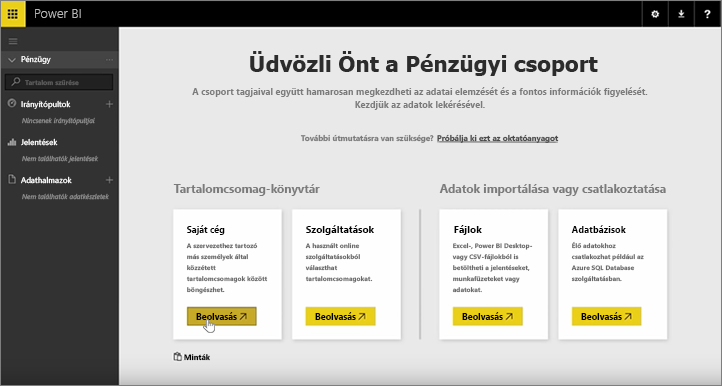
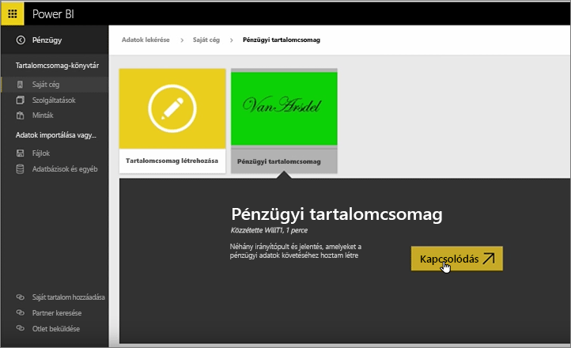
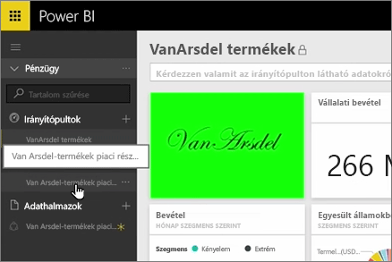
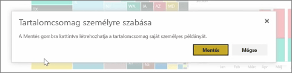
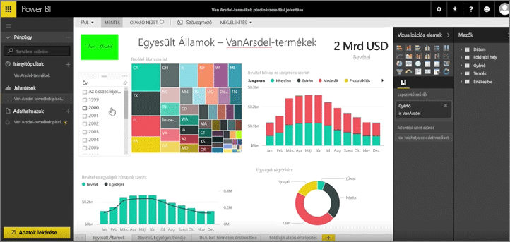

Az eddigi leckékben már létrehozott egy tartalomcsomagot és egy csoportot. Ebben a leckében a tartalomcsomag egy példányát fogja létrehozni a csoport összes tagja számára.

A kiindulópont a Saját munkaterület, ...

... ahonnan visszatér a korábbi leckében létrehozott Üzleti csoporthoz.

A csoportnak egyelőre nincsenek irányítópultjai, jelentései és adatkészletei. A létrehozott tartalomcsomag felhasználása következik. Nem külső szolgáltatásoktól, hanem a saját cégünktől származó tartalomcsomagok közül választunk.

Megvan az egy perce létrehozott tartalomcsomag. Látszik, hogy fontos beszédes címet, leírást és képet adni hozzá, hogy az emberek rátaláljanak. Következhet a csatlakozás.

A Power BI importálja a tartalomcsomagban lévő irányítópultokat, jelentéseket és adatkészleteket.

Az adatkészlet kijelölésekor a Power BI rákérdez a tartalomcsomag testreszabására.

A módosítások a tartalomcsomagról készített másolaton végezhetők el, amelyet le kell választani a tartalomcsomag közzétett változatáról. Ha a tartalomcsomag létrehozója módosítja a közzétett változatot, akkor a saját példány nem frissül automatikusan.

Így viszont szerkeszthető az irányítópult, a jelentés és igény esetén akár az adatkészlet is.

A tartalomcsomagokkal tehát egyszerűen megoldható a cég más alkalmazottai által létrehozott tartalom újrafelhasználása.

Most pedig lássuk a következő leckét!

