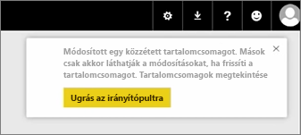
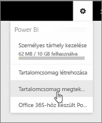
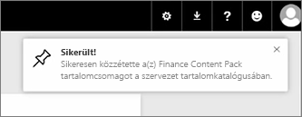

Ebben a leckében a korábban létrehozott kiinduló tartalomcsomag szerkesztése következik. Kiderül, hogy a módosítások hogyan érintik azokat, akik csatlakoztak hozzá.

Az eredeti irányítópult szerkesztése a Saját munkaterületen történik.

Az irányítópultban minden módosításakor figyelmeztetés jelenik meg arról, hogy megváltozott valami, ami egy tartalomcsomagban másokkal is meg van osztva, és hogy frissíteni kell a megosztott változatot.

A beállítások ikon után a **Tartalomcsomag megjelenítése** lehetőséget választva megjelenik a már közzétett tartalomcsomag.

Itt a saját készítésű tartalomcsomag látható. Ez a kis ikon jelzi, hogy valami módosult a tartalomcsomagban, és azt szerkeszteni kell, hogy a módosításokat mások is láthassák.

A **Szerkesztés** lehetőség visszavisz arra a képernyőre, ahol a cím és a leírás szerkeszthető, ezúttal azonban egy **Frissítés** gomb is van rajta. Erre kell kattintani.

A Power BI alkalmazza a módosításokat, és közzéteszi a frissített tartalomcsomagot a tartalomcsomag-katalógusba.

Aki csatlakozott a tartalomcsomaghoz, az értesítést kap annak módosulásáról, és választhat, hogy elfogadja a módosításokat, vagy megtartja a korábbi változatot.

A tartalomcsomag tulajdonosa ezáltal felügyelni tudja a munkatársai által használt verziókat.

