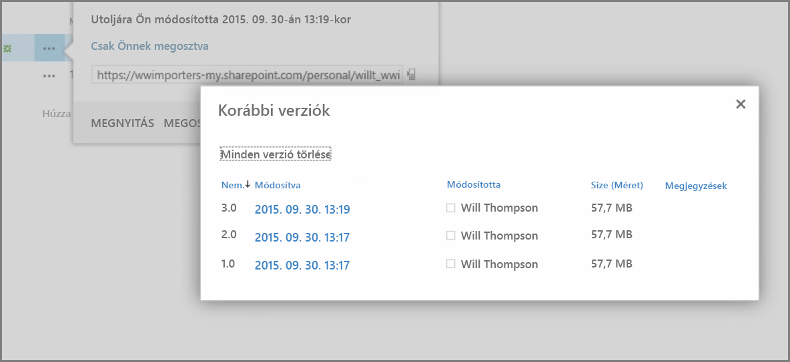
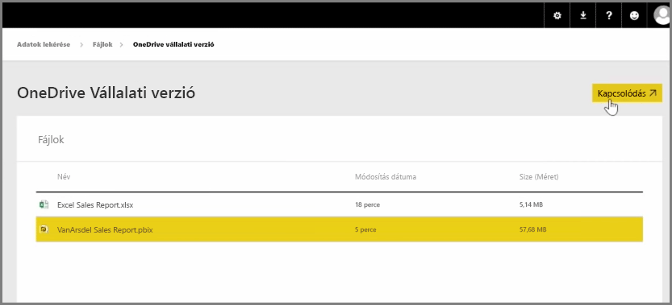
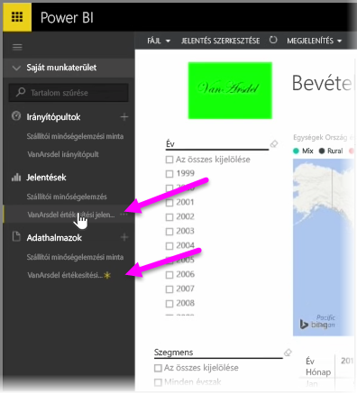

Egy korábbi cikkben áttekinthette, hogy miképpen lehet csoportok létrehozásával segíteni a céget a Power BI-tartalom kezelésében és közös használatában. A Power BI- / Office 365-csoportokat a **OneDrive Vállalati verzió** segítségével is használhatja együttműködésre és megosztásra.

A OneDrive Vállalati verzió a Power BI tartalomforrásaként számos olyan hasznos eszközhöz nyújt hozzáférést, mint a verzióelőzmények. A OneDrive Vállalati verzióból egy Office 365-csoport segítségével meg is oszthatja fájljait, így sokaknak teheti lehetővé a közös munkát ugyanazokon a Power BI- vagy Excel-fájlokon.

Ha a OneDrive Vállalati verzióban kapcsolódni szeretne egy PBIX-fájlhoz (Power BI Desktop), jelentkezzen be a Power BI szolgáltatásba, és kattintson a **Get Data** (Adatok beolvasása) elemre. Az Adatok importálása vagy csatlakoztatása menüpont alatt válassza a **Fájlok** lehetőséget, majd kattintson a **OneDrive Vállalati verzió** elemre. Jelölje ki a választott fájlt, és válassza a **Csatlakozás** lehetőséget.

A tartalom megjelenik a bal oldali navigációs sávon.

Mostantól a**OneDrive Vállalati verzióban** végrehajtott módosítások a Power BI-környezetben is automatikusan megjelennek, és tárolva lesznek a verzióelőzményekben is.

