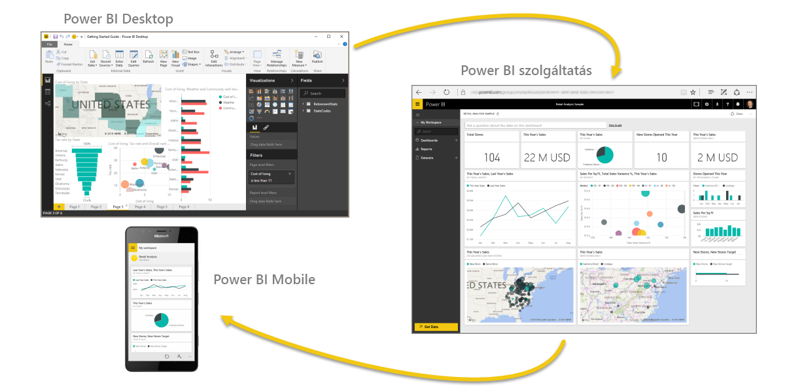
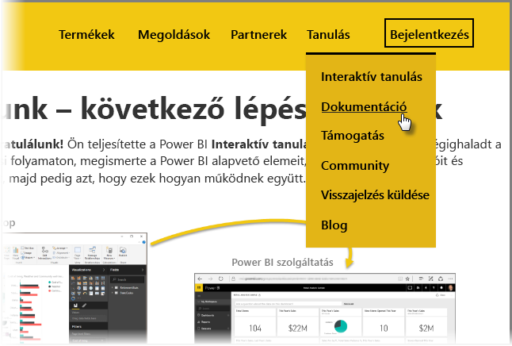

Sikerült! **Gratulálunk!** Ön teljesítette a Power BI **Interaktív tanulás** oktatóanyagát. Ön végighaladt a teljes tanulási folyamaton, megismerte a Power BI alapvető elemeit, majd a szoftver funkcióit és alkotórészeit, majd pedig azt, hogy ezek hogyan működnek együtt.

Ez az oktatóanyag utolsó szakasza (és az utolsó témaköre is, hacsak nem szeretné megismerni a DAX-ot), így szánjon rá egy pár másodpercet és érezze át, milyen sikereket ért el eddig. Szép munka! Most már ismeri az alábbi összes **fontos fogalmat**:

* A [Power BI](0-0-what-is-power-bi.md) bemutatása
* A Power BI [építőelemei](0-0b-building-blocks-power-bi.md)
* Adatok [beolvasása](1-2-connect-to-data-sources-in-power-bi-desktop.md) és [modellezése](2-1-intro-modeling-data.md)
* [Vizualizációk](3-1-intro-visualizations.md)
* [Adatok felfedezése](4-0-intro-power-bi-service.md) a Power BI szolgáltatásban
* Az [Excel és a Power BI](5-1-intro-excel-data.md) együttes használata
* És a munka [közzététele és megosztása](6-0-intro-content-packs-groups.md)

Ez a nagy mennyiségű tudás már mind az Ön fejében van, és készen áll arra, hogy használja is. Itt megtalálható néhány **hivatkozás a letöltésekhez** vagy hogy a böngészőjéből **csatlakozzon a Power BI szolgáltatáshoz**:

* [A Power BI Desktop legújabb verziója](https://powerbi.microsoft.com/desktop) bármikor elérhető
* A [Power BI szolgáltatás](https://powerbi.microsoft.com/) egyszerűen elérhető
* [Power BI mobilalkalmazás](https://powerbi.microsoft.com/mobile/) beszerzése egyetlen koppintással

További **segéd- és referenciaanyagok** is elérhetők. Csak válassza a lap tetején a **További tudnivalók > Dokumentáció** menüpontot a Power BI széles körű referenciaanyagainak megtekintéséhez.

Reméljük örömét lelte a **Power BI interaktív tanulás** oktatóanyagában. Sok sikert kívánunk! Legyen minden Power BI-vizualizációja magával ragadó és lenyűgöző.

## Még egy szakasz a DAX-felhasználóknak
Szeretne még többet tudni? Érdekli, hogyan lehet a Power BI-ban a **DAX (Data Analysis Expressions)** használatával egyéni oszlopokat vagy táblákat létrehozni, szűrni vagy használni? Van még egy szakasz azoknak, akik kódolni is szeretnének a Power BI-ban, és ez a szakasz **A DAX bemutatása** címet kapta. Vessen rá egy pillantást, ha felkeltette az érdeklődését – ez is ugyanolyan barátságosan közelíti meg a témát, mint az interaktív tanulás többi része.

