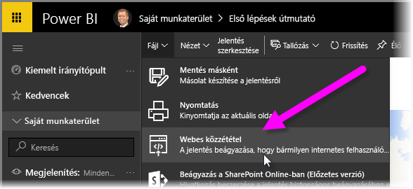
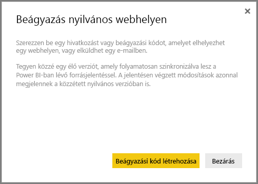
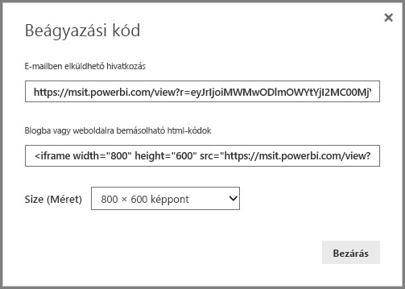
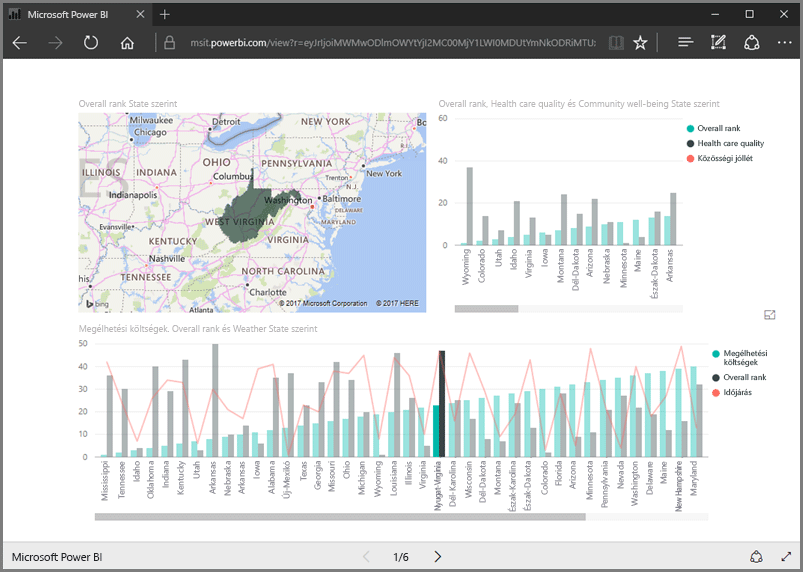
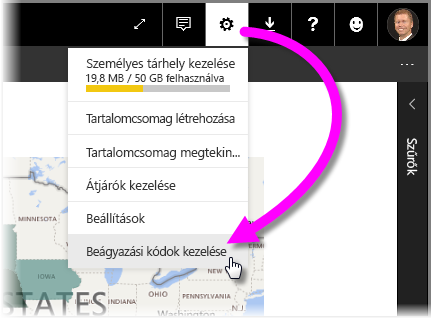
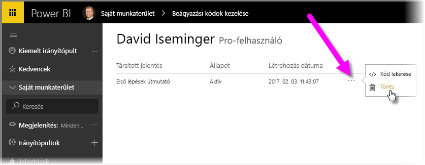

Ez a lecke egy Power BI-jelentésnek egy weboldalon keresztül vagy e-mailben történő megosztását mutatja be néhány egyszerű lépésben. Ez a **webes közzététel** néven is ismert Power BI-funkció könnyen használható és felügyelhető.

Jelölje ki a megosztani kívánt jelentést a Power BI-ban, hogy az megjelenjen a vásznon. Ekkor válassza a menüből a **Fájl > Webes közzététel** pontot.

A megjelenő párbeszédablak tájékoztatja arról, hogy kapni fog egy *beágyazási kódot*, amellyel a jelentés elhelyezhető egy weboldalon vagy e-mailben.

A **Beágyazási kód létrehozása** lehetőség kiválasztása után a Power BI újabb párbeszédablakot nyit meg, amely ismételten figyelmezteti, hogy adatokat készül megosztani mindenkivel az Interneten. Győződjön meg arról, hogy ez nem probléma!

A Power BI két hivatkozást ad meg egy párbeszédablakban:

* E-mailben megosztható hivatkozás, amely a jelentést weboldalként jeleníti meg
* HTML-kód (hivatkozás egy IFrame-keretben), amellyel a jelentés közvetlenül beágyazható egy weboldalba

A HTML-hivatkozás esetében a beágyazott jelentés mérete kiválasztható az előre megadott értékek közül, vagy egyénileg is beállítható az IFrame-kódot módosítva.

Az e-mail-hivatkozást elég bemásolni egy böngészőbe, és a jelentés weboldalként jelenik meg. A weboldal ugyanúgy kezelhető, mint a Power BI-ban megtekintett jelentés. A következő kép a **Webes közzététel** oldalt mutatja be, amelynél a hivatkozást közvetlenül a párbeszédablakból másolták át a böngészőbe:

Az IFrame-hivatkozás egy blogbejegyzésbe, weboldalba vagy a Swaybe is beilleszthető.

Törölni szeretné a létrehozott beágyazási kódot? Nem gond. Válassza a Power BI jobb felső sarokban lévő **fogaskerékikont**, majd a **Beágyazási kódok kezelése** lehetőséget.

A Power BI munkaterületén megjelennek a létrehozott beágyazási kódok (az alábbi ábrán csak egy). A három pontra kattintva kiválaszthatja, hogy a beágyazási kód forrását szeretné megkapni, vagy teljesen törölni szeretné a beágyazási kódot.

Mindössze ennyiből áll egy Power BI-jelentés közzététele a weben, és megosztása az egész világgal. Egyszerű!

