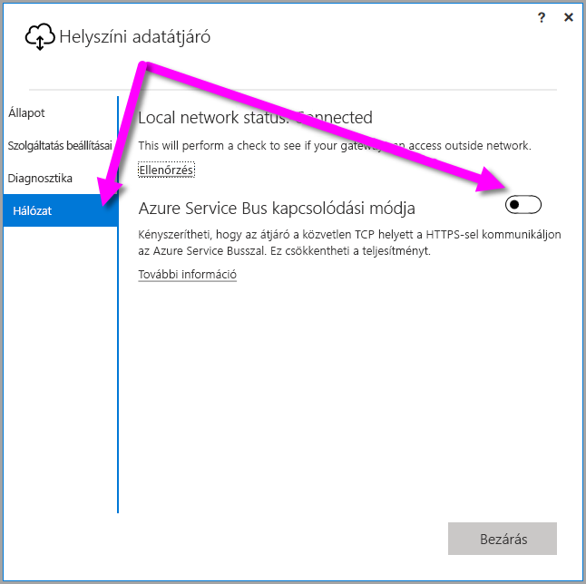
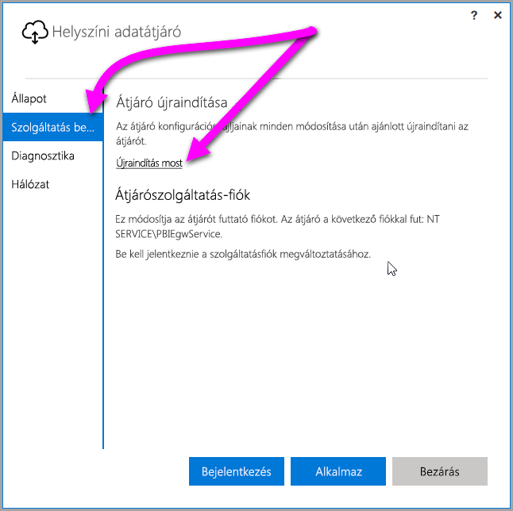

## <a name="sign-in-account"></a>Bejelentkezési fiók
A felhasználók munkahelyi vagy iskolai fiókjukkal jelentkeznek be. Ez az Ön céges fiókja. Ha feliratkozott egy Office 365-ajánlatra, és nem adta meg a tényleges munkahelyi e-mail-címét, lehetséges, hogy így fog kinézni a cím: nancy@contoso.onmicrosoft.com. A felhőszolgáltatásban lévő fiókját egy Azure Active Directory-bérlő tárolja. A legtöbb esetben AAD-fiókja egyszerű felhasználóneve megegyezik az e-mail-címével.

## <a name="windows-service-account"></a>Windows-szolgáltatásfiók
A helyszíni adatátjáró az *NT SERVICE\PBIEgwService* használatára van konfigurálva a Windows-szolgáltatás bejelentkezési hitelesítő adataihoz. Alapértelmezés szerint bejelentkezhet szolgáltatásként. Ez a gép környezetére vonatkozik, amelyen az átjárót telepíti.

> [!NOTE]
> Ha a személyes módot választotta, a Windows-szolgáltatásfiókot külön kell konfigurálnia.
> 
> 

Ez nem a helyszíni adatforrásokhoz való csatlakozáshoz használt fiók.  Továbbá nem is az iskolai vagy munkahelyi fiókja, amelyet a felhőszolgáltatásokba való jelentkezésre használ.

Amennyiben hitelesítési problémák lépnek fel a proxykiszolgálón, érdemes lehet a Windows-szolgáltatásfiókot egy tartományi felhasználói vagy felügyelt szolgáltatásfiókra cserélni. A fiók módosításáról a [proxy konfigurálásánál](../service-gateway-proxy.md#changing-the-gateway-service-account-to-a-domain-user) olvashat.

## <a name="ports"></a>Portok
Az átjáró kimenő kapcsolatot hoz létre az Azure Service Bus felé. A következő kimenő portokon kommunikál: TCP 443 (alapméretezett), 5671, 5672, 9350–9354.  Az átjáró nem igényel bejövő portokat. [További információ](https://azure.microsoft.com/documentation/articles/service-bus-fundamentals-hybrid-solutions/)

Ajánlott az adatrégió IP-címeit felvenni a tűzfal engedélyezési listájára. [A Microsoft Azure Datacenter IP-címeinek listáját innen töltheti le.](https://www.microsoft.com/download/details.aspx?id=41653) A listát hetente frissítjük. Az átjáró az IP-cím és a teljes tartománynév (FQDN) használatával kommunikál az Azure Service Busszal. Amennyiben kényszeríti az átjáró, hogy HTTPS használatával kommunikáljon, az csak a teljes tartománynevet használja majd, és nem kommunikál az IP-címeken keresztül.

> [!NOTE]
> Az Azure Datacenter listájában szereplő IP-címek a CIDR-jelölésrendszer használatával vannak megadva. Tehát a 10.0.0.0/24 jelölés nem a 10.0.0.0 és 10.0.0.24 közti tartományt jelöli. További információk a [CIDR-jelölésrendszerről](http://whatismyipaddress.com/cidr).
> 
> 

Az átjáró által használt teljes tartománynevek listája az alábbiakban látható.

| Tartománynevek | Kimenő portok | Leírás |
| --- | --- | --- |
| *.download.microsoft.com |80 |A telepítő letöltéséhez használt HTTP-cím. |
| *.powerbi.com |443 |HTTPS |
| *.analysis.windows.net |443 |HTTPS |
| *.login.windows.net |443 |HTTPS |
| *.servicebus.windows.net |5671-5672 |Advanced Message Queueing Protocol (AMQP) |
| *.servicebus.windows.net |443, 9350-9354 |A Service Bus Relay figyelői a TCP-n (443-as portot igényel a hozzáférés-vezérlési token beszerzéséhez) |
| *.frontend.clouddatahub.net |443 |HTTPS |
| *.core.windows.net |443 |HTTPS |
| login.microsoftonline.com |443 |HTTPS |
| *.msftncsi.com |443 |Az internetkapcsolat tesztelésére használatos, ha az átjáró nem érhető el a Power BI szolgáltatással. |
| *.microsoftonline-p.com |443 |Hitelesítésre használható a konfigurációtól függően. |

> [!NOTE]
> A visualstudio.com vagy a visualstudioonline.com webhelyekre irányuló adatforgalmat az App Insights használja, és nem szükséges az átjáró működéséhez.
> 
> 

## <a name="forcing-https-communication-with-azure-service-bus"></a>A HTTPS-kommunikáció kényszerítése az Azure Service Busszal
Kényszerítheti, hogy az átjáró a közvetlen TCP helyett a HTTPS-sel kommunikáljon az Azure Service Busszal. Ez befolyásolhatja a teljesítményt. Ehhez módosítsa a *Microsoft.PowerBI.DataMovement.Pipeline.GatewayCore.dll.config* fájl `AutoDetect` értékét `Https` értékre, ahogyan azt a bekezdés utáni kódrészlet mutatja. Ez a fájl (alapértelmezés szerint) a *C:\Program Files\On-premises data gateway* helyen található.

```
<setting name="ServiceBusSystemConnectivityModeString" serializeAs="String">
    <value>Https</value>
</setting>
```

A *ServiceBusSystemConnectivityModeString* paraméter értéke megkülönbözteti a kis- és nagybetűket. Az érvényes értékek az *AutoDetect* és a *Https*.

Alternatív megoldásként a [2017. márciusi](https://powerbi.microsoft.com/blog/power-bi-gateways-march-update/) kiadástól az átjáró felhasználói felületén is kényszerítheti az átjárót erre a működésre. Az átjáró felhasználói felületén válassza a **Hálózat** lehetőséget, és állítsa az **Azure Service Bus kapcsolódási módja** beállítást **Be** értékűre.



Ha a módosítás után az **Alkalmaz** gombra kattint (a gomb csak akkor jelenik meg, ha valamilyen módosítás történt), az *átjáró Windows-szolgáltatás* automatikusan újraindul, és a változtatás érvénybe lép.

A későbbiekben újraindíthatja az *átjáró Windows-szolgáltatást* a felhasználói felületi párbeszédablakban a **Szolgáltatásbeállítások**, majd az *Újraindítás most* lehetőség kiválasztásával.



## <a name="support-for-tls-1112"></a>A TLS 1.1/1.2 támogatása
A 2017. augusztusi frissítés után a helyszíni adatátjáró alapértelmezés szerint a Transport Layer Security (TLS) 1.1-es vagy 1.2-es verzióját használja a **Power BI szolgáltatással** való kommunikációra. A helyszíni adatátjáró korábbi verziói a TLS 1.0-t használják alapértelmezés szerint. 2018. január 15-étől a TLS 1.0 támogatása megszűnik, így az átjáró nem fog tudni kommunikálni a **Power BI szolgáltatással** a TLS 1.0 használatával. Eddig a határidőig frissítse helyszíni adatátjáróit a 2017. augusztusi vagy újabb kiadásra, hogy az átjárók ezután is megfelelően működjenek.

Fontos megjegyezni, hogy a november 1-je előtt a helyszíni adatátjáró továbbra is támogatja a TLS 1.0-t – az átjáró tartalékként használja. Ahhoz, hogy biztosítsa, hogy az átjárók teljes adatforgalma a TLS 1.1-es vagy 1.2-es verzióját használja (és hogy megakadályozza a TLS 1.0 használatát az átjárón), a következő beállításkulcsokat kell megadnia vagy módosítania az átjárószolgáltatáson futó gépen:

        [HKEY_LOCAL_MACHINE\SOFTWARE\Microsoft\.NETFramework\v4.0.30319]"SchUseStrongCrypto"=dword:00000001
        [HKEY_LOCAL_MACHINE\SOFTWARE\Wow6432Node\Microsoft\.NETFramework\v4.0.30319]"SchUseStrongCrypto"=dword:00000001

> [!NOTE]
> A beállításkulcsok hozzáadásával vagy módosításával a módosítások érvényesek lesznek az összes .NET-alkalmazásra. További információkat a TLS-t vagy az egyéb alkalmazásokat érintő beállításjegyzék-módosításokról [a Transport Layer Security (TLS) beállításjegyzék-módosításaival](https://docs.microsoft.com/windows-server/security/tls/tls-registry-settings) kapcsolatos cikkben olvashat.
> 
> 

## <a name="how-to-restart-the-gateway"></a>Az átjáró újraindítása
Az átjáró Windows-szolgáltatásként fut, ezért a többi Windows-szolgáltatáshoz hasonlóan indítható el vagy állítható le. Többféle módon indíthatja el vagy állíthatja le. A parancssorból az eljárás a következő:

1. Nyisson meg egy rendszergazdai jogú parancssort azon a gépen, amelyen az átjáró fut.
2. A következő paranccsal állítsa le a szolgáltatást.
   
   net stop PBIEgwService
3. A következő paranccsal indítsa el a szolgáltatást.
   
   net start PBIEgwService

