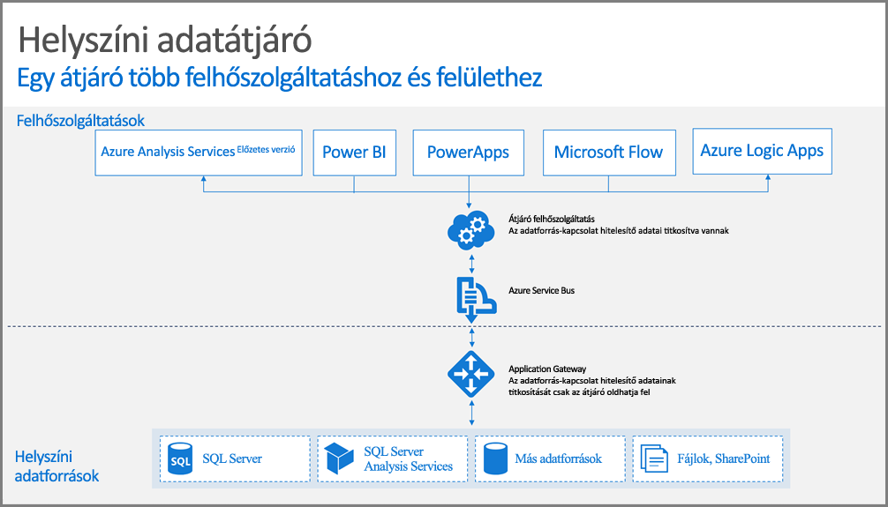

## Az átjáró működése

Először tekintsük át azt, hogy mi történik, ha a felhasználó olyan elemmel kommunikál, amely egy helyszíni adatforráshoz van csatlakoztatva. 

> [!NOTE]
> A Power BI esetén be kell állítania egy adatforrást az átjáróhoz.
> 
> 

1. A felhőszolgáltatás egy lekérdezést hoz létre a helyszíni adatforrás titkosított hitelesítő adataival együtt, majd feldolgozásra elküldi azt az átjáróhoz tartozó üzenetsorba.
2. Az átjáró felhőszolgáltatása elvégzi a lekérdezés elemzését, majd elküldi a kérést az [Azure Service Bus](https://azure.microsoft.com/documentation/services/service-bus/) részére.
3. A helyszíni adatátjáró lekérdezi a függőben lévő kéréseket az [Azure Service Busról](https://azure.microsoft.com/documentation/services/service-bus/).
4. Az átjáróhoz beérkezik a lekérdezés, az elvégzi a hitelesítő adatok visszafejtését, majd összekapcsolja az adatforrás(oka)t ezekkel a hitelesítő adatokkal.
5. A futtatáshoz az átjáró a lekérdezést elküldi az adatforrásnak.
6. A futtatás eredményeit az adatforrás visszaküldi az átjárónak, majd a felhőszolgáltatás felületére. A szolgáltatás ezt követően ezekkel az eredményekkel dolgozik.

