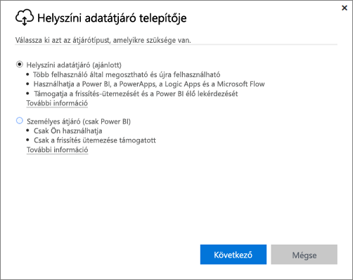
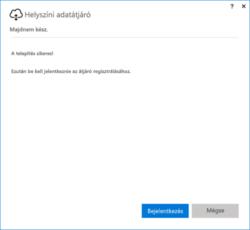
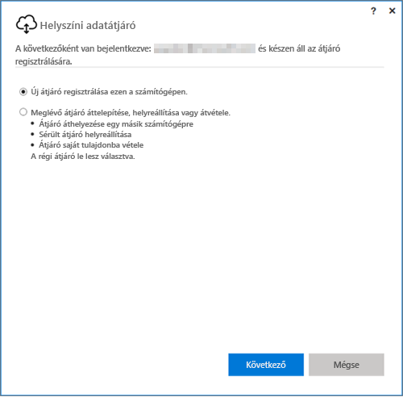
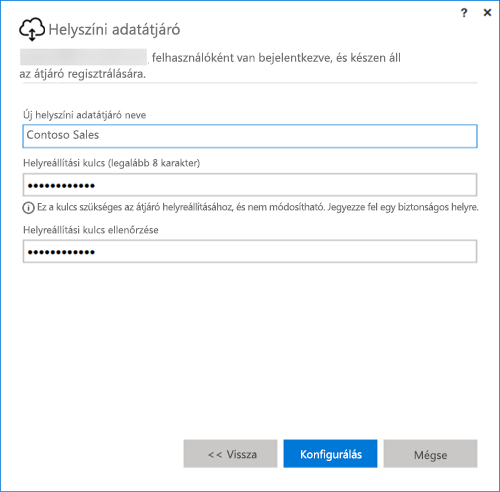

## A helyszíni adatátjáró telepítése
Az adatátjáró a számítógépre telepíthető, és azon fut. Az átjárót olyan gépre érdemes telepíteni, amely folyamatosan működhet.

> [!NOTE]
> Az átjáró csak 64 bites Windows operációs rendszereken támogatott.
> 
> 

A Power BI esetében az átjáró üzemmódja az első dolog, amelyet be kell állítani.

* **Helyszíni adatátjáró:** Az ilyen módban üzemelő átjárókat több felhasználó egyszerre használhatja. Az ilyen átjárókat a Power BI, a PowerApps, a Flow és a Logic Apps is képes használni. A Power BI esetében ez az ütemezett frissítés és a DirectQuery támogatását is magában foglalja.
* **Személyes:** Az ilyen átjáró csak a Power BI-jal működik, és az egyes felhasználók rendszergazdai konfigurálás nélkül használhatják. Az ilyen átjáró csak igény szerinti és ütemezett frissítéshez használható. Ennek a beállításnak a kiválasztása elindítja a személyes átjáró telepítését.

Az átjáró üzemmódjainak telepítésével kapcsolatban érdemes megjegyezni a következőket:

* mindkettő típusú átjáró használatához 64 bites Windows operációs rendszer szükséges,
* az átjárók tartományvezérlőre nem telepíthetőek,
* Egyazon számítógépre két helyszíni adatátjáró telepíthető, üzemmódonként (helyszíni vagy személyes) egy-egy. 
* egyazon számítógépen nem futtatható két ugyanolyan módban üzemelő átjáró,
* Ha több különböző számítógépre is telepít helyszíni átjárókat, azokat egy közös Power BI átjárófelügyeleti felületen keresztül felügyelheti (a személyes átjárók kivételével – lásd a következő pontot)
* Minden egyes Power BI-felhasználó esetében csak egyetlen személyes módú átjáró futtatható. Ha egy második személyes módú átjárót telepít egy adott felhasználó számára – akár ha egy másik számítógépen is –, a legutóbbi telepítés a korábbi telepítések helyébe lép.

Az átjáró telepítése előtt érdemes figyelembe venni a következőket:

* Ha az átjárót egy hordozható számítógépre telepíti, és az ki van kapcsolva, nem csatlakozik az internethez, vagy alvó módban van, akkor az átjáró nem fog működni, és a felhőben lévő adatok nem szinkronizálódnak a helyszíni adatokkal.
* Ha a gép egy vezeték nélküli hálózathoz csatlakozik, az átjáró esetleg lassabban működhet, így a felhőben lévő és a helyszíni adatok szinkronizálása hosszabb időt vehet igénybe.

Miután az átjáró telepítése befejeződött, be kell jelentkeznie a munkahelyi vagy iskolai fiókjával.

Miután bejelentkezett, lehetősége van egy új átjárót konfigurálni, vagy a meglévő átjárókat migrálni, visszaállítani vagy átvenni.

## Új átjáró konfigurálása
1. Adja meg az átjáró **nevét**.
2. Adjon meg egy **helyreállítási kulcsot**. Ennek legalább 8 karakter hosszúságúnak kell lennie.
3. Válassza a **Konfigurálás** lehetőséget.

> [!NOTE]
> A helyreállítási kulcsra akkor lesz szüksége, ha a későbbiekben migrálni, visszaállítani vagy átvenni szeretné az átjárót. A kulcsot mindenképp tárolja biztos helyen.
> 
> 

### Meglévő átjáró migrálása, visszaállítása vagy átvétele
Ki kell választania a visszaállítani kívánt átjárót, és meg kell adnia a kezdetben, az átjáró létrehozásakor meghatározott helyreállítási kulcsot.

### Helyszíni adatátjáró csatlakoztatva
Miután konfigurálta az átjárót, a használatával csatlakozhat a helyszíni adatforrásokhoz.

Ha az átjáró a Power BI-hoz készült, a Power BI-on belül hozzá kell adnia az adatforrásokat az átjáróhoz. Ez az **Átjárók kezelése** területen lehetséges. További információkért lásd az adatforrások kezelésével foglalkozó cikkeket.

A PowerApps esetében a támogatott adatforrások kapcsolataihoz ki kell választania az átjárókat. A Flow és Logic Apps estében az átjáró készen használható a helyszíni kapcsolatokkal.

