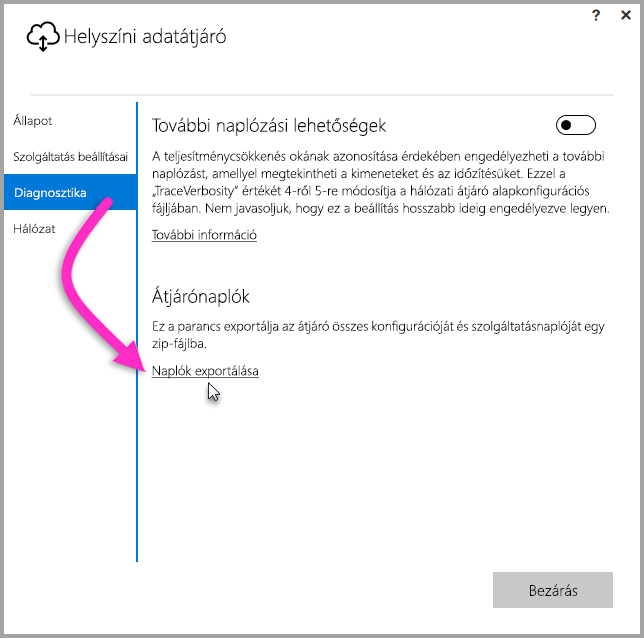

## Hibaelhárítási eszközök
<a name="logs" />

### A naplók összegyűjtése az átjárókonfigurálóról
Számos naplót lekérdezhet az átjáróhoz, és mindig a naplók lekérdezésével érdemes kezdenie a hibaelhárítást. Az átjáró telepítése után a felhasználói felületen keresztül kérdezheti le a legegyszerűbben a naplókat. A **Helyszíni adatátjáró** felhasználói felületen válassza a **Diagnosztika** lehetőséget, majd a **Naplók exportálása** hivatkozást az oldal alján (az alábbi ábrán látható módon).

**Telepítőnaplók**

    %localappdata%\Temp\On-premises_data_gateway_*.log

**Konfigurációs naplók**

    %localappdata%\Microsoft\On-premises Data Gateway\GatewayConfigurator*.log

**Helyszíni adatátjáró szolgáltatás naplói**

    C:\Users\PBIEgwService\AppData\Local\Microsoft\On-premises Data Gateway\Gateway*.log

### Eseménynaplók
A **helyszíni adatátjáró szolgáltatás** eseménynaplói az **Alkalmazás- és szolgáltatásnaplók** területen találhatók.

<a name="fiddler" />

### Fiddler-nyomkövetés
A [Fiddler](http://www.telerik.com/fiddler) a Telerik ingyenes eszköze, amely a HTTP-adatforgalom figyelésére használható.  Nyomon követheti a Power BI szolgáltatás és az ügyfélszámítógép közötti adatforgalmat. Az eszköz hibaüzenetek és egyéb, kapcsolódó információk megjelenítésére is képes.

