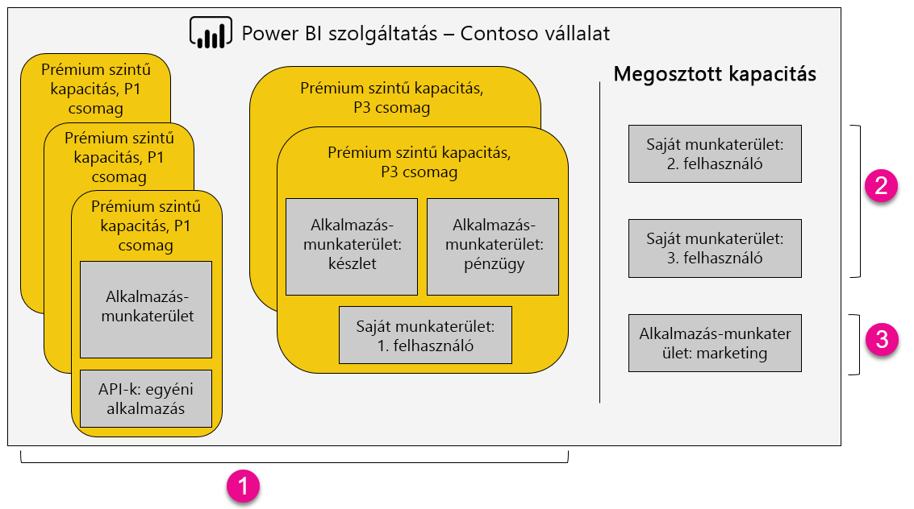

1. A Prémium-kapacitás elemei
   
   * Az alkalmazás-munkaterületek tagként vagy rendszergazdaként való eléréséhez és az alkalmazások közzétételéhez Power BI Pro-licenc szükséges.
   * Az alkalmazásolvasók a Power BI Pro és az ingyenes verzió felhasználói is lehetnek.
   * A megosztáshoz Power BI Pro-licenc szükséges, de a címzettek a Power BI Pro és az ingyenes verzió felhasználói is lehetnek.
   * Az irányítópultok címzettjei adatriasztásokat állíthatnak be, attól függetlenül, hogy Power BI Pro- vagy ingyenes Power BI-licenccel rendelkeznek-e.
   * A beágyazáshoz a REST API-k Power BI Pro-licences szolgáltatásfiókot használnak, nem felhasználói fiókot.
2. Saját munkaterület a Megosztott kapacitásban
   
   * A megosztáshoz Pro-licenc szükséges. A címzetteknek is Pro-licenccel kell rendelkezniük.
3. Alkalmazás-munkaterületek a Megosztott kapacitásban
   
   * Bármely alkalmazás használatához Pro-licenc szükséges.

