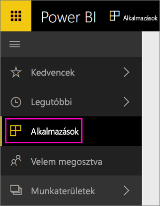

Az importálás befejezése után az új alkalmazás megjelenik az Alkalmazások lapon.

1. A bal oldali navigációs panelen válassza az **Alkalmazások** elemet, majd az alkalmazást.
   
     
2. Tegyen fel kérdést a Q&A mezőben, vagy válasszon ki egy csempét az alapjául szolgáló jelentés megnyitásához. 

