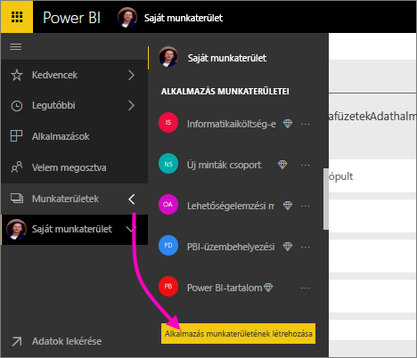
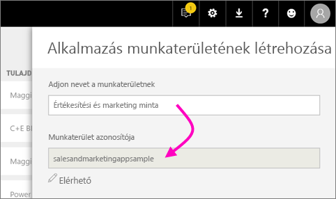
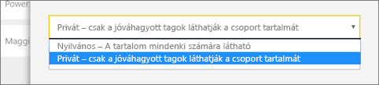
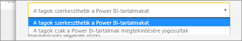
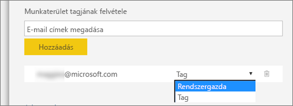

1. Kezdjük a munkaterület létrehozásával. Válassza a **Munkaterületek** > **Alkalmazás munkaterületének létrehozása** lehetőséget.
   
     
   
    Ez az a terület, ahová a tartalmak kerülnek, amelyen Ön és kollégái együtt dolgoznak majd.

2. Nevezze el a munkaterületet. Ha a megfelelő **munkaterület-azonosító** nem használható, szerkesztéssel hozzon létre egy egyedi azonosítót.
   
     Ez lesz az alkalmazás neve is.
   
     

3. Néhány beállítást meg kell adnia. Ha **nyilvánosra** állítja a munkaterületet, a szervezet bármely tagja megtekintheti annak tartalmát. A **Privát** beállítás ezzel szemben azt jelenti, hogy a munkaterület tartalmát csak a tagok láthatják.
   
     
   
    A Nyilvános/Privát beállítás a csoport létrehozását követően nem módosítható.

4. Azt is beállíthatja, hogy a tagok **szerkeszthetik-e** a tartalmakat vagy **csak megtekintési** jogosultságuk van.
   
     
   
     Csak azokat a személyeket adja hozzá a munkaterülethez, akik szerkeszthetik a tartalmakat. Akik csak megtekintik a tartalmakat, azokat ne adja hozzá a munkaterülethez. Ez utóbbiakat az alkalmazás közzétételekor is hozzáadhatja.

5. Vegye fel az adott személyek e-mail-címét, akiknek hozzáférést kíván adni a munkaterülethez, majd kattintson a **Hozzáadás** gombra. Csoportaliasokat nem adhat hozzá, csak egyéneket.

6. Döntse le, hogy az egyes személyek egyszerű tagok vagy adminisztrátorok legyenek-e.
   
     
   
    Az adminisztrátorok szerkeszthetik magát a munkaterületet is, és tagokat is felvehetnek. A tagok a munkaterület tartalmát szerkeszthetik, amennyiben nem csak megtekintési jogosultsággal rendelkeznek. Az alkalmazást az adminisztrátorok és a tagok egyaránt közzétehetik.

7. Kattintson a **Mentés** gombra.

A Power BI létrehozza és megnyitja a munkaterületet. Ekkor megjelenik az olyan munkaterületek listájában, amelyeknek Ön a tagja. Mivel adminisztrátori jogosultsággal rendelkezik, a három pontra (...) kattintva visszaléphet, és szerkesztheti a munkaterületet, például új tagokat adhat hozzá vagy módosíthatja a tagok jogosultságait.

