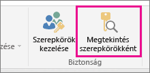
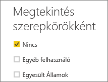
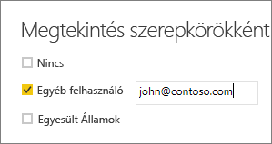

## Szerepkör érvényesítése a Power BI Desktopban
A szerepkör létrehozása után tesztelheti a szerepkör hatásait a Power BI Desktopban. Ehhez válassza a **Megtekintés szerepkörökként** elemet.

A **Megtekintés szerepkörökként** párbeszédpanelen ellenőrizheti, hogy egy adott felhasználó vagy szerepkör mit láthat. Megtekintheti azokat a szerepköröket, amelyeket létrehozott.

Jelölje ki az egyik létrehozott szerepkörét, majd kattintson az **OK** gombra, hogy alkalmazza a szerepkört arra, amit épp megtekintett. A jelentésekből csak a szerepkör számára releváns adatok jelennek meg.

Az **Egyéb felhasználó** beállítással egy adott felhasználót is kiválaszthat. Az egyszerű felhasználónevet (UPN) érdemes megadni, mivel a Power BI szolgáltatás azt használja. Kattintson az **OK** gombra, és a jelentések csak a felhasználó számára elérhető adatokat fogják megjeleníteni. 

> [!NOTE]
> A Power BI Desktopban csak akkor fognak megjelenni különböző eredmények, ha DAX-kifejezéseken alapuló dinamikus biztonsági megoldást alkalmaz.
> 
> 

