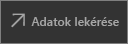

# Rövid útmutató: Irányítópultok és jelentések felfedezése a Power BI mobilalkalmazásokban
Ebben a rövid útmutatóban az androidos telefonokhoz készült Power BI mobilalkalmazásban használt irányítópultok és jelentések mintáját ismerheti meg. Az itt leírtakat a többi mobilalkalmazásban is követheti. 

A következőkre vonatkozik:

|  |  |  |  |
|:--- |:--- |:--- |:--- |
| iPhone | iPad | Android | Windows 10 |

Az irányítópultok betekintést nyújtanak és hozzáférést biztosítanak a vállalat életciklusához és folyamataihoz. Az irányítópult egy központi helyet biztosít, ahonnan áttekintheti és nyomon követheti vállalkozása aktuális állapotát. A jelentés az adatok interaktív nézete, amely vizualizációk segítségével mutatja be az adatokból származó eredményeket és elemzéseket. 

## Előfeltételek

### Regisztráció a Power BI-ra
Ha még nem regisztrált a Power BI-ra, a kezdés előtt [hozzon létre egy ingyenes próbaverziós fiókot](https://app.powerbi.com/signupredirect?pbi_source=web).

### Az Androidhoz készült Power BI telepítése
[Töltse le az Androidhoz készült Power BI alkalmazást](http://go.microsoft.com/fwlink/?LinkID=544867) a Google Play Áruházból.

A Power BI az Android 5.0 vagy annál későbbi operációs rendszert futtató androidos eszközökön működik. Az eszközt a **Beállítások** > **Az eszközről** > **Android verzió** részben ellenőrizheti.

### A Kiskereskedelmi elemzési minta letöltése
A rövid útmutató első lépéseként töltse le a Kiskereskedelmi elemzési mintát a Power BI szolgáltatásba.

1. Nyissa meg a Power BI szolgáltatást a böngészőben (app.powerbi.com), és jelentkezzen be.

1. A bal oldali navigációs ablak megnyitásához kattintson a globális navigációs ikonra.

    

2. A bal oldali navigációs ablaktáblán válassza a **Munkaterületek** > **Saját munkaterület** lehetőséget.

    

3. A bal alsó sarokban kattintson a **Lekérdezés** elemre.
   
    

3. A Lekérdezés lapon kattintson a **Minták** ikonra.
   
   

4. Válassza a **Kiskereskedelmi elemzési minta** lehetőséget.
 
    
 
8. Kattintson a **Csatlakozás** gombra.  
  
   
   
5. A Power BI importálja a mintát, majd új irányítópultot, jelentést és adatkészletet ad hozzá a Saját munkaterülethez.
   
   

Most már megtekintheti a mintát az androidos eszközön.

## Irányítópult megtekintése az androidos eszközön
1. Nyissa meg a Power BI alkalmazást az androidos eszközön, és jelentkezzen be a Power BI-fiók azon hitelesítő adataival, amelyeket a böngészőben is használt a Power BI szolgáltatáshoz.

1.  Koppintson a globális navigációs gombra .

2.  Koppintson a **Munkaterületek** > **Saját munkaterület** elemre.

    

3. Koppintson a Kiskereskedelmi elemzési minta irányítópultjára, és nyissa meg azt.
 
    
   
    Az irányítópult neve alatti jelölés (ebben az esetben „C”) az egyes irányítópultok adatbesorolását jelöli. A [Power BI adatbesorolásairól itt talál](service-data-classification.md) további információkat.

    A Power BI irányítópultok kissé máshogy néznek ki az Android-telefonokon. Minden csempe ugyanolyan szélesen jelenik meg, és felülről lefelé egymás után vannak rendezve.

4. Koppintson a csillag ikonra  Jelölje kedvencnek az irányítópultot a címsorban.

    Amit a mobilalkalmazásban kedvencnek jelöl, az a Power BI szolgáltatásban is kedvenc lesz, és fordítva.

4. Görgessen lefelé, és koppintson a „Folyó évi értékesítés, Elmúlt évi értékesítés” kitöltött vonaldiagramra.

    

    A grafikon fókusz módban nyílik meg.

7. Fókusz módban koppintson az Apr (április) elemre a grafikonon. Ekkor a grafikon tetején az áprilisi értékek jelennek meg.

    

8. Koppintson a Jelentés ikonra  a jobb felső sarokban. A csempéhez kapcsolódó jelentés fekvő tájolásban nyílik meg.

    

9. Koppintson a „040 – Beosztottak” buborékra a buborékdiagramban. Látja, hogyan emeli ki ez a lépés a kapcsolódó értékeket a többi grafikonon is? 

    

10. Pöccintsen felfelé, hogy láthatóvá váljon a lap alján lévő eszköztár, és koppintson a ceruza ikonra.

    

11. Ha a mosolygó arcra koppint a Jegyzetkészítés eszköztáron, hangulatjeleket adhat hozzá a jelentésoldalhoz.
 
    

12. Koppintson a **Megosztás** elemre a jobb felső sarokban.

1. Ha kedve van hozzá, töltse ki az e-mail-cím mezőt, és írjon be egy üzenetet.  

    

    A pillanatképet bárkivel megoszthatja cégen belül és kívül. A cégen belüli és saját Power BI-fiókkal rendelkező címzettek a Kiskereskedelmi elemzési mintát is megnyithatják.

## Az erőforrások felszabadítása

Miután elkészült ezzel a gyors útmutatóval, igény szerint eltávolíthatja a Kiskereskedelmi elemzési mintát, a jelentést és az adatkészletet.

1. Nyissa meg a Power BI-szolgáltatást (app.powerbi.com), és jelentkezzen be.

2. A bal oldali navigációs ablakban válassza a **Munkaterületek** > **Saját munkaterület** lehetőséget.

    Látja a sárga csillagot, amely a kedvencnek jelölést mutatja?

3. Az **Irányítópult** lapon kattintson a **Törlés** (kuka) ikonra a Kiskereskedelmi elemzés irányítópultja mellett.

    

4. Válassza ki a **Jelentések** lapot, és ismételje meg a műveletet a Kiskereskedelmi elemzés jelentésével.

5. Váltson az **Adatkészletek** lapra, és ismételje meg a műveletet a Kiskereskedelmi elemzés adatkészletével.

## Következő lépések

Ebből a rövid útmutatóból egy irányítópult és egy jelentés mintáját ismerhette meg az androidos eszközén. Tájékozódjon tovább a Power BI szolgáltatásban végzett munkáról. 

> [!div class="nextstepaction"]
> [Rövid útmutató: Navigáció a Power BI szolgáltatásban](service-the-new-power-bi-experience.md)

