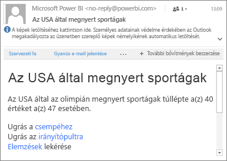

# Adatriasztások beállítása a Power BI mobilalkalmazásokban
A következőkre vonatkozik:

|  |  |  |  |  |
|:--- |:--- |:--- |:--- |:--- |
| iPhone-ok |iPadek |Android rendszerű telefonok |Android rendszerű táblagépek |Windows 10-eszközök |

Beállíthat riasztásokat az irányítópulton a Power BI-mobilalkalmazásokban és a Power BI szolgáltatásban is. A riasztások figyelmeztetik, ha egy csempe adatainak változásai meghaladják a beállított korlátokat. A riasztások az egyetlen értéket tartalmazó csempékkel, például kártyákkal és mérőműszerekkel működnek, a streamelési adatokkal azonban nem. A mobileszközön beállított adatriasztásokat megtekintheti a Power BI szolgáltatásban és viszont. Mindenki csak a saját maga által beállított adatriasztásokat látja, még az irányítópultnak vagy a csempe pillanatképének a megosztása esetén is.

Ha Power BI Pro-licenccel rendelkezik, vagy ha ingyenes Power BI-licenccel rendelkezik és a megosztott irányítópult prémium szintű kapacitást használ, beállíthat riasztásokat csempékhez. 

> [!WARNING]
> Az adatalapú riasztások értesítései az adatokkal kapcsolatos információkat tartalmaznak. Ha a mobileszközét ellopják, javasoljuk, hogy a Power BI szolgáltatásban tiltsa le az összes adatalapú riasztási szabályt. 
> 
> További információk [az adatriasztások kezeléséről a Power BI szolgáltatásban](service-set-data-alerts.md).
> 
> 

## Adatriasztások iPhone vagy iPad készüléken
### Riasztások beállítása iPhone vagy iPad készüléken
1. Koppintson az irányítópult egyik számot vagy mérőműszert tartalmazó csempéjére annak fókusz módban való megnyitásához.  
   
   
2. Riasztás hozzáadásához koppintson a harang ikonra .  
3. Koppintson a **Riasztási szabály felvétele** gombra.
   
   
4. Válassza ki, hogy egy adott érték felett vagy alatt aktiválódjon a riasztás, majd adja meg az értéket.
   
   
5. Döntse el, hogy óránként vagy naponta szeretne riasztást kapni, és hogy riasztásokról e-mailben is kapjon-e értesítést.
   
   > [!NOTE]
   > Az óránkénti vagy napi riasztásokat csak abban az esetben kapja meg, ha az érték az adott időtartamban ténylegesen változott.
   > 
   > 
6. A riasztás címét is módosíthatja.
7. Koppintson a **Mentés** gombra.
8. Egy adott csempe rendelkezhet felső és alsó küszöbértékeket jelző riasztásokkal is. A **Riasztások kezelése** felületen koppintson a **Riasztási szabály felvétele** gombra.
   
   

### Riasztások kezelése iPhone vagy iPad készüléken
A riasztásokat egyenként kezelheti a mobileszközökön vagy [az összeset együtt a Power BI szolgáltatásban](service-set-data-alerts.md).

1. Koppintson az irányítópulton az egyik számot vagy mérőműszert tartalmazó csempére, amelyikhez van riasztás rendelve.  
   
   
2. Koppintson a harang ikonra .  
3. Koppintson a riasztás nevére annak szerkesztéséhez, a kapcsolóra az e-mail értesítések kikapcsolásához vagy a szemetesre a riasztás törléséhez.
   
    

## Adatriasztások az Android-eszközökön
### Riasztások beállítása Android-eszközökön
1. A Power BI-irányítópulton koppintson az egyik számot vagy mérőműszert tartalmazó csempére annak megnyitásához.  
2. Riasztás hozzáadásához koppintson a harang ikonra .  
   
   
3. Koppintson a plusz ikonra (+).
   
   
4. Válassza ki, hogy egy adott érték felett vagy alatt aktiválódjon a riasztás, majd írja be az értéket.
   
   
5. Koppintson a **Kész** gombra.
6. Döntse el, hogy óránként vagy naponta szeretne riasztást kapni, és hogy riasztásokról e-mailben is kapjon-e értesítést.
   
   > [!NOTE]
   > Az óránkénti vagy napi riasztásokat csak abban az esetben kapja meg, ha az érték az adott időtartamban ténylegesen változott.
   > 
   > 
7. A riasztás címét is módosíthatja.
8. Koppintson a **Mentés** gombra.

### Riasztások kezelése Android-eszközökön
A riasztásokat egyenként kezelheti a Power BI mobilalkalmazásban vagy [az összeset együtt a Power BI szolgáltatásban](service-set-data-alerts.md).

1. Koppintson az irányítópulton az egyik kártyára vagy mérőműszert tartalmazó csempére, amelyikhez van riasztás rendelve.  
2. Koppintson az egyszínű harang ikonra .  
3. Koppintson a riasztásra, ha módosítani szeretné a küszöbértékét, vagy ki szeretné kapcsolni.
   
    
4. Koppintson a plusz ikonra (+), ha egy újabb riasztást szeretne hozzáadni ugyanahhoz a csempéhez.
5. A riasztás végleges törléséhez koppintson a szemetes ikonra .

## Adatriasztások a Windows-eszközökön
### Riasztások beállítása Windows-eszközökön
1. Koppintson az irányítópult egyik számot vagy mérőműszert tartalmazó csempéjére annak megnyitásához.  
2. Riasztás hozzáadásához koppintson a harang ikonra .  
   
   
3. Koppintson a plusz ikonra (+).
   
   
4. Válassza ki, hogy egy adott érték felett vagy alatt aktiválódjon a riasztás, majd írja be az értéket.
   
   
5. Döntse el, hogy óránként vagy naponta szeretne riasztást kapni, és hogy riasztásokról e-mailben is kapjon-e értesítést.
   
   > [!NOTE]
   > Az óránkénti vagy napi riasztásokat csak abban az esetben kapja meg, ha az érték az adott időtartamban ténylegesen változott.
   > 
   > 
6. A riasztás címét is módosíthatja.
7. Koppintson a pipa jelre.
8. Egy adott csempe rendelkezhet felső és alsó küszöbértékeket jelző riasztásokkal is. A **Riasztások kezelése** felületen koppintson a plusz jelre (+).
   
   

### Adatriasztások kezelése Windows-eszközökön
A riasztásokat egyenként kezelheti a Power BI mobilalkalmazásban vagy [az összeset együtt a Power BI szolgáltatásban](service-set-data-alerts.md).

1. Koppintson az irányítópulton az egyik kártyára vagy mérőműszert tartalmazó csempére, amelyikhez van riasztás rendelve.  
2. Koppintson a harang ikonra .  
   
   
3. Koppintson a riasztásra, ha módosítani szeretné a küszöbértékét, vagy ki szeretné kapcsolni.
   
    
4. A riasztás végleges törléséhez koppintson a **Törlés** gombra, és tartsa megérintve.

## Riasztások fogadása
A riasztások a Power BI [Értesítési központjába](mobile-apps-notification-center.md) érkeznek a mobileszközön vagy a Power BI szolgáltatásban, ugyanúgy, ahogy az Önnel megosztott új irányítópultokról tájékoztató értesítések.

Az adatforrások általában napi frissítésre vannak állítva, némelyik azonban ennél gyakrabban frissül. Az irányítópultok adatainak frissítése során, ha a követett adatok valamelyike eléri valamelyik beállított küszöböt, több dolog történhet.

1. A Power BI ellenőrzi, hogy eltelt-e legalább egy óra vagy 24 óra (a választott beállítástól függően) az utolsó riasztás óta.
   
   Ha az adat meghaladja a küszöböt, a rendszer óránként vagy 24 óránként mindenképp riasztást küld.
2. Ha úgy konfigurálta a riasztást, hogy az e-mailben is értesítse, valami ilyesmit talál majd a bejövő levelei közt.
   
   
3. A Power BI egy üzenetet küld az **Értesítési központba**, és egy új riasztás ikont jelenít meg az érintett csempén .
4. A globális navigációs gombra  koppintva [nyissa meg az **Értesítési központot**](mobile-apps-notification-center.md), és tekintse meg a riasztás részleteit.
   
      

> [!NOTE]
> A riasztások kizárólag a frissített adatokon működnek. Az egyes adatok frissítésekor a Power BI ellenőrzi, hogy az adott adathoz van-e beállítva riasztás. Ha az adott adat elérte a riasztási küszöböt, a riasztás aktiválódik.
> 
> 

## Tippek és hibaelhárítás
* A riasztásokat a Bing-csempék, illetve a dátum/idő mértékekkel rendelkező kártyacsempék jelenleg nem támogatják.
* A riasztások kizárólag numerikus adatokkal működnek.
* A riasztások kizárólag a frissített adatokon működnek. Statikus adatokon nem.
* A riasztások streamelési adatokat tartalmazó csempéken nem működnek.

## További lépések
* [Riasztások kezelése a Power BI szolgáltatásban](service-set-data-alerts.md)
* [Power BI mobil értesítési központ](mobile-apps-notification-center.md)
* Kérdése van? [Forduljon a Power BI közösségéhez](http://community.powerbi.com/)

