# Jelentésoldal méretének módosítása (Oktatóanyag)
Az [előző cikk és videó](power-bi-report-display-settings.md) segítségével megismerhette azt a két lehetőséget, amelyekkel módosíthatja a Power BI-jelentések oldalainak megjelenítését: a **Nézet** és az **Oldalméret** beállításokat. Most próbáljuk is ki ezeket.

## Elsőként módosítsuk az oldal Nézet beállításait
1. Nyisson meg egy jelentést Olvasó vagy Szerkesztő nézetben. Ez a példa a [Kiskereskedelmi elemzési minta](sample-retail-analysis.md) „New Stores” (Új üzletek) oldalát használja.  Az oldal megjelenítése **Laphoz igazítás** nézetre van állítva.  A Laphoz igazítás nézetben, ahogy esetünkben is, a jelentésoldal görgetősávok nélkül jelenik meg, azonban egyes részletek és címek olvashatatlanul kicsik.
   
   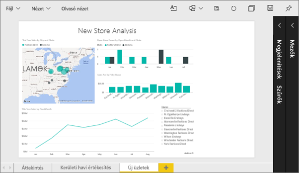
2. Győződjön meg róla, hogy a vászon egyetlen vizualizációja sincs kiválasztva. Válassza a **Nézet** lehetőséget a megjelenítési lehetőségek áttekintéséhez.

* Olvasó nézetben ezt fogja látni.
  
     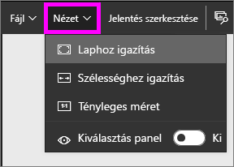
* Szerkesztő nézetben pedig ezt fogja látni.
  
    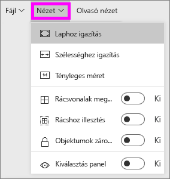

1. Nézzük meg, hogyan néz ki az oldal a **Tényleges méret** nézettel.
   
   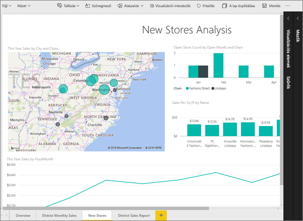
   
   Nem a legjobb, az irányítópultnak két görgetősávja is lett.
2. Váltson a **Szélességhez igazítás** nézetre.
   
   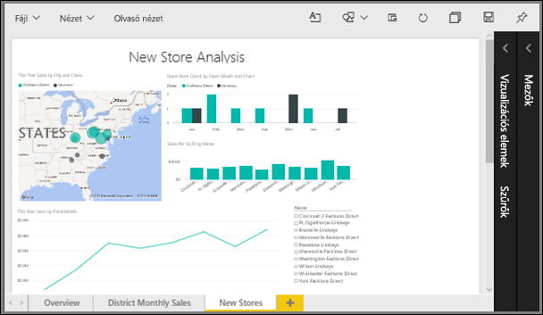
   
   Jobban néz ki, így is vannak görgetősávjaink, de könnyebben kivehetők a részletek.

## Jelentésoldal alapértelmezett nézetének módosítása
A Power BI-jelentések alapértelmezés szerinti megjelenítési nézete a **Laphoz igazítás**. Mi a teendő, ha azt szeretné, hogy a jelentésoldal mindig a **Tényleges méret** nézetben nyíljon meg?

1. A **New stores** (Új üzletek) jelentésoldalon váltson vissza **Tényleges méret** nézetre.
   
   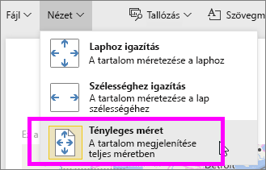
2. Mentse a jelentést másmilyen néven a **Fájl > Mentés másként** lehetőség kiválasztásával. Így már két másolata van a jelentésből. Az eredeti jelentésben a **New stores** (Új üzletek) nevű oldal továbbra is az alapértelmezés szerinti nézetben jelenik meg, az új jelentésben azonban a **Tényleges méret** nézetben fog megnyílni. Nézzük is ezt meg.
   
   
3. A felső navigációs sávon válassza az aktuális munkaterülete nevét, hogy visszatérjen a munkaterületre.  
   
   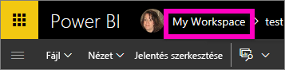
4. Válassza a **Jelentések** lapot, majd az imént létrehozott új jelentést (sárga csillag jelöli).
   
    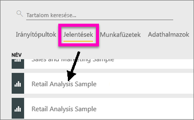
5. A jelentés **Tényleges méret** nézetben nyílik meg.
   
   

## Nézzük meg most az *Oldalméret*-beállításokat
Az oldalméret-beállítások kizárólag [Szerkesztő nézetben](service-interact-with-a-report-in-editing-view.md) érhetők el. Ahhoz, hogy egy jelentést Szerkesztő nézetben nyithasson meg, a jelentéshez tulajdonosi engedélyekkel kell rendelkeznie. Ha valamelyik [mintánkhoz](sample-datasets.md) kapcsolódott, akkor a jelentésekhez tulajdonosi engedélyei vannak.

1. Nyissa meg a [Retail Analysis sample](sample-retail-analysis.md) (Kiskereskedelmi elemzési minta) „District monthly sales” (Körzetek havi értékesítései) nevű oldalát Szerkesztő nézetben.
2. Győződjön meg róla, hogy a vászon egyetlen vizualizációja sincs kiválasztva.  A **Megjelenítések ablaktáblán** válassza a festőhenger  ikont.
3. Válassza az **Oldalméret** &gt; **Típus** lehetőséget az oldal méretezési lehetőségeinek megjelenítéséhez.
   
   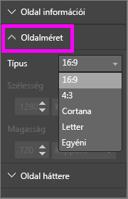
4. Válassza a **Letter** lehetőséget.  Így csak azok a tartalmak maradtak a vászon fehér részén, amelyek elférnek a 816x1056 képpont méretű (Letter méretű) helyen.
   
   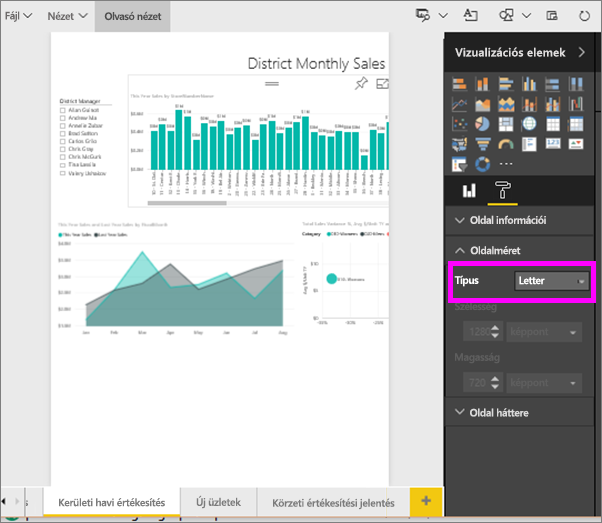
5. Ha módosítjuk a **Nézet** beállítását „Szélességhez igazításra”, akkor az oldalnak csak azok a tartalmai jelennek meg a vásznon, amelyek elférnek a Letter méreten.
   
   
6. Válassza a **Oldalméret** típusánál a **16:9**-es arányt.
   
   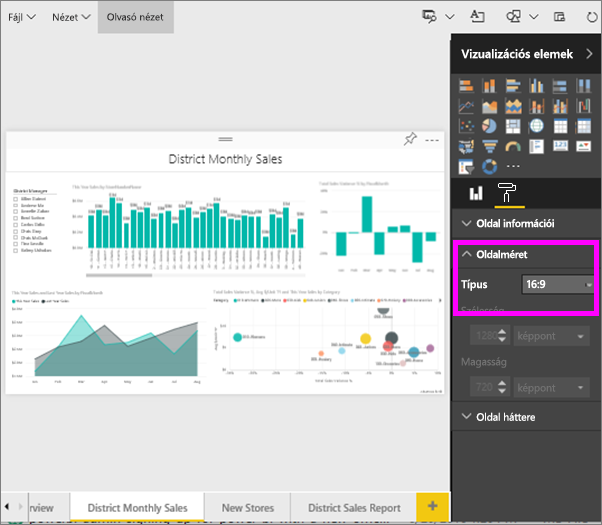
   
   A jelentésoldal ekkor 16:9-es szélesség-magasság arányban jelenik meg. A ténylegesen használt, képpontokban kifejezett méretet a kiszürkített Szélesség és Magasság mezőkben tekintheti meg (1280x720). A jelentésvászon körül sok az üres hely, ugyanis a **Nézet** beállítást korábban „Szélességhez igazításra” állítottuk.
7. Folytassa az ismerkedést az **Oldalméret**-beállításokkal.

## A Nézet és az Oldalméret beállításainak együttes használata
A Nézet és az Oldalméret beállításainak együttes használatával olyan jelentéseket hozhat létre, amelyek más alkalmazásokba beágyazva néznek ki a legjobban.

Ebben a példában egy olyan jelentésoldalt fog létrehozni, amely egy alkalmazás 500 képpont szélességű és 750 képpont magasságú helyén fog megjelenni.

Ne felejtse el, hogy az előző lépésben azt láttuk, hogy a jelentésoldal jelenleg 1280 képpont szélességű és 720 képpont magasságú. Így sok tennivalónk lesz az átméretezésekkel és az elrendezésekkel, ha azt szeretnénk, hogy az egész vizualizációnk elférjen egy ekkora helyen.

1. Méretezze át és helyezze át a vizualizációkat úgy, hogy a jelenlegi vászon területének kevesebb mint felét foglalják el.
   
    
2. Válassza az **Oldalméret** &gt; **Egyéni** lehetőséget.
3. Állítsa a Szélességet 500-ra, a magasságot pedig 750-re.
   
    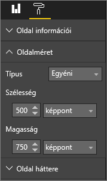
4. Módosítsa a jelentésoldalt, hogy a lehető legjobban nézzen ki. Váltson a **Nézet > Tényleges méret** és a **Nézet > Laphoz igazítás** lehetőségek között a nézet módosításához.
   
    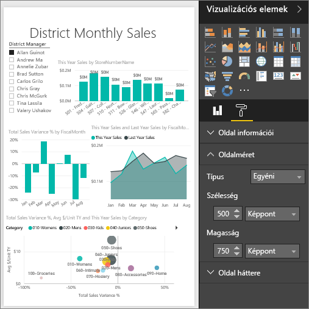

## Következő lépések
[Jelentés létrehozása Cortanához](service-cortana-answer-cards.md)

Vissza az [Oldal megjelenítési beállításai Power BI-jelentésben](power-bi-report-display-settings.md) című cikkhez

További információ a [Power BI-jelentésekről](service-reports.md)

További kérdései vannak? [Kérdezze meg a Power BI közösségét](http://community.powerbi.com/)

