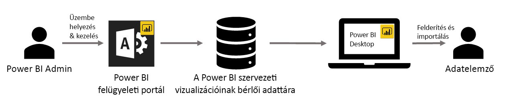

# Egyéni céges vizualizációk használata a Power BI-ban (Előzetes verzió)

A Power BI-ban egyéni vizualizációkkal hozhat létre olyan egyedi vizualizációtípust, mely személyre szabott, vagy az átadni kívánt adatelemzésekhez van igazítva. Ezeket az egyéni vizualizációkat gyakran fejlesztők készítik, és azokat gyakran akkor hozzák létre, amikor a Power BI által tartalmazott számos látványelem nem egészen felelt meg az igényeiknek. 

Egyes szervezeteknél az egyéni vizualizációk még ennél is fontosabbak – szükségesek lehetnek a szervezet bizonyos egyedi adatainak vagy elemzéseinek átadásához, speciális adatkövetelményeik lehetnek, vagy privát üzleti eljárásokat emelhetnek ki. Az ilyen szervezeteknek egyéni vizualizációkat kell fejleszteniük, azokat meg kell osztaniuk az egész szervezetben, és gondoskodniuk kell azok megfelelő karbantartásáról. A Power BI (jelenleg előzetes verzióban elérhető) egyéni vizualizációival a szervezetek pont ezt tehetik. 

A következő képen az a folyamat látható, mely alapján a Power BI egyéni szervezeti vizualizációi (előzetes verzió) a rendszergazdától a fejlesztésen és a karbantartáson át végül eljutnak az adatelemzőkhöz.

## Az egyéni szervezeti vizualizációk (előzetes verzió) engedélyezése

Az egyéni szervezeti vizualizációk jelenleg előzetes verzióban érthetők el, ezért engedélyezni kell a funkciót a Power BI Desktopban. Ezen előzetes verziójú funkció engedélyezéséhez válassza a Fájl > Lehetőségek és beállítások > Beállítások lehetőséget a menüszalagon, majd a bal oldali panelen válassza az Előzetes verziójú funkciók lehetőséget, és végül jelölje be a Saját cég vagy szervezet egyéni vizualizációi lehetőség melletti jelölőnégyzetet, a következő képen látható módon.

A szervezeti vizualizációkat a Power BI rendszergazdája helyezi üzembe és kezeli a felügyeleti portálon. A szervezeti adattárban való üzembe helyezésük után a szervezet felhasználói könnyedén felderíthetik őket, és közvetlenül a Power BI Desktopból importálhatják az egyéni szervezeti vizualizációkat.

## Egyéni szervezeti vizualizációk használata

Az egyéni szervezeti vizualizációk a létrehozott jelentésekben való használatával kapcsolatban a következő cikkben találhat további információkat: [További információk a szervezeti vizualizációk jelentésekbe való importálásával kapcsolatban](power-bi-custom-visuals.md).
 
## Az egyéni szervezeti vizualizációk felügyelete

Az egyéni szervezeti vizualizációk a szervezetben való felügyeletével, üzembe helyezésével és kezelésével kapcsolatban a következő cikkben találhat további információkat: [További információk az egyéni szervezeti vizualizációk üzembe helyezésével és kezelésével kapcsolatban](https://go.microsoft.com/fwlink/?linkid=866790).

> [!WARNING]
> Az egyéni vizualizációk biztonsági és adatvédelmi kockázatokat tartalmazó kódot is tartalmazhatnak. Győződjön meg arról, hogy az egyéni vizualizációk szerzője és forrása megbízható, mielőtt üzembe helyezné őket a szervezet tárházban. 
> 

## Megfontolandó szempontok és korlátozások
 
Mivel az egyéni szervezeti vizualizációk jelenleg előzetes verzióban érhetők el, több szemponttal és korlátozással tisztában kell lennie, és azokat figyelembe kell vennie.
 
Rendszergazdák:

* Az örökölt egyéni vizualizációk (mint például azok az egyéni vizualizációk, melyek nem az új verzióval ellátott API-kra épülnek) használata nem támogatott

* A helyben történő frissítés még nem támogatott. Egy vizualizáció frissítéséhez fel kell töltenie a vizualizáció új verzióját a szervezet tárházába (emellett azt is ellenőrizze, hogy ugyanazzal a vizualizációazonosítóval rendelkezik-e a PBIVIZ-fájlban). A jelentések szerzői ezután importálhatják az új verziót a jelentésükbe, és elvégezhetik a vizualizáció aktuális verziójának helyben végzett cseréjét a jelentésben.

* Ha egy egyéni vizualizációt törölnek a tárházból, leáll minden olyan meglévő jelentés megjelenítése, mely a törölt vizualizációt használja. A tárházból való törlési művelet nem vonható vissza.
 
Végfelhasználók:

* Ugyanazon vizualizáció (ugyanazon vizualizációazonosító) a nyilvános piactérről (AppSource) és a szervezet tárházából való használata nem támogatott. Ebben az esetben a rendszer a legújabb importált vizualizációt fogja használni.

* A szervezeti vizualizációk irányítópultokon és jelentésekben való külső megosztása nem támogatott. Az olyan irányítópultokat megtekintő szervezeten kívüli felhasználók számára, melyek egyéni szervezeti vizualizációt tartalmaznak, egy üres vizualizációs elem fog megjelenni. 

* A Power BI-munkaterület-csoport szervezeti vizualizációkhoz való használata nem támogatott

* A weben közzétett jelentésekben lévő egyéni szervezeti vizualizációk nem jelennek meg

* Az AppSource piactérről származó Visio vizualizáció, PowerApps vizualizáció és GlobeMap vizualizáció nem jelenik meg, ha a szervezet tárházának használatával van üzembe helyezve

* Ha a rendszergazda töröl egy egyéni vizualizációt a tárházból, és az adott vizualizáció egy jelentésben van használva, a vizualizáció többé nem fog megjelenni, és a jelentés mentéséhez azt el kell távolítani a jelentésből