# Egyéni vizualizációk a Power BI-ban
Power BI-jelentések létrehozása vagy szerkesztése során számos különböző vizualizációtípus használatára van lehetősége. Ezek a vizualizációk a **Vizualizációk** ablaktáblában láthatók. A Power BI Desktop letöltésekor vagy a Power BI szolgáltatás (app.powerbi.com) megnyitásakor a vizualizációk egy készlete azonnal elérhető. 

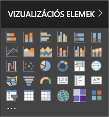

Ennél azonban több vizualizáció is a rendelkezésére áll. A három pontot ábrázoló gombra kattintva újabb vizualizációforrást nyithat meg, az *egyéni vizualizációkét*.

Az egyéni vizualizációkat a közösség tagjai, illetve a Microsoft hozza létre, és az [AppSource](https://appsource.microsoft.com/marketplace/apps?product=power-bi-visuals) alatt vannak tárolva. Ezek a vizualizációk letölthetők, és hozzáadhatók a Power BI-jelentésekhez. Az összes egyéni vizualizáció jóvá lett hagyva a Microsoft által, és a Power BI-ban alapból megtalálható vizualizációkhoz hasonlóan működnek: szűrhetők, kiemelhetők, szerkeszthetők, megoszthatók stb. 

Mi az az AppSource? Egyszerűen szólva az a hely, ahol a Microsoft-szoftverekhez alkalmazásokat, beépülő modulokat és bővítményeket találhat. Az [AppSource](https://appsource.microsoft.com) többek között az Office 365, az Azure, a Dynamics 365, Cortana és a Power BI több millió felhasználóját köti össze olyan megoldásokkal, amelyekkel minden eddiginél hatékonyabban, mélyebb betekintéssel vagy látványosabban dolgozhatnak.

## Az egyéni vizualizációk két típusa

A Power BI AppSource webhelyen elérhető egyéni vizualizációk 2 kategóriába sorolhatók: **jóváhagyott** és **minősített**. Az *AppSource által jóváhagyott* vizualizációk futtathatók böngészőkben, jelentésekben és irányítópultokban.  A *Power BI-minősítéssel* rendelkező vizualizációk szigorú teszteken feleltek meg, és további forgatókönyvek, például [e-mailes előfizetések](service-report-subscribe.md) és [PowerPointba történő exportálás](service-publish-to-powerpoint.md) esetén is támogatottak.

A minősített egyéni vizualizációk listájának megtekintéséhez vagy saját vizualizáció közzétételéhez lásd a [minősített egyéni vizualizációkat](power-bi-custom-visuals-certified.md) ismertető szakaszt.

Ön olyan webfejlesztő, aki szeretne saját vizualizációkat létrehozni, és hozzáadni azokat az AppSource-hoz?  A [fejlesztői eszközöket ismertető](service-custom-visuals-getting-started-with-developer-tools.md) rész megtekintésével megtudhatja, hogyan [tehet közzé egyéni vizualizációkat az AppSource-on](https://appsource.microsoft.com/marketplace/apps?product=power-bi-visuals).

## Egyéni vizualizáció letöltése vagy importálása a Microsoft AppSource-ról
Az egyéni vizualizációk letöltésének és importálásának két módja van. Megteheti ezt a Power BI-on belülről és az AppSource webhelyről. 

###    Egyéni vizualizációk importálása a Power BI-on belül
1. Válassza a Vizualizációk ablaktábla alján található, három pontot ábrázoló gombot. 

    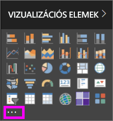

2. A legördülő listából válassza az **Importálás az áruházból** lehetőséget.

    

3. Tekintse át a listát, és keresse meg az importálni kívánt vizualizációt. 

    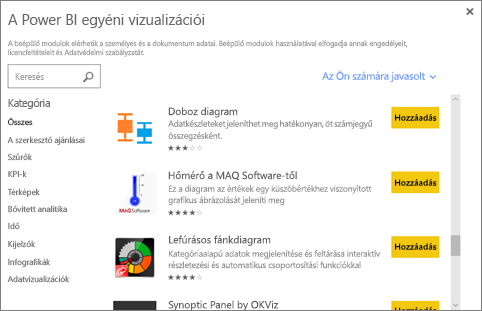

4.  Az egyes vizualizációk kijelölésével további információkat tudhat meg róluk.

    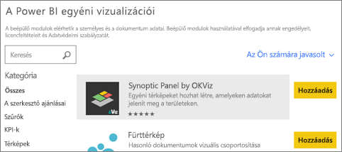

5.  A részletek lapon többek között képernyőképeket, videókat és részletes leírásokat tekinthet meg. 

    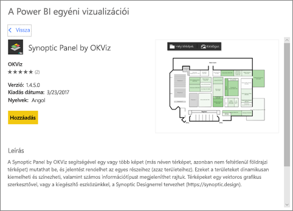

6. A képernyő alján értékelések is találhatók.

    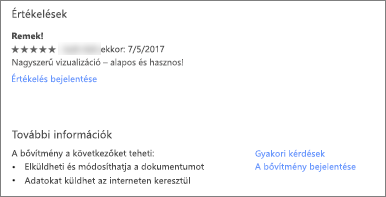

7.    Az egyéni vizualizáció importálásához válassza a **Hozzáadás** parancsot. Az egyéni vizualizáció ikonja ekkor megjelenik a Vizualizációk ablaktábla alján, és már használhatja is a jelentésben.

       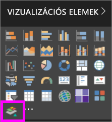

###    Egyéni vizualizáció letöltése és importálása a Microsoft AppSource-ról

1. A [Microsoft AppSource](https://appsource.microsoft.com) webhelyről kiindulva válassza az **Alkalmazások** lapot. 

    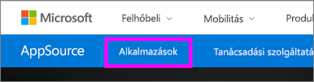

2. Ez átirányítja Önt az [Alkalmazások találatainak oldalára](https://appsource.microsoft.com/en-us/marketplace/apps), ahol megtekintheti az egyes kategóriák legnépszerűbb alkalmazásait, beleértve a *Power BI-alkalmazásokat*. Mi azonban egyéni vizualizációkat keresünk, szóval szűkítsük le a találatokat a bal oldali navigációs listában található **Power BI-vizualizációk** lehetőség kiválasztásával.

    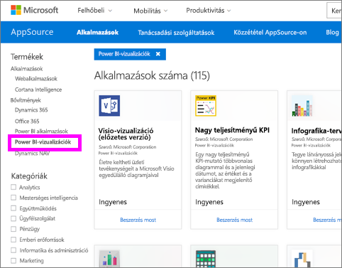

3. Az AppSource minden egyes egyéni vizualizációhoz megjelenít egy csempét.  Minden csempe tartalmaz egy képernyőképet az egyéni vizualizációról, illetve egy rövid leírást és egy letöltési hivatkozást. További részletekért kattintson a csempére. 

    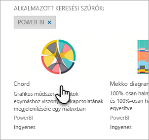

4. A részletek lapon többek között képernyőképeket, videókat és részletes leírásokat tekinthet meg. Az egyéni vizualizáció letöltéséhez kattintson a **Letöltés most** hivatkozásra, és fogadja el a használati feltételeket. 

    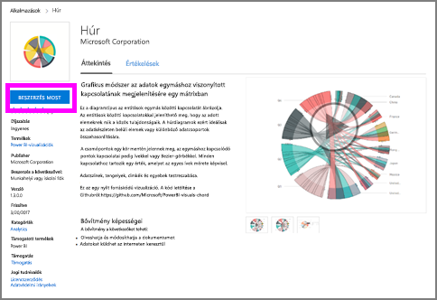

5. Kattintson az egyéni vizualizáció letöltési hivatkozására.

    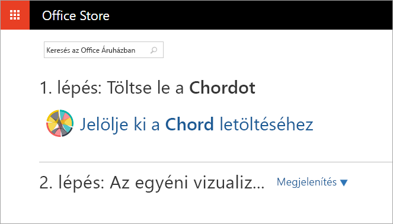

    A letöltési oldal az egyéni vizualizációnak a Power BI Desktopba és Power BI szolgáltatásba történő importálásával kapcsolatos utasításokat is tartalmaz.

    Egy mintajelentést is letölthet, amely tartalmazza az egyéni vizualizációt, és bemutatja annak képességeit.

    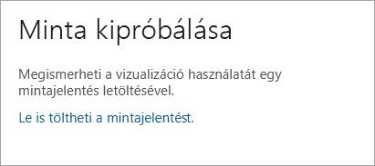

6. Mentse a .pbiviz-fájlt, majd nyissa meg a Power BI-t.    
7. Nyissa meg a jelentést, amelyhez hozzá szeretné adni az egyéni vizualizációt, majd a **Vizualizációk** ablaktábla alján kattintson a három pontot ábrázoló gombra, és válassza az **Importálás fájlból** lehetőséget.  

      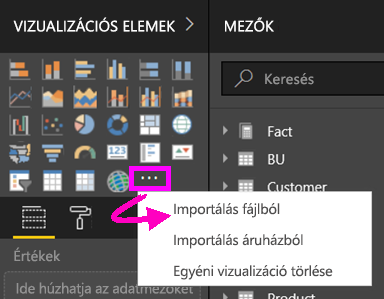

8. Válassza ki az egyéni vizualizáció fájlját. Ezzel hozzáadja annak ikonját a **Vizualizációk** ablaktábla aljához. Az egyéni vizualizáció most már használható a jelentésben.

    
    
##    Megfontolandó szempontok és hibaelhárítás

- Az egyéni vizualizáció az importálásakor az adott jelentéshez lesz hozzáadva. Ha egy másik jelentésben is használni szeretné a vizualizációt, abba a jelentésbe is importálnia kell. Ha egy egyéni vizualizációval rendelkező jelentést a **Mentés másként** lehetőséggel ment, az új jelentéssel együtt az egyéni vizualizáció egy másolata is mentve lesz.

- Ha nem látja a **Vizualizációk** ablaktáblát, akkor nem rendelkezik a jelentés szerkesztéséhez szükséges engedélyekkel.  Csak azokhoz a jelentésekhez adhat hozzá egyéni vizualizációkat, amelyek szerkesztésére jogosult, az Önnel megosztott jelentésekhez nem.

További kérdései vannak? [Forduljon a Power BI közösségéhez](http://community.powerbi.com/)

