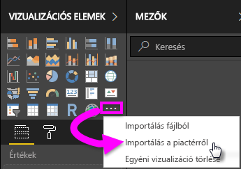
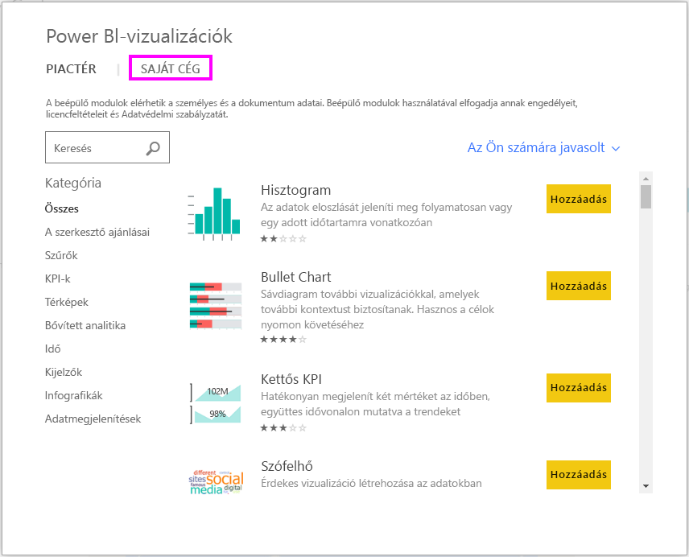
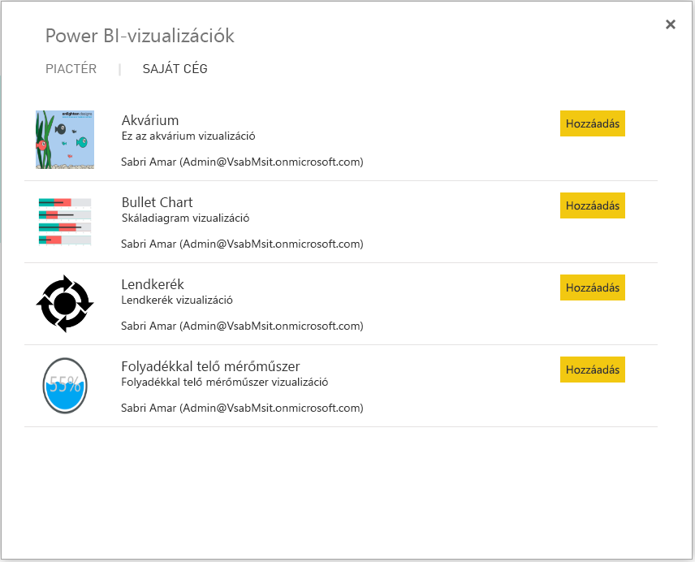
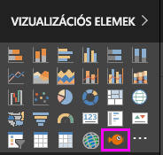

# Egyéni vizualizációk a Power BI-ban
Power BI-jelentések létrehozása vagy szerkesztése során számos különböző vizualizációtípus használatára van lehetősége. Ezek a vizualizációk a **Vizualizációk** ablaktáblában láthatók. A Power BI Desktop letöltésekor vagy a Power BI szolgáltatás (app.powerbi.com) megnyitásakor a vizualizációk egy készlete azonnal elérhető.

Ennél azonban több vizualizáció is a rendelkezésére áll. A három pontot ábrázoló gombra kattintva újabb vizualizációforrást nyithat meg, az *egyéni vizualizációkét*.

Az egyéni vizualizációkat fejlesztők hozzák létre az egyéni vizualizációk SDK-val, az üzleti felhasználók így az üzleti igényekhez leginkább igazodó módon tekinthetik meg az adataikat. A jelentéskészítők importálhatják az egyéni vizualizációkat a jelentéseikbe, és azokat a többi Power BI-vizualizációhoz hasonlóan használhatják. Az egyéni vizualizációk kiemelt helyet élveznek a Power BI szolgáltatáson belül, így szűrhetők, kiemelhetők, szerkeszthetők, megoszthatók és egyéb műveletekkel használhatók.

Az egyéni vizualizációk háromféle üzembe helyezési csatornán jelenhetnek meg:
* Egyéni vizualizációfájlok
* Szervezeti vizualizációk
* Piactér-vizualizációk

## Egyéni vizualizációfájlok

Az egyéni vizualizációk olyan csomagok, amelyek a nekik szolgáltatott adatok rendereléséhez szükséges kódot tartalmazzák. Egyéni vizualizációt bárki létrehozhat, valamint becsomagolhatja azt egy .pbiviz fájlként, amelyet aztán egy Power BI-jelentésbe importálhat.

> [!WARNING]
> Az egyéni vizualizációk biztonsági vagy adatvédelmi kockázatot jelentő kódokat tartalmazhatnak, ezért az a jelentésbe való importálás előtt győződjön meg arról, hogy megbízható a vizualizáció szerzője és forrása.
> 
> 

## Szervezeti vizualizációk

A Power BI-rendszergazdák egyéni vizualizációkat helyezhetnek üzembe a cégnél, a jelentéskészítők így könnyen felfedezhetik és használhatják a rendszergazda által jóváhagyott vizualizációkat. A rendszergazdák így konkrét egyéni vizualizációkat helyezhetnek üzembe a cégnél, valamint könnyen kezelhetik (frissíthetik, letilthatják vagy engedélyezhetik) őket. A jelentéskészítők pedig könnyen felfedezhetnek a cég számára egyedi vizualizációkat, amelyek frissítéséhez zökkenőmentes támogatást is kapnak.

További információt a szervezeti egyéni vizualizációkról [a szervezeti vizualizációkról szóló cikkekben](power-bi-custom-visuals-organization.md) találhat.

## Piactér-vizualizációk

A közösség és a Microsoft tagjai nyilvánosan megosztották az egyéni vizualizációikat az [AppSource](https://appsource.microsoft.com/en-us/marketplace/apps?product=power-bi-visuals) piactéren. Ezek a vizualizációk letölthetők, és hozzáadhatók a Power BI-jelentésekhez. Ezeket az egyéni vizualizációkat a Microsoftnál teszteltük és jóváhagytuk működés és minőség terén is.

Mi az az AppSource? Egyszerűen szólva az a hely, ahol a Microsoft-szoftverekhez alkalmazásokat, beépülő modulokat és bővítményeket találhat. Az [AppSource](https://appsource.microsoft.com/en-us/) többek között az Office 365, az Azure, a Dynamics 365, Cortana és a Power BI több millió felhasználóját köti össze olyan megoldásokkal, amelyekkel minden eddiginél hatékonyabban, mélyebb betekintéssel vagy látványosabban dolgozhatnak.

### Hitelesített vizualizációk

A Power BI-minősítéssel rendelkező vizualizációk olyan vizualizációk, amelyek a piactéren érhetők el, további szigorú minőségteszteken feleltek meg, és további forgatókönyvek, például [e-mailes előfizetések](https://docs.microsoft.com/power-bi/service-report-subscribe) és [PowerPointba történő exportálás](https://docs.microsoft.com/power-bi/service-publish-to-powerpoint) esetén is támogatottak.
A minősített egyéni vizualizációk listájának megtekintéséhez vagy saját vizualizáció közzétételéhez lásd a [minősített egyéni vizualizációkat](https://docs.microsoft.com/power-bi/power-bi-custom-visuals-certified) ismertető szakaszt.

Ön olyan webfejlesztő, aki szeretne saját vizualizációkat létrehozni, és hozzáadni azokat az AppSource-hoz? A [fejlesztői eszközöket ismertető](https://docs.microsoft.com/power-bi/service-custom-visuals-getting-started-with-developer-tools) rész megtekintésével megtudhatja, hogyan [tehet közzé egyéni vizualizációkat az AppSource-on](https://appsource.microsoft.com/en-us/marketplace/apps?product=power-bi-visuals).

### Egyéni vizualizáció importálása egy fájlból

1. Válassza a Vizualizációk ablaktábla alján található, három pontot ábrázoló gombot.

    

2. A legördülő listából válassza az **Importálás fájlból** lehetőséget.

    

3. A Fájl megnyitása menüben válassza ki az importálni kívánt .pbiviz-fájlt, majd válassza a Megnyitás lehetőséget. Az egyéni vizualizáció ikonja ekkor megjelenik a Vizualizációk ablaktábla alján, és már használhatja is a jelentésben.

    

### Szervezeti vizualizációk importálása

1. Válassza a Vizualizációk ablaktábla alján található, három pontot ábrázoló gombot.

    

2. A legördülő listából válassza az Importálás a piactérről lehetőséget.

    

3. Válassza a **SAJÁT SZERVEZET** lehetőséget a felső lap menüjében.

    

4. Tekintse át a listát, és keresse meg az importálni kívánt vizualizációt.
    
    

5. Az egyéni vizualizáció importálásához válassza a **Hozzáadás** parancsot. Az egyéni vizualizáció ikonja ekkor megjelenik a Vizualizációk ablaktábla alján, és már használhatja is a jelentésben.

    
 
## Egyéni vizualizáció letöltése vagy importálása a Microsoft AppSource-ról
Az egyéni vizualizációk letöltésének és importálásának két módja van. Megteheti ezt a Power BI-on belülről és az AppSource webhelyről.

### Egyéni vizualizációk importálása a Power BI-on belül

1. Válassza a Vizualizációk ablaktábla alján található, három pontot ábrázoló gombot.

    

2. A legördülő listából válassza az **Importálás a piactérről** lehetőséget.

    

3. Tekintse át a listát, és keresse meg az importálni kívánt vizualizációt.

    

4. Az egyes vizualizációk kijelölésével további információkat tudhat meg róluk.

    

5. A részletek lapon többek között képernyőképeket, videókat és részletes leírásokat tekinthet meg.

    

6. A képernyő alján értékelések is találhatók.

    

7. Az egyéni vizualizáció importálásához válassza a Hozzáadás parancsot. Az egyéni vizualizáció ikonja ekkor megjelenik a Vizualizációk ablaktábla alján, és már használhatja is a jelentésben.

    

### Egyéni vizualizáció letöltése és importálása a Microsoft AppSource-ról

1. A [Microsoft AppSource](https://appsource.microsoft.com) webhelyről kiindulva válassza az **Alkalmazások** lapot. 

    

2. Ez átirányítja Önt az [Alkalmazások találatainak oldalára](https://appsource.microsoft.com/en-us/marketplace/apps), ahol megtekintheti az egyes kategóriák legnépszerűbb alkalmazásait, beleértve a *Power BI-alkalmazásokat*. Mi azonban egyéni vizualizációkat keresünk, szóval szűkítsük le a találatokat a bal oldali navigációs listában található **Power BI-vizualizációk** lehetőség kiválasztásával.

    

3. Az AppSource minden egyes egyéni vizualizációhoz megjelenít egy csempét.  Minden csempe tartalmaz egy képernyőképet az egyéni vizualizációról, illetve egy rövid leírást és egy letöltési hivatkozást. További részletekért kattintson a csempére. 

    

4. A részletek lapon többek között képernyőképeket, videókat és részletes leírásokat tekinthet meg. Az egyéni vizualizáció letöltéséhez kattintson a **Letöltés most** hivatkozásra, és fogadja el a használati feltételeket. 

    

5. Kattintson az egyéni vizualizáció letöltési hivatkozására.

    

    A letöltési oldal az egyéni vizualizációnak a Power BI Desktopba és Power BI szolgáltatásba történő importálásával kapcsolatos utasításokat is tartalmaz.

    Egy mintajelentést is letölthet, amely tartalmazza az egyéni vizualizációt, és bemutatja annak képességeit.

    

6. Mentse a .pbiviz-fájlt, majd nyissa meg a Power BI-t.

7. Importálja a .pbiviz-fájlt a jelentésbe (lásd a fenti,[Egyéni vizualizáció importálása egy fájlból](#import-a-custom-visuals-from-a-file) című szakaszt)

## Megfontolandó szempontok és hibaelhárítás

- Az egyéni vizualizáció az importálásakor az adott jelentéshez lesz hozzáadva. Ha egy másik jelentésben is használni szeretné a vizualizációt, abba a jelentésbe is importálnia kell. Ha egy egyéni vizualizációval rendelkező jelentést a **Mentés másként** lehetőséggel ment, az új jelentéssel együtt az egyéni vizualizáció egy másolata is mentve lesz.

- Ha nem látja a **Vizualizációk** ablaktáblát, akkor nem rendelkezik a jelentés szerkesztéséhez szükséges engedélyekkel.  Csak azokhoz a jelentésekhez adhat hozzá egyéni vizualizációkat, amelyek szerkesztésére jogosult, az Önnel megosztott jelentésekhez nem.

További kérdései vannak? [Kérdezze meg a Power BI közösségét](http://community.powerbi.com/)
