# Ismerkedés a jelentések Szűrők panelével
A cikk a jelentések Szűrők panelét mutatja be részletesen. A panel [a Power BI szolgáltatásban Szerkesztési és Olvasó nézetben](service-reading-view-and-editing-view.md), míg a [Power BI Desktopban Jelentés nézetben](desktop-report-view.md) jelenik meg.

Az adatok szűrésének számos módja áll rendelkezésre a Power BI-ban, ezért javasoljuk, hogy először olvassa el a [szűrőkkel és a kiemeléssel](power-bi-reports-filters-and-highlighting.md) foglalkozó szakaszt.

## A szűrők használata
A jelentések [Szerkesztő vagy Olvasó nézetben](service-reading-view-and-editing-view.md) nyithatóak meg. Szerkesztési nézetben a tulajdonosai [szűrőket adhatnak a jelentéshez](power-bi-report-add-filter.md), és a szűrők a jelentéssel együtt lesznek mentve. Azok, akik Olvasó nézetben tekintik meg a jelentést, kezelhetik a szűrőket, de nem menthetik a jelentést a módosított szűrőkkel.

## Az Olvasás nézet szűrői
Amikor megnyit egy jelentést Olvasás nézetben, a Szűrők panel megjelenik a jelentésvászon jobb oldalán. Ha a panel nem látható, a jobb felső sarokban található nyíllal nyitható meg.

Ehhez a példához egy 6 szűrővel rendelkező vizualizációt választottunk. A jelentésoldalon szintén találhatóak szűrők – ezek a **Lapszintű szűrők** cím alatt vannak felsorolva. Egy [Részletezési szűrő](power-bi-report-add-filter.md) is rendelkezésre áll, továbbá a teljes jelentésre is vonatkozik egy szűrő: a **FiscalYear** (Pénzügyi év) lehet 2013 vagy 2014.

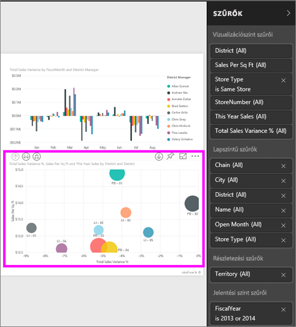

Némelyik szűrő mellett a **Mind** szó szerepel, ami azt jelzi, hogy a szűrő az összes értékre kiterjed.  A fenti képernyőfelvételen például a **Chain (All)** (Lánc (Mind)) beállítás azt jelzi, hogy a jelentésoldal az összes áruházlánc adatait tartalmazza.  Másfelől, a **FiscalYear is 2013 or 2014** (A pénzügyi év 2013 vagy 2014) jelentésszintű szűrő azt jelzi, hogy a jelentés csak a 2013-as és 2014-es pénzügyi évek adatait tartalmazza.

Bárki, aki megtekinti a jelentést, kezelheti ezeket a szűrőket.

* Megtekintheti egy szűrő részleteit, ha a kurzort a mellette lévő nyílra viszi, majd kijelöli a nyilat.
  
   
* Módosíthatja a szűrő értékeit, például a **Lindseys** értékét **Fashions Direct** értékre válthatja.
  
     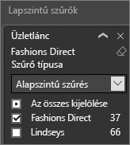
* Törölheti a szűrőt, ha a neve melletti **x** gombra kattint.
  
  A szűrő törlése eltávolítja a szűrőt a listából, de az adatokat nem törli a jelentésből.  Például ha törli a **FiscalYear is 2013 or 2014** szűrőt, a pénzügyi évek adatai továbbra is elérhetők a jelentésben, azonban a jelentés nem lesz a 2013-as és 2014-es pénzügyi évre korlátozva, hanem az összes olyan üzleti évet mutatja majd, amelyre vonatkozóan vannak adatok.  Miután törölt egy szűrőt, többé már nem tudja módosítani, mert lekerül a listáról. Jobb megoldás, ha csak a szűrő értékét törli a radír ikonra  kattintva.
  
  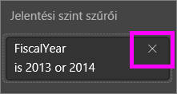

## Szűrők a Szerkesztési nézetben
Amikor megnyit egy jelentést a szerkesztési nézetben, a Szűrők panel megjelenik a jelentésvászon jobb oldalán, a **Vizualizáció panel** alsó részén. Ha a panel nem látható, a jobb felső sarokban található nyíllal nyitható meg.

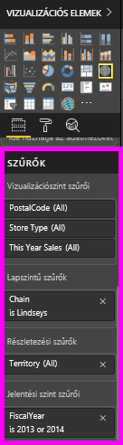.  

Ha egy vizualizáció sincs kijelölve a vásznon, a Szűrők panel csak a teljes jelentésoldalra vagy a teljes jelentésre vonatkozó szűrőket, valamint az esetlegesen beállított részletezési szűrőket jeleníti meg. Az alábbi példában nincsenek vizualizációk kiválasztva, továbbá lapszintű és részletezési szűrők sincsenek, csupán egyetlen jelentésszintű szűrő érhető el.  

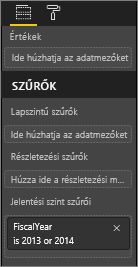  

Ha valamelyik vizualizáció ki van választva a vásznon, a csak az adott vizualizációra vonatkozó szűrők is megjelennek:   

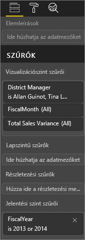

Az egyes szűrők beállítási lehetőségeinek megjelenítéséhez kattintson a lefelé mutató nyílra a szűrő neve mellett.  Az alábbi példában a jelentésszintű szűrő a 2013-as és 2014-es évre van állítva. Ez a példa az **alapszintű szűrést mutatja be**.  A speciális beállítások megjelenítéséhez válassza a **Speciális szűrés** lehetőséget.

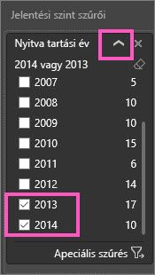

## Szűrők törlése
 A szűrőket az alapszintű és a speciális szűrési módban is a radír ikonnal  lehet visszaállítani. 

## Szűrők hozzáadása
* Ha szerkesztési nézetben a vizualizációkhoz, oldalakhoz, részletezésekhez vagy jelentésekhez szűrőt szeretne megadni, jelölje ki a mezőt a Mezők panelen, és húzza a megfelelő szűrési területre, ahol a **Húzza ide a mezőket** felirat látható. Miután hozzáadott egy szűrőt, az alapszintű és a speciális szűrés vezérlőivel (lásd alább) finomhangolhatja a működését.

- **Ha egy új mezőt húz a Vizualizációszint szűrői területére, az nem kerül fel a vizualizációra**, csak lehetővé teszi a vizualizáció szűrését ezzel az új mezővel. Az alábbi példában a **Chain** (Lánc) mezőt új szűrőként hozzáadtuk a vizualizációhoz. Fontos megjegyezni, hogy a **Chain** (Lánc) szűrőként való hozzáadása nem módosítja a vizualizációt, amíg nem veszi használatba alapszintű vagy a speciális szűrés vezérlőit.

    

* Az egyes vizualizációk létrehozásához használt mezők is használhatók szűrőként. Először jelölje ki, és ezzel tegye aktívvá a vizualizációt. A vizualizációban használt mezők a Vizualizációk panelen vannak felsorolva (Szerkesztési nézetben), valamint a Szűrők panelen a **Vizualizációszint szűrői** cím alatt.
  
   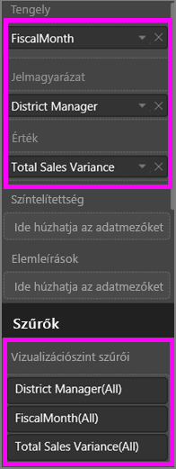  
  
   A szűrők finomhangolásához használja az alapszintű és a speciális szűrésvezérlőket (lásd alább).

## Szűrők típusai: szövegmezők szűrői
### Lista mód
A jelölőnégyzetekkel jelölhetők be az értékek vagy vonható vissza a bejelölésük. A **Mind** jelölőnégyzettel az összes jelölőnégyzet egyszerre jelölhető be, illetve egyszerre vonható vissza a kijelölésük. A jelölőnégyzetek az adott mező összes lehetséges értékét felsorolják.  A szűrők módosításával a szűrőutasítás frissül, és tükrözi a változtatásokat. 

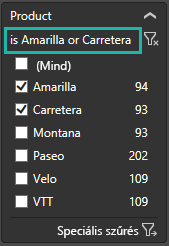

Mint látható, az utasítás most a következő: „is Amarilla or Carretera” („Amarilla vagy Carretera”).

### Speciális mód
Kattintson a **Speciális szűrés** gombra, ha speciális módra szeretne váltani. A legördülő vezérlőkkel és szövegmezőkkel választhatja ki a szerepeltetendő mezőket. Az **És** és a **Vagy** operátorok használatával összetett szűrőkifejezéseket hozhat létre. Miután beállította a kívánt értékeket, kattintson a **Szűrő alkalmazása** gombra.  

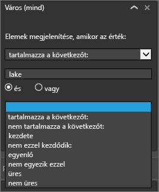

## Szűrők típusai: numerikus mezők szűrői
### Lista mód
Ha az értékek száma véges, a mező nevének kijelölésekor egy lista jelenik meg.  A jelölőnégyzetek használatával kapcsolatban lásd a fenti **Szövegmezők szűrői** &gt; **Lista mód** szakaszt.   

### Speciális mód
Ha az értékek száma véges vagy egy tartományt jelölnek, a mező nevének kijelölésekor megnyílik a speciális szűrési mód. A legördülő listák és a szövegmezők használatával adhatja meg a megjeleníteni kívánt értékek tartományát. 

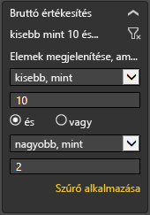

Az **És** és a **Vagy** operátorok használatával összetett szűrőkifejezéseket hozhat létre. Miután beállította a kívánt értékeket, kattintson a **Szűrő alkalmazása** gombra.

## Szűrők típusai: dátum és időpont
### Lista mód
Ha az értékek száma véges, a mező nevének kijelölésekor egy lista jelenik meg.  A jelölőnégyzetek használatával kapcsolatban lásd a fenti **Szövegmezők szűrői** &gt; **Lista mód** szakaszt.   

### Speciális mód
Ha egy mező dátum- vagy időértékeket tartalmaz, a Dátum/idő szűrőknél megadhat kezdő és befejező időpontokat.  

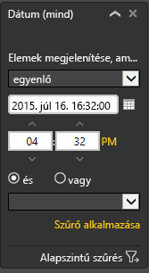

## Következő lépések
[Szűrők és kiemelések a jelentésekben](power-bi-reports-filters-and-highlighting.md)  
[Szűrők és kiemelések használata a jelentések Olvasás nézetében](service-reading-view-and-editing-view.md)  
[Szűrők létrehozása a jelentések Szerkesztési nézetében](power-bi-report-add-filter.md)  
[A jelentésvizualizációk keresztszűrési és keresztkiemelési viselkedésének módosítása](service-reports-visual-interactions.md)

A [Power BI jelentéseiről itt talál](service-reports.md) további információkat  
[Power BI – Alapfogalmak](service-basic-concepts.md)

További kérdései vannak? [Kérdezze meg a Power BI közösségét](http://community.powerbi.com/)

