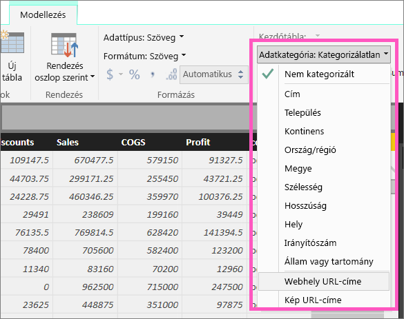
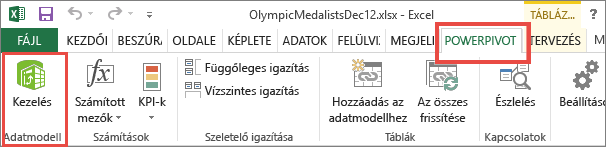
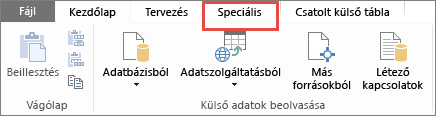
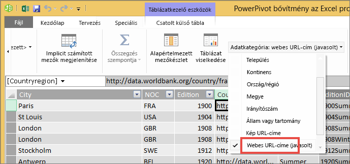

# Hivatkozások a táblázatokban
Ez a témakör azt mutatja be, hogyan hozhatók létre hivatkozások a Power BI Desktopban. A létrehozott hivatkozásokat a Power BI Desktop vagy a Power BI szolgáltatás segítségével adhatja hozzá a jelentések táblázataihoz és a mátrixokhoz. 

> **MEGJEGYZÉS**: Az [irányítópultok csempéin](service-dashboard-edit-tile.md) és az [irányítópultok szövegdobozain](service-dashboard-add-widget.md) lévő hivatkozásokat a Power BI szolgáltatással hozhatja létre menet közben. A [jelentések szövegdobozaiban](service-add-hyperlink-to-text-box.md) lévő hivatkozásokat a Power BI szolgáltatással és a Power BI Desktoppal is létrehozhatja menet közben.
> 
> 

## Hivatkozás létrehozása táblázatban vagy mátrixban a Power BI Desktop segítségével
A táblázatokban és mátrixokban lévő hivatkozásokat csak a Power BI Desktoppal hozhatja létre, a Power BI szolgáltatással nem. A hivatkozásokat az Excel Power Pivotban is létrehozhatja, mielőtt a munkafüzeteket a Power BI-ba importálná. Az alábbiakban mindkét módszer leírása megtalálható.

## Hivatkozás létrehozása táblázatban vagy mátrixban a Power BI Desktop használatával
A hivatkozás felvételének menete attól függ, hogy importálta az adatokat, vagy a DirectQuery segítségével csatlakozott hozzájuk. Az alábbiakban mindkét eset leírása megtalálható.

### Power BI-ba importált adatok
1. Ha a hivatkozás még nem létezik mezőként az adatkészletben, vegye fel a Desktoppal [egyéni oszlopként](desktop-common-query-tasks.md).
2. Az Adatok nézetben válassza ki az oszlopot, és a **Modellezés** lapon válassza az **Adatkategória** legördülő menüt.
   
    
3. Kattintson a **Webes URL-cím** lehetőségre.
4. Váltson Jelentés nézetre, majd hozzon létre egy táblázatot vagy mátrixot a Webes URL-cím kategóriába sorolt mező használatával. A hivatkozások kék színnel, aláhúzva jelennek meg.
    
> **FIGYELEM**: Az URL-címeknek a **http://, a https://** vagy a **www** előtaggal kell kezdődniük.
> 
>   
5. Ha nem szeretne hosszú URL-címet megjeleníteni a táblázatban, használhatja helyette a  hivatkozásikont is. Figyelem: a mátrixokban nem jeleníthet meg ikonokat.
   
   * A diagram aktiválásához kattintson a diagramra.
   * A festőhenger ikonra  kattintva nyissa meg a Formázás lapot.
   * Bontsa ki az **Értékek** elemet, keresse meg az **URL-ikont**, és kapcsolja **Be**.
6. (Nem kötelező.) [A Desktopról származó jelentést közzéteheti a Power BI szolgáltatásban](guided-learning/publishingandsharing.yml?tutorial-step=2), és megnyithatja a Power BI szolgáltatáson belül. A hivatkozások itt is működni fognak.

### DirectQuery segítségével csatlakoztatott adatok
DirectQuery módban nem hozhat létre új oszlopot,  de az adatokban már meglévő URL-címeket átalakíthatja hivatkozásokká.

1. Jelentés nézetben hozzon létre egy táblázatot egy URL-címeket tartalmazó mezővel.
2. Jelölje ki az oszlopot, majd a **Modellezés** lapon válassza az **Adatkategória** legördülő menüt.
3. Kattintson a **Webes URL-cím** lehetőségre. A hivatkozások kék színnel, aláhúzva jelennek meg.
4. (Nem kötelező.) [A Desktopról származó jelentést közzéteheti a Power BI szolgáltatásban](guided-learning/publishingandsharing.yml?tutorial-step=2), és megnyithatja a Power BI szolgáltatáson belül. A hivatkozások itt is működni fognak.

## Hivatkozás létrehozása táblázatban vagy mátrixban az Excel Power Pivot használatával
A Power BI táblázataihoz és mátrixaihoz úgy is hozzáadhatja a hivatkozásokat, hogy még azelőtt létrehozza őket az adatkészletben, hogy az adatkészletet importálná vagy csatlakoztatná a Power BI-ban. Ez a példa egy Excel-munkafüzetet használ.

1. Nyissa meg a munkafüzetet az Excelben.
2. Kattintson a **PowerPivot** lapra, majd a **Kezelés** elemre.
   
   
3. Amikor megnyílik a PowerPivot, kattintson a **Speciális** fülre.
   
   
4. Vigye a kurzort arra az oszlopra, amely azokat az URL-címeket tartalmazza, amelyeket hivatkozásokká szeretne alakítani a Power BI tábláiban.
   
   > **FIGYELEM**: Az URL-címeknek a **http://, a https://** vagy a **www** előtaggal kell kezdődniük.
   > 
   > 
5. A **Jelentéskészítési tulajdonságok** csoportban válassza az **Adatkategória** legördülő menüt, és kattintson a **Webes URL-cím** elemre. 
   
   
6. Csatlakozzon a munkafüzethez a Power BI szolgáltatásból vagy a Power BI Desktopról, vagy importálja a munkafüzetet.
7. Hozzon létre egy táblázatvizualizációt, amely tartalmazza az URL-mezőt.
   
   

## Megfontolandó szempontok és hibaelhárítás
K: Használhatok hivatkozásként egyéni URL-t a táblázatokban és a mátrixokban?    
V: Nem. Csak hivatkozás ikont lehet használni. Ha a hivatkozáshoz egyéni szöveget szeretne használni, és túl kevés URL van a listán, érdemes lehet szövegmezőt használni inkább.

## Következő lépések
[Vizualizációk a Power BI jelentéseiben](power-bi-report-visualizations.md)

[Power BI – Alapfogalmak](service-basic-concepts.md)

További kérdései vannak? [Kérdezze meg a Power BI közösségét](http://community.powerbi.com/)

