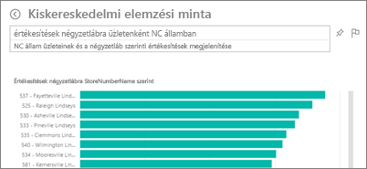
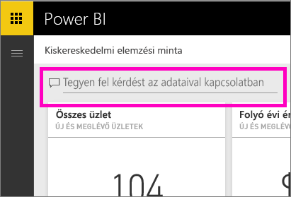
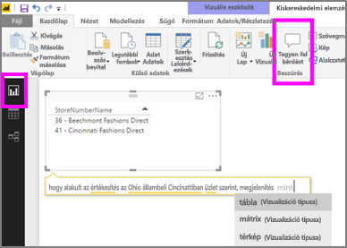

# A Q&A a Power BI szolgáltatásban és a Power BI Desktopban
## Mi a Q&A?
Ha válaszokat keres az adatokban, néha az a leggyorsabb megoldás, ha természetes nyelven kérdez. Például: „what were total sales last year (mennyi volt az összes értékesítés tavaly).”  A Q&A szolgáltatás könnyen használható, természetes nyelvi funkciókat kínál az adatok elemzéséhez, és kérdéseire grafikonok vagy diagramok formájában ad választ. A Q&A nem keresőmotor – csak a Power BI-ban lévő adatokról szolgáltat eredményeket.

Ebben a cikkben minden olyan témát tárgyalunk, amelyet a Q&A használatba vételéhez ajánlunk. Az alábbi hivatkozásokat követve arról tájékozódhat, hogy hogyan működik a Q&A a Power BI szolgáltatásban (irányítópultok és jelentések), a Power BI Embeddedben és a Power BI Mobile-ban.  

> [!NOTE]
> A **Power BI Q&A** csak angol nyelven támogatja a természetes nyelven írt lekérdezések megválaszolását. Kipróbálhatja a spanyolul feltett kérdésekre válaszoló előzetes verziójú funkciót is. A **Power BI Desktopban** nyissa meg a **Fájl**, **Lehetőségek és beállítások**, **Beállítások** menüt, és keresse meg az **Előzetes verziójú funkciók** fület. Jelölje be **A Q&A spanyol nyelvű támogatása** jelölőnégyzetet.  
>
>

A kérdés megfogalmazása csak az első lépés.  Pontosíthatja vagy kibővítheti a kérdést, megbízható új információkat fedezhet fel, összpontosíthat a részletekre, vagy feltárhatja a szélesebb összefüggéseket, így az adatok feltérképezése valódi élménnyé válik. Örömét lelheti az új eredményekben és felfedezésekben.

Valóban interaktív élmény... és gyors! A memóriabeli tárolás segítségével szinte egy pillanat alatt megkapja a választ.

##  Q&A *felhasználók* számára
Ha megosztanak Önnel egy irányítópultot, a Q&A kérdésmező a Power BI szolgáltatásban (app.powerbi.com) az irányítópulton jelenik meg, a Power BI Mobile-ban az irányítópult alján, míg a Power BI Embeddedben a vizualizáció fölött. Ha a tulajdonos nem adott Önnek szerkesztési jogosultságot, akkor megnézheti és feltárhatja az adatokat, de a Q&A használatával létrehozott vizualizációkat nem fogja tudni menteni.

## Q&A *létrehozók* számára
Ha Ön a Power BI-jelentés *létrehozója*, vagy ha jogosultsága van az adatkészlet szerkesztéséhez, akkor a Q&A kérdésmezője a Power BI szolgáltatásban az irányítópulton jelenik meg, és a Power BI szolgáltatásban és a Power BI Desktopban minden jelentésoldalon. A Q&A használatával létrehozott vizualizációk irányítópulton és jelentésbe is menthetők lesznek.

Az adatok vizsgálatán túl a létrehozók és az adatkészletek tulajdonosai javíthatják is a Q&A felhasználói élményét a felhasználók számára: [módosíthatják az adatkészletet](service-prepare-data-for-q-and-a.md), hozzáadhatnak [kiemelt kérdéseket](service-q-and-a-create-featured-questions.md), valamint [engedélyezhetik és letilthatják a Q&A-t](service-q-and-a-direct-query.md) a helyszíni élő kapcsolatú adatkészletek használatához. [Beágyazott megoldások](developer/qanda.md) esetén a fejlesztők két mód közül választhatnak: **interaktív** és **csak eredmény**.

## Honnan tudja a Q&A, hogy hogyan válaszoljon meg egy kérdést?
### Melyik adatkészleteket használja a Q&A?
Honnan tudja a Q&A, hogy hogyan válaszoljon meg egy adott adatokra vonatkozó kérdést? Az alapul szolgáló adatkészlet tábláinak, oszlopainak és számított mezőinek nevére támaszkodik. Éppen ezért fontos, hogy Ön (vagy az adatkészlet tulajdonosa) mit minek nevez el!

Például egy “Eladások” nevű Excel-táblázatban, amelynek “Termék”, “Hónap”, “Eladott mennyiség”, “Bruttó bevétel” és “Nyereség” nevű oszlopai vannak, Ön kérdéseket tehet fel ezek bármelyikével kapcsolatban.  Kérheti az *eladások* és az összes *nyereség* *havonkénti* kimutatását, a *termékek* *eladott mennyiség* szerinti rendezését és sok minden mást.

A Q&A az adatkészlet felépítésén alapuló kérdésekre képes választ adni. Hogyan működne ez Salesforce-adatok esetén? Amikor Ön a salesforce.com-fiókjához kapcsolódik, a Power BI automatikusan létrehoz egy irányítópultot.  Mielőtt elkezdene kérdéseket feltenni a Q&A-val, vessen egy pillantást az irányítópult vizualizációin és a Q&A legördülő menüjében látható adatokra.

* Ha a vizualizáció tengelyfeliratai és értékei között szerepelnek a "sales", "account", "month" és "opportunity" szavak, akkor feltehet olyan angol nyelvű kérdéseket, mint hogy "Which *account* has the highest *opportunity*", vagy "show *sales* by month as a bar chart".
* Ha a legördülő listában szerepelnek a "salesperson", "state", és "year" szavak, akkor bizonyára választ kap a "which *salesperson* had the lowest *sales* in *Florida* in *2013*" angol nyelvű kérdésre.

Ha egy webhely Google Analytics-beli teljesítményadatairól van szó, akkor kérdezheti a Q&A-t a weboldalakon töltött időről, az egyedi látogatások számáról és a felhasználói érdeklődés mérőszámairól. Demográfiai adatok lekérdezésekor például az életkor és a háztartások bevétele földrajzi hely szerinti eloszlásáról tehet fel kérdéseket.

### Mely vizualizációkat használja a Q&A?
A Q&A az éppen megjelenített adatok alapján választja ki a legalkalmasabb vizualizációt. Az alapul szolgáló adatkészlet(ek) adatai egy bizonyos típusba vagy kategóriába vannak besorolva, ami segít a Q&A-nak eldönteni, hogy hogyan jelenítse meg. Ha az adat például dátum típusúként van megadva, akkor nagyobb valószínűséggel jelenik meg vonaldiagramként. Városként kategorizált adatok nagyobb valószínűséggel lesznek térképen megjelenítve.

Utasíthatja is a Q&A-t, hogy melyik vizualizációt használja, ha hozzáfűzi azt a kérdéséhez. Azt azonban mindig vegye figyelembe, hogy a Q&A nem mindig tudja a kért vizualizációtípusban megjeleníteni az adatokat.

A Q&A által felismert kulcsszavakról a [Tippek kérdések feltevéséhez](service-q-and-a-tips.md) című cikkben talál információt.

## További információk a Power BI Q&A szolgáltatásáról
[A Q&A használata Power BI-irányítópultokkal és jelentésekkel – áttekintés](power-bi-tutorial-q-and-a.md): Részletes leírás a Q&A használatához és a működésének áttekintése.

[Microsoft Power BI mobilalkalmazás](mobile-apps-ios-qna.md) iOS-hez készült iPadekhez, iPhone-okhoz, és iPod Touch eszközökhöz.

[Microsoft Power BI Embedded](developer/qanda.md) A Q&A beágyazása alkalmazásba.

[Tippek a kérdésfeltevéshez a Q&A szolgáltatásban](service-q-and-a-tips.md):Megtudhatja, miképpen fogalmazhatja meg kérdéseit a Q&A-ban, hogy a legjobb válaszokat kapja meg.

[Kiemelt kérdések hozzáadása az adatkészletekhez](service-q-and-a-create-featured-questions.md): Ha ezt a megoldást választja, a Q&A javasolni fogja a kérdéseket a munkatársainak.

[A Q&A engedélyezése helyszíni adatkészletekhez](service-q-and-a-direct-query.md) Ha az adatkészlethez való csatlakozáshoz átjáróra van szüksége, használja a Power BI beállításait a Q&A be- és kikapcsolásához.

[Oktatóanyag: A Q&A használata a Kiskereskedelmi értékesítési mintával a Power BI szolgáltatásban](power-bi-visualization-introduction-to-q-and-a.md): Valósághű iparági oktatóanyag a Q&A használatáról.

[Az adatok és a Q&A összeegyeztetése](service-prepare-data-for-q-and-a.md): Adatkészleteket és adatmodelleket állít elő?  Akkor ez a témakör Önnek szól.

További kérdései vannak? [Kérdezze meg a Power BI közösségét](http://community.powerbi.com/)
