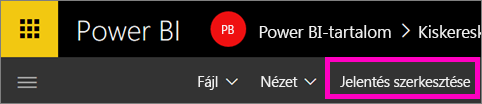
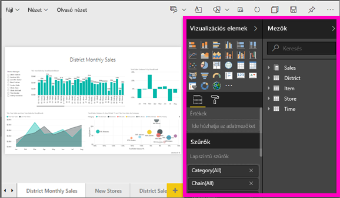
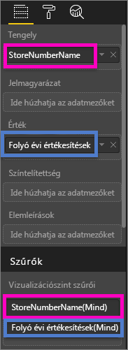
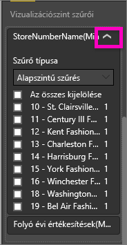
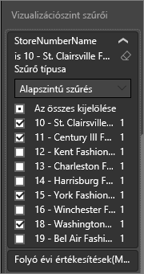
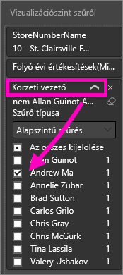
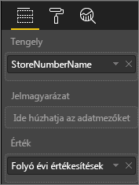
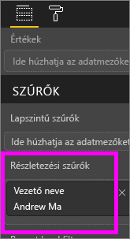
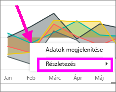
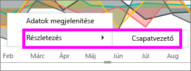

# Szűrő hozzáadása Power BI-jelentéshez (Szerkesztési nézetben)
> [!TIP]
> Javasoljuk, hogy először olvassa el a [Power BI- jelentések szűrőivel és kiemeléseivel](power-bi-reports-filters-and-highlighting.md) foglalkozó szakaszt.
> 
> 

## Mi a különbség a Szerkesztési nézet és az Olvasás nézet jelentésszűrői között?
A jelentések két módban használhatók: [Olvasás nézetben](service-interact-with-a-report-in-reading-view.md) és [Szerkesztési nézetben](service-interact-with-a-report-in-editing-view.md).  A szűrési képességek attól függnek, hogy milyen módban van éppen.

* Szerkesztési nézetben hozzáadhat jelentés-, oldal- és vizualizációszűrőket. Ha menti a jelentést, a rendszer a szűrőket is menti. Azok, akik Olvasás nézetben tekintik meg a jelentést, használhatják a hozzáadott szűrőket, de nem menthetik a módosításokat.
* Olvasás nézetben használhatja a jelentésben már meglévő jelentés-, oldal- és vizualizációszűrőket, de nem mentheti a szűrők módosításait.

> [!NOTE]
> Ez a cikk azt ismerteti, hogyan hozhatók létre szűrők egy jelentés **Szerkesztési nézetében**.  Az Olvasás nézet szűrőire vonatkozó további információkért tekintse át [a jelentés szűrőinek Olvasás nézetben történő használatával](service-interact-with-a-report-in-reading-view.md) foglalkozó témakört.
> 
> 

## Vizualizáció-, oldal-, részletezési és jelentésszűrők
Egy **oldalszűrő** a jelentésoldal összes vizualizációjára vonatkozik. Egy **vizualizációszűrő** egy adott vizualizációra vonatkozik a jelentésoldalon. A **jelentésszűrő** a jelentés összes oldalára vonatkozik.

## Szűrő hozzáadása egy adott vizualizációhoz (vizualizációszűrő)
Ennek 2 módja van: 

* Szűrhet egy, a vizualizáció által már használt mezőt
* Azonosíthat egy mezőt, amelyet a vizualizáció még nem használ, és hozzáadhatja ezt a mezőt közvetlenül a **Vizualizációszint szűrői** gyűjtőhöz.

### A vizualizációban már szereplő mezők szűrése
1. Nyissa meg a [jelentést Szerkesztési nézetben](service-reading-view-and-editing-view.md).
   
   
2. Nyissa meg a Megjelenítések, a Szűrők és a Mezők panelt (ha még nincsenek megnyitva).
   
   
3. Tegyen aktívvá egy vizualizációt kijelöléssel. A vizualizáció által használt összes mező szerepel a **Mezők** és a **Szűrők** panelen is, a **Vizualizációszint szűrői** fejléc alatt.
   
   
4. Ezen a ponton felveszünk egy szűrőt egy, a vizualizáció által már használt mezőhöz. 
   
   * Görgessen le a **Vizualizációszint szűrői** területre, és a nyilat kiválasztva bontsa ki a szűrni kívánt mezőt. Ebben a példában a **StoreNumberName** mezőt szűrjük.
     
       
   * Állítson be **Alapszintű**, **Speciális** vagy **Felső N** szűrésvezérlőket (lásd [a jelentésszűrők használatát](power-bi-how-to-report-filter.md) ismertető témakört). Ebben a példában Alapszintű szűrést választunk, és a következő számok jelölőnégyzetét jelöljük ki: 10, 11, 15 és 18.
     
       
   * A vizualizáció módosul az új szűrőnek megfelelően. Ha menti a jelentést a szűrővel, a jelentés olvasói használhatják a szűrőt Olvasás nézetben: kiválaszthatnak vagy törölhetnek értékeket.
     
      
5. Most vegyünk fel egy teljesen új mezőt a vizualizációhoz vizualizáció szintű szűrőnek.
   
   * A Mezők panelen válassza ki az új vizualizáció szintű szűrőként felvenni kívánt mezőt, és húzza a **Vizualizációszint szűrői területre**.  Ebben a példában a **District Manager** (kerületi vezető) mezőt húzzuk a **Vizualizációszint szűrői** gyűjtőbe, és csak Andrew Mát választjuk ki. 
     
      
   * Vegye figyelembe, hogy a **District Manager** elemet a rendszer *nem* adta hozzá magához a vizualizációhoz. A vizualizációnak még mindig a **StoreNumberName** mező a tengelye, és a **This Year Sales** (Idei értékesítések) az értéke.  
     
      
   * A vizualizáció maga viszont úgy van most szűrve, hogy csak Andrew idei értékesítéseit jelenítse meg az adott üzletekhez.
     
     

## Szűrő hozzáadása az egész oldalhoz (oldalnézetszűrő)
1. Nyissa meg a [jelentést Szerkesztési nézetben](service-reading-view-and-editing-view.md).
2. Nyissa meg a Megjelenítések, a Szűrők és a Mezők panelt (ha még nincsenek megnyitva).
3. A Mezők panelen válassza az új oldalszintű szűrőként hozzáadni kívánt mezőt, és húzza a **Lapszintű szűrők** területre.  
4. Válassza ki a szűrni kívánt értékeket, és állítson be **Alapszintű** vagy **Speciális** szűrésvezérlőket (lásd [a jelentésszűrők használatát](power-bi-how-to-report-filter.md) ismertető témakört).
   
   A rendszer a szűrő hatálya alá eső oldalon szereplő összes vizualizációt újrarajzolja, hogy megfeleljenek a módosításnak. 
   
   

Ha menti a jelentést a szűrővel, a jelentés olvasói használhatják a szűrőt Olvasás nézetben: kiválaszthatnak vagy törölhetnek értékeket.

## Részletezési szűrő hozzáadása
A Power BI szolgáltatás és a Power BI Desktop részletezési funkciójával olyan *cél* jelentésoldalt hozhat létre, amely egy adott entitásra összpontosít – például egy szállítóra, ügyfélre vagy gyártóra. A felhasználók a jelentés többi oldalán a jobb gombbal az entitáshoz tartozó adatpontra kattintva eljuthatnak az összpontosított oldalra.

### Részletezési szűrő létrehozása
Annak érdekében, hogy követni tudja a lépéseket, nyissa meg az ügyfél-jövedelmezőségi mintát Szerkesztési nézetben. Tegyük fel, hogy egy olyan oldalt szeretne, amely a vezetői üzleti területekre összpontosít.   

1. Adjon a jelentéshez egy új, **Csapatvezető** nevű oldalt. Ez lesz a részletezés *céloldala*.
2. Adjon hozzá vizualizációkat, amelyek nyomon követik a csapatvezetők üzleti területeinek fő mérőszámait.    
3. Vegye fel a Részletezési szűrők szakaszba a **Vezető > Vezető neve** elemet.    
   
    
   
    Észreveheti, hogy a Power BI hozzáad egy vissza nyilat a jelentésoldalhoz.  A vissza nyíl kiválasztásával a felhasználó visszatér a *kiindulási* jelentésoldalra, ahol a részletezés megjelenítése mellett döntött. A vissza nyíl csak Olvasás nézetben működik.
   
     

### A részletezési szűrő használata
Lássuk, hogy működik a részletezési szűrő.

1. Kezdjen a **Team Scorecard** (Csapat mutatószáma) jelentésoldalon.    
2. Tegyük fel, hogy Ön Andrew Ma, és úgy szeretné megtekinteni a Csapatvezető jelentésoldalt, hogy az csak a saját adatait mutassa.  A diagram bal felső területén kattintson a jobb gombbal egy zöld adatpontra a Részletezés menüelem megnyitásához.
   
    
3. Válassza a **Részletezés > Csapatvezető** lehetőséget, hogy a **Csapatvezető** jelentésoldalra lépjen. A rendszer szűri az oldalt, hogy megjelenítse azon adatpont információit, amelyre a jobb gombbal kattintott, ami ebben az esetben az Andrew Ma. Csak a Részletezési szűrők szakaszban lévő mező kerül át a részletező jelentésoldalra.  
   
    

## Szűrő hozzáadása egy teljes jelentéshez (jelentésszűrő)
1. Nyissa meg a [jelentést Szerkesztési nézetben](service-reading-view-and-editing-view.md).
2. Nyissa meg a Megjelenítések, a Szűrők és a Mezők panelt (ha még nincsenek megnyitva).
3. A Mezők panelen válassza ki az új jelentésszintű szűrőként felvenni kívánt mezőt, és húzza a **Jelentési szint szűrői** területre.  
4. Válassza ki a szűrni kívánt értékeket (lásd [a jelentésszűrők használatát](power-bi-how-to-report-filter.md) ismertető témakört).

A vizualizációk a jelentés összes oldalán módosulnak az új szűrőnek megfelelően, az aktív oldalt is beleértve. Ha menti a jelentést a szűrővel, a jelentés olvasói használhatják a szűrőt Olvasás nézetben: kiválaszthatnak vagy törölhetnek értékeket.

1. A vissza nyilat kiválasztva térhet vissza az előző jelentésoldalra.

## Hibaelhárítás
### Miért adhat különböző eredményt a vizualizációszintű és az oldalszintű szűrő?
Amikor vizualizációszintű szűrőt ad meg, a Power BI az összesített eredményeket szűri.  Az alapértelmezett összesítés a Sum, de [az összesítés típusa módosítható](service-aggregates.md).  

Amikor oldalszintű szűrőt ad meg, a Power BI összesítés nélkül végzi el a szűrést.  Ennek az az oka, hogy egy oldalon több, különböző típusú összesítést használó vizualizáció is lehet.  Így a rendszer minden egyes adatsorra külön alkalmazza a szűrőt.

Ha nem látja a Mezők panelt, győződjön meg arról, hogy a jelentés [Szerkesztési nézetében](service-interact-with-a-report-in-editing-view.md) van.

## Következő lépések
 [A jelentésszűrők használata](power-bi-how-to-report-filter.md)

  [Szűrők és kiemelések a jelentésekben](power-bi-reports-filters-and-highlighting.md)

[Szűrők és kiemelések használata a jelentések Olvasás nézetében](service-interact-with-a-report-in-reading-view.md)

[A jelentésvizualizációk keresztszűrési és keresztkiemelési viselkedésének módosítása](service-reports-visual-interactions.md)

További kérdései vannak? [Forduljon a Power BI közösségéhez](http://community.powerbi.com/)

