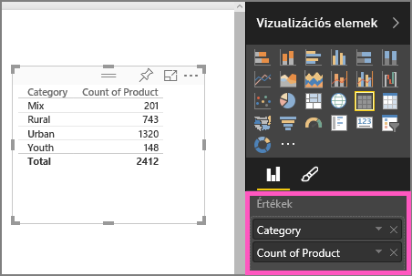
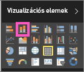

# I. rész – Vizualizációk hozzáadása Power BI-jelentésekhez (oktatóanyag)
A cikk röviden bemutatja a vizualizációk jelentésekben történő létrehozását.  Részletesebb útmutatásért [lásd a II. részt](power-bi-report-add-visualizations-ii.md). Amanda bemutatja, hogyan lehet különbözőképpen létrehozni, szerkeszteni és formázni a vizualizációkat a jelentésvásznon. Ezután Ön is megpróbálhatja létrehozni a saját jelentését a [Értékesítési és marketing minta](sample-datasets.md) segítségével.

<iframe width="560" height="315" src="https://www.youtube.com/embed/IkJda4O7oGs" frameborder="0" allowfullscreen></iframe>

## Jelentés megnyitása és egy üres lap hozzáadása
1. Nyisson meg egy [jelentést Szerkesztési nézetben](service-reading-view-and-editing-view.md). Ez az oktatóanyag az [Értékesítési és marketing mintát](sample-datasets.md) használja.
2. Ha a Mezők panel nem látható, a nyíl ikonnal tudja megnyitni. 
   
   
3. [Adjon hozzá egy üres lapot a jelentéshez](power-bi-report-add-page.md).

## Vizualizációk hozzáadása a jelentéshez
1. A vizualizáció létrehozásához válasszon egy mezőt a **Mezők** panelen.  
   
   **Ha egy numerikus mezővel kezdi**, mint az Értékesítés > Értékesítés $, a Power BI egy egy oszlopból álló oszlopdiagramot hoz létre.
   
   
   
   **Ha egy kategóriamezővel kezdi**, mint a Név vagy a Termék, A Power BI egy táblát hoz létre, és hozzáadja az adott mezőt az **Értékek** területhez.
   
   
   
   **Ha egy földrajzi mezővel indít**, mint a Földrajz > Város, a Power BI a Bing Maps segítségével egy térképi vizualizációt hoz létre.
   
   
2. Hozzon létre egy vizualizációt, majd módosítsa a típusát. Jelölje ki a **Termék > Termékek száma** és a **Termék > Kategória** elemeket, és adja hozzá őket az **Értékek** területhez.
   
   
3. Az oszlopdiagram ikonra kattintva váltsa át a vizualizációt egy oszlopdiagramra.
   
   
4. Ha vizualizációkat hoz létre egy jelentésben, [rögzítheti őket az irányítópulton](service-dashboard-pin-tile-from-report.md). A vizualizáció rögzítéséhez kattintson a rajzszög ikonra .
   
   
5. Ezután:
   
   Továbbléphet a következőre: [2. rész: Vizualizációk hozzáadása Power BI-jelentésekhez](power-bi-report-add-visualizations-ii.md).
   
   [Használhatja a vizualizációkat](service-interact-with-a-report-in-reading-view.md) a jelentésben.
   
   [Még hatékonyabban használhatja a vizualizációkat](power-bi-report-visualizations.md).
   
   [Mentheti a jelentést](service-report-save.md).

## További lépések
További információk [a Power BI-jelentések vizualizációjáról](power-bi-report-visualizations.md).

[Power BI-jelentések](service-reports.md)

További kérdései vannak? [Kérdezze meg a Power BI közösségét](http://community.powerbi.com/)

